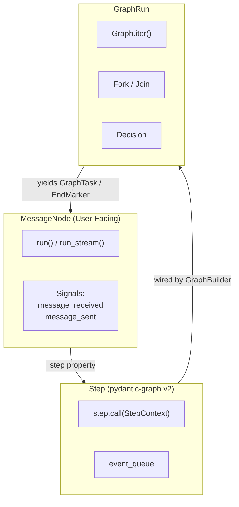

## Project Overview

AgentPool is a unified agent orchestration framework that enables YAML-based configuration of heterogeneous AI agents. It bridges multiple protocols (ACP, AG-UI, OpenCode, MCP) and supports native PydanticAI agents, Claude Code agents, Goose, and other external agents.

**Core Philosophy**: Define once in YAML, expose through multiple protocols, enable seamless inter-agent collaboration.

## Development Commands

### Installation & Setup
```bash
# Install with uv (recommended)
uv sync --all-extras

# Install specific extras
uv sync --extra coding --extra server
```

### Testing
```bash
# Run all tests (excludes slow and acp_snapshot by default)
uv run pytest

# Run with coverage
uv run pytest --cov-report=xml --cov=src/agentpool/ --cov-report=term-missing

# Run specific test markers
uv run pytest -m unit          # Unit tests only
uv run pytest -m integration   # Integration tests only
uv run pytest -m slow          # Include slow tests
uv run pytest -m acp_snapshot  # ACP snapshot tests

# Run single test file
uv run pytest tests/test_specific.py

# Run with verbose output
uv run pytest -vv

# Run tests in parallel
uv run pytest -n auto
```

### Code Quality
```bash

# Main command: runs all

duty lint

# Lint with ruff
uv run ruff check src/

# Format check
uv run ruff format --check

# Format code
uv run ruff format src/

# Type checking with mypy
uv run --no-group docs mypy src/
```

### Running AgentPool
```bash
# Run agent directly
agentpool run <agent_name> "prompt text"

# Start ACP server (for IDEs like Zed)
agentpool serve-acp config.yml

# Start OpenCode server
agentpool serve-opencode config.yml

# Start MCP server
agentpool serve-mcp config.yml

# Start AG-UI server
agentpool serve-agui config.yml

# Start OpenAI-compatible API server
agentpool serve-api config.yml

# Watch for triggers
agentpool watch --config agents.yml

# View analytics
agentpool history stats --group-by model
```

## Code Architecture

### Module Structure

The codebase is organized into focused packages under `src/`:

- **`agentpool/`** - Core agent framework
  - `agents/` - Agent implementations (native, ACP, AG-UI, Claude Code)
  - `delegation/` - AgentPool orchestration, Team coordination, message routing
  - `messaging/` - Message processing, MessageNode abstraction, compaction
  - `tools/` - Tool framework and implementations
  - `tool_impls/` - Concrete tool implementations (bash, read, grep, etc.)
  - `models/` - Pydantic data models and configuration schemas
  - `prompts/` - Prompt management and templating
  - `storage/` - Interaction tracking and analytics
  - `mcp_server/` - MCP server integration
  - `running/` - Agent execution runtime
  - `sessions/` - Session management
  - `hooks/` - Event hooks system
  - `observability/` - Logging and telemetry (Logfire)

- **`agentpool_config/`** - Configuration models (separated for clean imports)
  - YAML schema definitions for agents, teams, tools, MCP servers

- **`agentpool_server/`** - Protocol servers
  - `acp_server/` - Agent Communication Protocol server
  - `opencode_server/` - OpenCode TUI/Desktop server
  - `agui_server/` - AG-UI protocol server
  - `openai_api_server/` - OpenAI-compatible API server
  - `mcp_server/` - Model Context Protocol server

- **`agentpool_toolsets/`** - Reusable toolset implementations
  - `builtin/` - Built-in toolsets (code, debug, subagent, file_edit, workers)
  - `mcp_discovery/` - MCP server discovery with semantic search
  - Specialized toolsets (composio, search, streaming, etc.)

- **`agentpool_storage/`** - Storage providers
  - `sql_provider/` - SQLAlchemy-based storage
  - `zed_provider/` - Zed IDE storage integration
  - `claude_provider/` - Claude storage integration
  - `opencode_provider/` - OpenCode storage integration

- **`agentpool_cli/`** - Command-line interface

- **`agentpool_commands/`** - Command implementations

- **`agentpool_prompts/`** - Prompt templates

- **`acp/`** - Agent Communication Protocol implementation
  - `client/` - ACP client implementations
  - `agent/` - Agent-side protocol implementation
  - `schema/` - Protocol schemas and types
  - `bridge/` - ACP bridge for connecting agents
  - `transports/` - Transport layer (stdio, websocket)

### Key Architectural Patterns

#### ProtocolEventConsumerMixin

`ProtocolEventConsumerMixin` (in `src/agentpool_server/mixins.py`) provides a reusable event consumer lifecycle for protocol servers. It extracts the common pattern of subscribing to the `EventBus`, running an async consumer loop, and cleaning up on shutdown.

**Why it exists**: Before this mixin, OpenCode and ACP each implemented their own event consumer loop independently. The code was duplicated, and ACP's implementation was missing features like `SpawnSessionStart` handling and recursive child subscription. The mixin centralizes the loop mechanics while letting each protocol define its own event conversion.

**Which protocols use it**:
- **ACP** (`acp_server/handler.py`): Adopted in Phase 1. Uses `scope="descendants"` to receive child events through the parent consumer. `_on_spawn_session_start` is a no-op because ACP does not create child consumers.
- **OpenCode** (`opencode_server/session_pool_integration.py`): NOT yet adopted (Phase 2, future change). The mixin interface was designed to be compatible with OpenCode's needs (ToolPart registration, child consumer creation, `OpenCodeEventAdapter`).
- **AG-UI / OpenAI API**: NOT yet adopted. Can adopt the mixin when subagent event forwarding is needed.

**Key hooks**:
- `_before_consumer_loop(session_id)`: Set up per-session context (e.g. create an event converter).
- `_handle_event(session_id, event)`: Convert and deliver the event. May raise `ConsumerShutdown` to stop the loop.
- `_on_spawn_session_start(session_id, event)`: React to subagent spawning. Default is no-op.
- `_after_consumer_loop(session_id)`: Clean up per-session context. Only called if the consumer actually started.

**Thread safety**: `start_event_consumer` is idempotent and serializes concurrent calls for the same session via per-session locks.

#### MessageNode Abstraction
All processing units (Agents, Teams) inherit from `MessageNode[TInputType, TOutput]`. This provides:
- Unified interface for message processing via `process()`
- Connection management (forwarding outputs between nodes)
- Hook system for intercepting messages
- Type-safe input/output handling

```python
# Both agents and teams are MessageNodes
agent: MessageNode[ChatMessage, ChatMessage]
team: MessageNode[ChatMessage, TeamRun]

# Nodes can be connected
agent.add_connection(other_agent)  # Forward messages to other_agent
```

!!! warning "Deprecation: Runtime Dynamic Connections"
    `MessageNode.connect_to()` and `ConnectionManager.create_connection()` are deprecated.
    These methods allow runtime mutation of agent topology, which conflicts with the
    immutable graph model used by pydantic-graph.

    **Migration path**: Define connections in YAML (`graph:` or `connections:` sections)
    or use `GraphBuilder` programmatically instead of calling `connect_to()` at runtime.
    The deprecated methods continue to work but will emit a `DeprecationWarning`.

#### AgentPool as Registry
`AgentPool` is a `BaseRegistry[NodeName, MessageNode]` that:
- Manages lifecycle of all agents and teams
- Provides dependency injection (shared_deps)
- Handles connection setup from YAML config
- Coordinates resource cleanup

#### Team Patterns

**New graph-based approach (recommended):**
Teams are compiled into pydantic-graph workflows:
- **Sequential**: Chained Steps via edges (`agent1 -> agent2 -> agent3`)
- **Parallel**: Fork + Join (`agent1 & agent2 & agent3`)
- **YAML configuration**: Define workflows in the `graph:` section

**Legacy syntax (still supported):**
- **Sequential (chain)**: `agent1 | agent2 | agent3` - Output flows through pipeline
- **Parallel**: `agent1 & agent2 & agent3` - All process same input concurrently
- **YAML configuration**: Define teams in manifest with mode and members

See the Graph Architecture section below for full details.

#### Tool System
Tools follow PydanticAI's tool pattern with AgentPool extensions:
- Tools are typed functions with Pydantic schemas
- Can access `AgentContext` for agent-specific state
- Support `subagent` tool for delegation
- Built-in toolsets provide common functionality (code editing, bash, grep)

#### Protocol Bridging
AgentPool acts as a protocol adapter:
1. Agent defined once in YAML (with type: native/acp/agui/claude)
2. Pool loads and manages agent lifecycle
3. Server exposes agent through chosen protocol (ACP/AG-UI/OpenCode/OpenAI API)
4. Client interacts via standardized protocol

### Graph Architecture

AgentPool now compiles agents and teams into pydantic-graph workflows. This provides step-by-step execution, fork/join parallelism, and graph-level observability while preserving the existing `MessageNode` public API.



#### Agents as Steps

Every `MessageNode` (including agents and teams) exposes an internal `_step` property that wraps its execution logic as a pydantic-graph `Step`:

```python
class MessageNode[TDeps, TResult](ABC):
    @property
    @abstractmethod
    def _step(self) -> Step[AgentPoolState, TDeps, ChatMessage[Any], ChatMessage[TResult]]: ...
```

The `Step` receives a `StepContext` containing:
- `state`: `AgentPoolState` with prompts, kwargs, and event queue
- `deps`: Node dependencies (e.g., database connections)
- `inputs`: Input message (or `None` for root runs)

For single-node execution, `MessageNode.run()` builds a one-node graph and runs it via `Graph.run()`. `MessageNode.run_stream()` drives the same graph via `Graph.iter()`, draining the event queue after each step to yield `RichAgentStreamEvent` tokens.

#### Teams as Graphs

**Sequential teams** compile to chained Steps:

```mermaid
flowchart LR
    start((start)) --> agent1[analyzer]
    agent1 --> agent2[reviewer]
    agent2 --> agent3[formatter]
    agent3 --> end((end))
```

**Parallel teams** compile to Fork + Join:

```mermaid
flowchart TB
    start((start)) --> fork{Fork}
    fork --> agent1[claude]
    fork --> agent2[goose]
    agent1 --> join{Join}
    agent2 --> join
    join --> end((end))
```

The `AgentPool` lazily builds the graph from registered nodes and `Talk` connections. The graph rebuilds automatically when nodes are added or removed.

#### New `graph:` YAML Syntax

The `graph:` section maps directly to pydantic-graph's `GraphBuilder` API:

```yaml
graph:
  name: review_pipeline
  steps:
    - id: analyzer
      agent: analyzer
    - id: reviewer
      agent: reviewer
    - id: formatter
      agent: formatter
  # Implicit edges: start -> analyzer -> reviewer -> formatter -> end
```

**Parallel execution** uses list syntax for `to:` and `from:`:

```yaml
graph:
  name: parallel_analysis
  steps:
    - id: researcher
      agent: research_agent
    - id: analyst
      agent: analysis_agent
    - id: summarizer
      agent: summary_agent
  edges:
    - from: start
      to: [researcher, analyst]
    - from: [researcher, analyst]
      to: summarizer
    - from: summarizer
      to: end
```

**Conditional branching** via `condition:`:

```yaml
graph:
  steps:
    - id: classifier
      agent: classifier_agent
    - id: handle_error
      agent: error_agent
    - id: handle_success
      agent: success_agent
  edges:
    - from: classifier
      to: handle_error
      condition:
        type: match
        field: sentiment
        value: negative
    - from: classifier
      to: handle_success
      condition:
        type: match
        field: sentiment
        value: positive
```

**Edge transforms** via `transform:`:

```yaml
graph:
  steps:
    - id: extractor
      agent: extract_agent
    - id: formatter
      agent: format_agent
  edges:
    - from: extractor
      to: formatter
      transform: mymodule.prepare_input
```

**Map (iterable fan-out)**:

```yaml
graph:
  steps:
    - id: url_fetcher
      agent: fetch_agent
    - id: page_processor
      agent: process_agent
    - id: result_aggregator
      agent: aggregate_agent
  edges:
    - from: url_fetcher
      to: page_processor
      map: true
    - from: page_processor
      to: result_aggregator
      join: true
```

#### Signal Behavior

AgentPool signals are emulated at pydantic-graph step boundaries via `SignalEmittingGraphRun`:

| Signal | Emission Point |
|---|---|
| `MessageNode.message_received` | When `GraphTask` is yielded (step about to run) |
| `MessageNode.message_sent` | On the next yield (step completed) |
| `Talk.connection_processed` | When edge traversal produces a new `GraphTask` |
| `Talk.message_forwarded` | When a transform is applied before continuing |

The wrapper intercepts `GraphRun.__anext__()` without subclassing, tracks previous tasks across yields, and maps `(source_node_id, destination_node_id)` tuples back to `Talk` instances.

#### Streaming Behavior

Graph-based streaming uses `Graph.iter()` and maps yields to existing event types:

| Graph Yield | Event |
|---|---|
| `Sequence[GraphTask]` | `PartStartEvent` (one per task) |
| Step-internal streaming | `PartDeltaEvent` via `StepEventCollector` |
| Tool call invocation | `ToolCallStartEvent` + `ToolCallCompleteEvent` |
| `EndMarker` | `StreamCompleteEvent` with final `ChatMessage` |
| `ErrorMarker` | `RunErrorEvent` then re-raise |

A background task drives `Graph.iter()` and pushes events into an async queue, which `run_stream()` drains. This matches the existing native agent streaming pattern.

#### Migration Guide: `teams:` to `graph:`

**Sequential team (legacy)**:
```yaml
# Legacy syntax — still supported
teams:
  review_pipeline:
    mode: sequential
    members: [analyzer, reviewer, formatter]
```

**Equivalent graph syntax**:
```yaml
graph:
  name: review_pipeline
  steps:
    - id: analyzer
      agent: analyzer
    - id: reviewer
      agent: reviewer
    - id: formatter
      agent: formatter
```

**Parallel team (legacy)**:
```yaml
# Legacy syntax — still supported
teams:
  parallel_coders:
    mode: parallel
    members: [claude, goose]
```

**Equivalent graph syntax**:
```yaml
graph:
  name: parallel_coders
  steps:
    - id: claude
      agent: claude
    - id: goose
      agent: goose
  edges:
    - from: start
      to: [claude, goose]
    - from: [claude, goose]
      to: end
```

**Agent connections (legacy)**:
```yaml
# Legacy syntax — still supported
agents:
  picker:
    connections:
      - type: node
        name: analyzer
```

**Equivalent graph syntax**:
```yaml
graph:
  steps:
    - id: picker
      agent: picker
    - id: analyzer
      agent: analyzer
  edges:
    - from: picker
      to: analyzer
```

Old configs with `teams:` or `connections:` are automatically translated to `GraphConfig` at load time. You can mix `graph:` with legacy sections, or migrate incrementally.

### Session Orchestration

AgentPool sessions are managed by `SessionPool` and `SessionController`. `SessionPool` holds all active sessions. `SessionController` routes incoming requests and tracks active runs.

#### Unified Request Entry Point

`SessionController.receive_request()` is the single entry point for all incoming prompts:

```python
async def receive_request(session_id, content, priority="when_idle")
```

- If the session is idle, it creates a `RunHandle` and starts execution.
- If the session has an active run, it routes based on priority.
- `"asap"` injects into the active turn immediately.
- `"when_idle"` queues the message for the next turn.

Protocol handlers should subscribe to the `EventBus` before calling `receive_request()`, since the method is fire-and-forget. All events stream through the bus.

#### Dual Queue Architecture

AgentPool maintains two queue systems because native and non-native agents use different run loops.

**Native agents** rely on PydanticAI's `PendingMessageDrainCapability`. PydanticAI auto-injects this capability outermost. It handles message queuing at two hook points:

- `before_model_request` drains `"asap"` messages immediately before the model call.
- `after_node_run` drains `"when_idle"` messages after the current node finishes.

Native agents drive execution through `RunExecutor`, which calls `agent_run.next(node)` in a loop. The bare `async for node in agent_run:` pattern does not fire `after_node_run` hooks, so `"when_idle"` messages would never drain. `RunExecutor` avoids this by using explicit `next()` calls.

**Non-native agents** (ACP, ClaudeCode, AGUI) do not use PydanticAI's agent loop. They communicate through subprocess JSON-RPC, Claude SDK, or HTTP/SSE. These agents use `TurnRunner`, which preserves the manual queue system:

- `_post_turn_injections` for immediate injections.
- `_post_turn_prompts` for follow-up prompts.
- `_process_queued_work()` and `_trigger_auto_resume()` for the auto-resume loop.
- `SessionState.turn_lock` for turn serialization.

`TurnRunner` creates `RunHandle` instances and registers them in `SessionController._runs` just like native runs. This gives the pool a unified view of all active execution.

#### RunHandle Lifecycle

`RunHandle` tracks the state of a single run from start to finish:

```python
@dataclass
class RunHandle:
    run_id: str
    session_id: str
    agent_type: str
    status: RunStatus  # pending | running | completed | failed
    complete_event: asyncio.Event
```

The lifecycle flows through these states:

1. **pending** - Created when `receive_request()` sees an idle session.
2. **running** - `start()` is called after the asyncio task begins.
3. **completed** - `complete()` is called when the run finishes normally.
4. **failed** - `fail()` is called when an exception escapes the run loop. It publishes `RunFailedEvent` to the EventBus.

`complete_event` is set only after all cleanup finishes. `close_session()` awaits this event with a timeout to allow graceful shutdown. If the timeout expires, it falls back to `cancel_run()`.

#### Event Mapping (Native Agents)

`RunExecutor` maps PydanticAI node-level events to AgentPool EventBus events:

| PydanticAI Node Event | AgentPool EventBus Event |
|---|---|
| `AgentRun` created | `RunStartedEvent` |
| `ModelRequestNode` start | `PartStartEvent` |
| `ModelRequestNode` text chunks | `PartDeltaEvent` |
| `ModelRequestNode` end | `PartEndEvent` |
| `FunctionToolCallEvent` | `ToolCallStartEvent` |
| `FunctionToolResultEvent` | `ToolCallCompleteEvent` |
| `EndNode` | `StreamCompleteEvent` |
| Run cancelled | `StreamCompleteEvent(cancelled=True)` |

The `RunExecutor` runs PydanticAI iteration in a background task and pushes events into an async queue. The consumer drains this queue and yields `RichAgentStreamEvent` tokens. This preserves CancelScope safety: cancelling the consumer does not immediately tear down the PydanticAI run.

#### PromptInjectionManager

`PromptInjectionManager` serves two purposes depending on the agent type.

**For all agents**, `inject()` and `consume()` handle tool result augmentation. When a tool finishes, `after_tool_execute` hooks call `consume()` to inject additional context into the conversation. If no tool runs, `flush_pending_to_queue()` moves unconsumed injections into the queued prompts.

**For non-native agents**, `queue()` and `pop_queued()` also handle follow-up prompts after a turn ends. `TurnRunner` drains these queues through `_process_queued_work()`.

**For native agents**, the follow-up prompt queue (`queue()` / `pop_queued()`) is replaced by PydanticAI's `PendingMessageDrainCapability`. `inject()` / `consume()` remain in use for tool augmentation.

### Agent Types

**Native Agents** (`type: native`)
- PydanticAI-based agents with full framework features
- Direct model integration (OpenAI, Anthropic, Google, Mistral, etc.)
- Tool support, structured output, streaming
- Most flexible and feature-rich

**ACP Agents** (`type: acp`)
- External agents implementing Agent Communication Protocol
- Examples: Goose, Codex, custom ACP servers
- Communicate via stdio or websocket

**Claude Code Agents** (`type: claude`)
- Direct integration with Claude Code CLI
- Specialized for code-related tasks
- Access to Claude Code's tool ecosystem

**AG-UI Agents** (`type: agui`)
- Remote agents implementing AG-UI protocol
- HTTP-based communication
- Useful for distributed agent architectures

**File Agents** (`type: file`)
- Agent behavior defined by file content/prompts
- Lightweight for simple use cases

### Storage and Observability

**Storage Providers**: Track all agent interactions
- SQL-based with SQLModel/SQLAlchemy
- Per-agent or shared database
- Analytics via CLI: `agentpool history stats`

**Observability**: Logfire integration
- Structured logging with context
- Trace agent execution
- Performance monitoring
- Disabled in tests via env vars

### Configuration System

**YAML-First Design**:
- `AgentsManifest` is the root config model
- Supports inheritance via `INHERIT` field
- Inline schema definitions with Schemez
- Environment variable substitution
- Jinja2 templating in prompts

**Key Config Sections**:
- `agents`: Agent definitions
- `teams`: Multi-agent teams
- `responses`: Structured output schemas
- `mcp_servers`: MCP server configurations
- `storage`: Interaction tracking config
- `observability`: Logging/telemetry config
- `workers`: Background worker definitions
- `jobs`: Scheduled tasks

## Development Guidelines

### Code Style
- Python 3.13+ required (use modern syntax: match/case, walrus operator)
- Follow PEP 8 via Ruff
- Google-style docstrings (no types in Args section)
- Type hints required (checked with mypy --strict)
- Use `from __future__ import annotations` for forward references

### Testing
- Tests use pytest (not in classes)
- Fixtures in `tests/conftest.py`
- TestModel from pydantic-ai for agent testing
- Disable observability in tests (see conftest.py)
- Markers: `@pytest.mark.unit`, `@pytest.mark.integration`, `@pytest.mark.slow`

### Import Patterns
```python
# Avoid circular imports - use TYPE_CHECKING
from __future__ import annotations
from typing import TYPE_CHECKING

if TYPE_CHECKING:
    from agentpool.delegation import AgentPool

# Config models are in agentpool_config to avoid circular deps
from agentpool_config.teams import TeamConfig
```

### Tool Implementation
When adding new tools:
1. Create implementation in `agentpool/tool_impls/<tool_name>/`
2. Define config model in `agentpool_config/` if complex
3. Register in appropriate toolset (`agentpool_toolsets/`)
4. Add tests in `tests/tool_impls/`

### Adding Agent Types
New agent types require:
1. Config model in `agentpool/models/` (inherit from base, set `type` discriminator)
2. Implementation in `agentpool/agents/`
3. Add to `AnyAgentConfig` union in `manifest.py`
4. Update manifest loading in `pool.py`

### Server Implementation
New protocol servers:
1. Inherit from `BaseServer` in `agentpool_server/base.py`
2. Implement protocol-specific handlers
3. Use `AggregatingServer` if wrapping multiple agents
4. Add CLI command in `agentpool_cli/`

## Common Patterns

### Creating an AgentPool
```python
async with AgentPool("config.yml") as pool:
    agent = pool.get_agent("agent_name")
    result = await agent.run("prompt")
```

### Running Tests on Modified Code
```bash
# Find relevant tests
pytest tests/path/to/test_file.py -k "test_pattern"

# Quick sanity check (unit tests only)
pytest -m unit --no-cov

# Full validation
pytest && mypy src/ && ruff check src/
```

### Debugging Agent Issues
1. Enable verbose logging (set `OBSERVABILITY_ENABLED=true`)
2. Check storage database for interaction history
3. Use `TestModel` for isolated testing
4. Add `--log-cli-level=DEBUG` to pytest

### Working with YAML Configs
- Examples in `site/examples/*/config.yml`
- Schema reference auto-generated from Pydantic models
- Validate with: `python -m agentpool_config.manifest config.yml`

## Special Considerations

### Async Context Managers
AgentPool and Agents use async context managers - always use `async with`:
```python
async with AgentPool(manifest) as pool:
    async with pool.get_agent("name") as agent:
        result = await agent.run("prompt")
```

### MCP Server Lifecycle
MCP servers are spawned as subprocesses - pool cleanup handles termination.
Use `ProcessManager` from `anyenv` for external process management.

### UPath for File Operations
Use `UPath` (universal_pathlib) not `Path` - supports remote filesystems (s3://, gs://, etc.)

### Model Configuration
Prefer string shorthand in YAML: `model: "openai:gpt-4o"`
Fallback models: `type: fallback, models: [primary, backup]`

### Entry Points
The project uses entry points for extensibility:
- `agentpool_toolsets` - Register custom toolsets
- `fsspec.specs` - Filesystem implementations (ACP)
- `universal_pathlib.implementations` - Path implementations

## Key Files to Understand

- `src/agentpool/delegation/pool.py` - AgentPool orchestration
- `src/agentpool/agents/agent.py` - Native agent implementation
- `src/agentpool/messaging/messagenode.py` - Base abstraction
- `src/agentpool/models/manifest.py` - Configuration schema
- `src/agentpool/tools/tool.py` - Tool framework
- `src/agentpool_server/acp_server/acp_agent.py` - ACP server agent wrapper
- `src/acp/client/protocol.py` - ACP client interface
- `src/acp/agent/protocol.py` - ACP agent interface

## Documentation

- Main docs: [phil65.github.io/agentpool](https://phil65.github.io/agentpool/)
- Built with MkNodes (see `mkdocs.yml`)
- Auto-generated from docstrings and examples. Utilities in agentpool/docs/

## Complete Usage Examples

### Direct Agent Instantiation

**Native Agent**
```python
from agentpool.agents import Agent

def greet(name: str) -> str:
    """Greet someone."""
    return f"Hello, {name}!"

async with Agent(
    name="my_agent",
    model="openai:gpt-4o-mini",  # Required: model string or Model instance
    system_prompt="You are a helpful assistant",
    tools=[greet],  # Callables or import paths like "mymodule:my_tool"
) as agent:
    async for event in agent.run_stream("Greet Alice"):
        ...
```

**ACP Agent**
```python
from agentpool.agents.acp_agent import ACPAgent

async with ACPAgent(
    command="goose",  # Required: executable name
    args=["acp"],  # Required: command arguments
    name="goose_agent",
    cwd="/path/to/project",
) as agent:
    async for event in agent.run_stream("Write code"):
        ...
```

**Claude Code Agent**
```python
from agentpool.agents.claude_code_agent import ClaudeCodeAgent

async with ClaudeCodeAgent(
    name="claude_coder",
    model="claude-sonnet-4-20250514",  # Optional: defaults to latest
    cwd="/path/to/project",  # Optional: defaults to current directory
) as agent:
    async for event in agent.run_stream("Refactor this code"):
        ...
```

### Agent from Config with Streaming

**Config (config.yml)**
```yaml
agents:
  coder:
    type: native
    model: "openai:gpt-4o-mini"
    system_prompt: "You are an expert Python developer"
    tools:
      - name: bash
        enabled: true
      - name: read
        enabled: true
```

**Python Code**
```python
from agentpool.delegation import AgentPool
from agentpool.agents.events import (
    PartDeltaEvent,
    ToolCallStartEvent,
    ToolCallCompleteEvent,
    StreamCompleteEvent,
)

async with AgentPool("config.yml") as pool:
    agent = pool.get_agent("coder")
    
    # Stream events (run_stream returns AsyncIterator, not a context manager)
    async for event in agent.run_stream("Read setup.py and list dependencies"):
        match event:
            case PartDeltaEvent(delta=text):
                # Stream text chunks as they arrive
                print(text, end="", flush=True)
            
            case ToolCallStartEvent(tool_name=name):
                print(f"\n[Tool starting: {name}]")
            
            case ToolCallCompleteEvent(tool_name=name, tool_result=result):
                print(f"\n[Tool {name} completed: {result}]")
            
            case StreamCompleteEvent(message=msg):
                # Final complete message with full content
                print(f"\n\nComplete response: {msg.content}")
```

Rules:
- ALWAYS use uv for all python related tasks.
- DO NOT USE getattr and hasattr in very rare exceptions. Always provide full type safety.
- Maximum type safety.
- never resort to shortcuts, never leave out stuff with TODOs unless explicitely asked.
