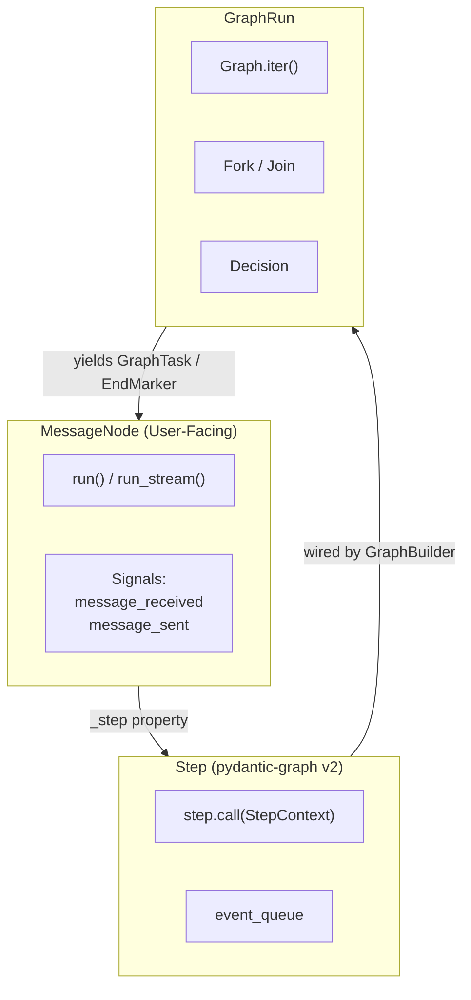

## Project Overview

AgentPool is a unified agent orchestration framework that enables YAML-based configuration of heterogeneous AI agents. It bridges multiple protocols (ACP, AG-UI, OpenCode, MCP) and supports native PydanticAI agents and external agents via ACP.

**Core Philosophy**: Define once in YAML, expose through multiple protocols, enable seamless inter-agent collaboration.

## Development Workflow

### OpenSpec (Spec-Driven Change Management)

All significant changes go through OpenSpec — a spec-driven workflow with 4 phases:

```
/opsx:explore  → Investigate problems, map codebase, compare options (no code)
/opsx:propose  → Create proposal.md + design.md + specs/ + tasks.md
/opsx:apply    → Implement tasks one-by-one, mark [ ] → [x] in tasks.md
/opsx:archive  → Move completed change to openspec/changes/archive/
```

- **Location**: `openspec/` (24 capability specs, 34 archived changes)
- **Config**: `openspec/config.yaml` (schema: spec-driven)
- **Skills**: `.claude/skills/openspec-{explore,propose,apply-change,archive-change}/`
- **CLI**: `openspec` v1.4+ (installed separately)

Each change produces: `.openspec.yaml` (metadata), `proposal.md` (what/why), `design.md` (how), `specs/<capability>/spec.md` (formal requirements), `tasks.md` (checklist).

### .omo (Task Orchestration & Evidence)

OpenCode's Sisyphus workflow directory tracks structured development work:

```
.omo/
├── boulder.json        # Active work registry (schema v2)
├── plans/              # 24 structured implementation plans
├── evidence/           # 185+ verification artifacts (test logs, QA reports)
├── notepads/           # Per-work learnings, decisions, issues
├── run-continuation/   # Session state for interrupted session resumption
└── drafts/             # Reserved for future use
```

- **Gitignored** but ~156 evidence files force-tracked as documentation
- Each plan links to an OpenSpec change in `openspec/changes/`
- Notepads serve as persistent context across multi-session work

## Development Commands

### Installation & Setup
```bash
# Install with uv (recommended)
uv sync --all-extras

# Install specific extras
uv sync --extra coding --extra server
```

### Testing
```bash
# Run all tests (excludes slow and acp_snapshot by default)
uv run pytest

# Run with coverage
uv run pytest --cov-report=xml --cov=src/agentpool/ --cov-report=term-missing

# Run specific test markers
uv run pytest -m unit          # Unit tests only
uv run pytest -m integration   # Integration tests only
uv run pytest -m slow          # Include slow tests
uv run pytest -m acp_snapshot  # ACP snapshot tests

# Run single test file
uv run pytest tests/test_specific.py

# Run with verbose output
uv run pytest -vv

# Run tests in parallel
uv run pytest -n auto
```

### Code Quality
```bash

# Main command: runs all

duty lint

# Lint with ruff
uv run ruff check src/

# Format check
uv run ruff format --check

# Format code
uv run ruff format src/

# Type checking with mypy
uv run --no-group docs mypy src/
```

### Running AgentPool
```bash
# Run agent directly
agentpool run <agent_name> "prompt text"

# Start ACP server (for IDEs like Zed)
agentpool serve-acp config.yml

# Start OpenCode server
agentpool serve-opencode config.yml

# Start MCP server
agentpool serve-mcp config.yml

# Start AG-UI server
agentpool serve-agui config.yml

# Start OpenAI-compatible API server
agentpool serve-api config.yml

# Watch for triggers
agentpool watch --config agents.yml

# View analytics
agentpool history stats --group-by model
```

## Code Architecture

### Module Structure

The codebase is organized into focused packages under `src/`:

- **`agentpool/`** - Core agent framework
  - `agents/` - Agent implementations (native, ACP)
  - `capabilities/` - Native pydantic-ai capability implementations (MCPCapability, FunctionToolsetCapability, CombinedToolsetCapability, SubagentCapability, CodeModeCapability, FilteredToolsetCapability, AgentContext, DelegationService, ResourceSource, entry-point registry)
  - `delegation/` - AgentPool orchestration, Team coordination, message routing
  - `lifecycle/` - RunLoop lifecycle dimensions (TriggerSource, Journal, SnapshotStore, CommChannel, EventTransport)
  - `messaging/` - Message processing, MessageNode abstraction, compaction
  - `tools/` - Tool framework and implementations
  - `tool_impls/` - Concrete tool implementations (bash, read, grep, etc.)
  - `models/` - Pydantic data models and configuration schemas
  - `prompts/` - Prompt management and templating
  - `storage/` - Interaction tracking and analytics
  - `mcp_server/` - MCP server integration
  - `running/` - Agent execution runtime
  - `sessions/` - Session management
  - `hooks/` - Event hooks system
  - `observability/` - Logging and telemetry (Logfire)

- **`agentpool_config/`** - Configuration models (separated for clean imports)
  - YAML schema definitions for agents, teams, tools, MCP servers

- **`agentpool_server/`** - Protocol servers
  - `acp_server/` - Agent Communication Protocol server
  - `opencode_server/` - OpenCode TUI/Desktop server
  - `agui_server/` - AG-UI protocol server
  - `openai_api_server/` - OpenAI-compatible API server
  - `mcp_server/` - Model Context Protocol server

- **`agentpool_toolsets/`** - Reusable toolset implementations
  - `builtin/` - Built-in toolsets (code, debug, subagent, file_edit, workers)
  - `mcp_discovery/` - MCP server discovery with semantic search
  - Specialized toolsets (composio, search, streaming, etc.)

- **`agentpool_storage/`** - Storage providers
  - `sql_provider/` - SQLAlchemy-based storage
  - `zed_provider/` - Zed IDE storage integration
  - `claude_provider/` - Claude storage integration
  - `opencode_provider/` - OpenCode storage integration

- **`agentpool_cli/`** - Command-line interface

- **`agentpool_commands/`** - Command implementations

- **`agentpool_prompts/`** - Prompt templates

- **`acp/`** - Agent Communication Protocol implementation
  - `client/` - ACP client implementations
  - `agent/` - Agent-side protocol implementation
  - `schema/` - Protocol schemas and types
  - `bridge/` - ACP bridge for connecting agents
  - `transports/` - Transport layer (stdio, websocket)

### Skills System

Skills are defined as `SKILL.md` files following the [Agent Skills Spec](https://github.com/agentskills/agentskills). They are discovered, loaded, and injected into agent prompts.

**Skill Locations** (three tiers):
- `~/.claude/skills/*/SKILL.md` — User-wide (default)
- `.claude/skills/*/SKILL.md` — Project-wide (e.g., `openspec-*`)
- `.agents/skills/*/SKILL.md` — Agent/workflow skills
- MCP servers via `skill://` resource URIs

**Key Files**:
- `src/agentpool/skills/skill.py` — `Skill` model: YAML frontmatter parsing, lazy instruction loading
- `src/agentpool/skills/registry.py` — `SkillsRegistry` auto-discovers SKILL.md files from configured paths
- `src/agentpool/skills/manager.py` — `SkillsManager` pool-level lifecycle
- `src/agentpool/skills/uri_resolver.py` — `skill://` URI scheme resolver
- `src/agentpool/skills/command.py` — `SkillCommand` wraps skills as protocol-agnostic slash commands
- `src/agentpool/skills/instruction_provider.py` — `SkillsInstructionProvider` injects skills as XML into prompts (metadata/full modes) — migrated from `resource_providers/`

**Injection Modes** (via YAML `skills.instruction`):
- `off` — No injection
- `metadata` — `<available-skills>` XML block (names + descriptions)
- `full` — `<skill_content>` XML block with complete instructions + parameters

### Capabilities (M3 — replaces Resource Providers)

In M3, the old `ResourceProvider` hierarchy was replaced with native pydantic-ai `AbstractCapability` / `AbstractToolset` implementations. Each `AbstractCapability` produces tools, instructions, change notifications, and optionally implements `ResourceSource` for read-only data access. The old `src/agentpool/resource_providers/` directory (14 files, ~3860 LOC) was physically deleted after migration.

| Capability | Replaces | Key File |
|---|---|---|
| `MCPCapability` | `MCPResourceProvider` | `capabilities/mcp_capability.py` |
| `SkillCapability` | `LocalResourceProvider` | `skills/capability.py` |
| `SubagentCapability` | `PoolResourceProvider` | `capabilities/subagent_capability.py` |
| `FunctionToolsetCapability` | `StaticResourceProvider` | `capabilities/function_toolset.py` |
| `CombinedToolsetCapability` | `AggregatingResourceProvider` | `capabilities/combined_toolset.py` |
| `FilteredToolsetCapability` | `FilteringResourceProvider` | `capabilities/filtered_toolset.py` |
| `CodeModeCapability` | `CodeModeResourceProvider` | `capabilities/code_mode_capability.py` |

**Supporting types:**
- `ResourceSource` (`capabilities/resource_source.py`) — `@runtime_checkable Protocol` for read-only data access (`list()`, `read(uri)`, `exists(uri)`, `on_change()`). Orthogonal to `AbstractCapability` — same object can implement both.
- `AggregatedResourceSource` — Composes multiple `ResourceSource` instances, routes by URI scheme.
- `AgentContext` (`capabilities/agent_context.py`) — Frozen dataclass carrying `agent_registry`, `delegation`, `session`, `scope`, `resources`, `host`. Constructed by RunLoop per-turn.
- `DelegationService` (`capabilities/delegation.py`) — Protocol exposing `spawn_subagent(name, prompt)` and `get_available_agents()`. Limits tools to operations they need without exposing `AgentPool`.
- `ChangeEvent` (`capabilities/change_event.py`) — Frozen dataclass for capability change notifications (`on_change()` stream).
- Entry-point registry (`capabilities/registry.py`) — Discovers custom capabilities via `agentpool.capabilities` entry-point group.

**Deleted alongside ResourceProviders:**
- `src/agentpool/tools/factory.py` (194 LOC, 6 `ToolsetFactory` classes) — became dead code after all providers migrated.
- `src/agentpool/tools/manager.py` (364 LOC, `ToolManager`) — all `agent.tools.X` access migrated to direct capability references.

### Hooks & Events System

**Hooks** (`src/agentpool/hooks/`): Intercept agent turns at 4 points: `pre_turn`, `post_turn`, `pre_tool_use`, `post_tool_use`. Three hook types: `CallableHook` (in-process), `CommandHook` (subprocess), `PromptHook` (LLM evaluation). Hooks run in parallel, results combined with priority: deny > ask > allow.

#### HookAwareTurn Architecture

Hooks fire through the `HookAwareTurn` mixin (`src/agentpool/orchestrator/turn.py`), which is inherited by both `NativeTurn` and `ACPTurn`. This provides a single choke point for hook execution inside `Turn.execute()`.

**Firing flow:**

- `fire_pre_turn_hooks()` runs before the LLM call (turn start). Returns `HookResult | None`. If `decision="deny"`, the turn is blocked.
- `fire_post_turn_hooks(result, duration_ms)` runs in the `finally` block after the response, even on error. Injects `duration_ms` from elapsed wall time.
- `fire_pre_tool_hooks(tool_name, tool_input)` runs before a tool call. For native agents, this is blocking (returns `decision="deny"` raises `ModelRetry`). For ACP agents, this is advisory (logs a warning but cannot block).
- `fire_post_tool_hooks(tool_name, tool_output)` runs after a tool call. Can return `modified_output` to replace tool results. For ACP agents, modifies the event payload.
- All four methods check a `hooks_fired` double-fire guard (a `set[str]` on `AgentRunContext`) to prevent the same hook from firing twice in one turn.

**Difference by agent type:**

| Aspect | Native (NativeTurn) | ACP (ACPTurn) |
|--------|--------------------|----------------|
| `pre_turn` | Blocking via `HookAwareTurn` | Blocking via `HookAwareTurn` |
| `post_turn` | Via `HookAwareTurn` finally block | Via `HookAwareTurn` finally block |
| `pre_tool_use` | Blocking via `_ToolInterceptCapability` (model retry on deny) | Blocking via `ACPClientHandler.request_permission()` + advisory on `ToolCallStart` event |
| `post_tool_use` | Via `_ToolInterceptCapability` | Advisory on `ToolCallComplete` event (modify event payload) |
| Standalone fallback | `BaseAgent._run_stream_once()` guarded by `AGENT_TYPE != "native"` | Still uses `BaseAgent._run_stream_once()` (future work to route through `ACPTurn.execute()`) |

**Double-fire guard:** The old path in `BaseAgent._run_stream_once()` fires hooks first and adds keys to `run_ctx.hooks_fired`. The `Turn.execute()` path (called via `_stream_events()`) checks `hooks_fired` and skips if the key is already present. This ensures the old ACP standalone path and the new Turn path don't fire duplicates.

**Deprecated APIs (v0.5.0 removed):**
- `AgentHooks.as_capability()` — removed. Hooks now fire automatically via `HookAwareTurn`.
- `pre_run`/`post_run` config field aliases in `HooksConfig` — removed. Use `pre_turn`/`post_turn` only.
- `run_pre_run_hooks()`/`run_post_run_hooks()` methods — removed. Use `run_pre_turn_hooks()`/`run_post_turn_hooks()`.
- `_wrap_before_run()`, `_wrap_after_run()`, `_wrap_before_tool_execute()`, `_wrap_after_tool_execute()` — removed.

#### Migration Guide: Hook Rename and HookAwareTurn

**1. YAML config rename** — In your agent YAML config, rename hook fields:

```yaml
# OLD (v0.4.x)
hooks:
  pre_run:
    - type: callable
      callable: mymodule:my_pre_hook
  post_run:
    - type: callable
      callable: mymodule:my_post_hook

# NEW (v0.5.0+)
hooks:
  pre_turn:
    - type: callable
      callable: mymodule:my_pre_hook
  post_turn:
    - type: callable
      callable: mymodule:my_post_hook
```

The old `pre_run`/`post_run` field names were briefly supported with deprecation warnings in v0.4.x and are **removed in v0.5.0**. Only `pre_turn`/`post_turn` are accepted now.

**2. `AgentHooks.as_capability()` removed** — If you programmatically called `agent_hooks.as_capability()` to inject hooks as a PydanticAI capability, remove that call. Hooks now fire automatically through `HookAwareTurn` at the `Turn.execute()` level. No manual wiring is needed.

```python
# OLD (v0.4.x) — removed
capability = agent_hooks.as_capability(hook_manager)

# NEW (v0.5.0+) — hooks fire automatically via HookAwareTurn
# Just configure hooks in YAML or pass AgentHooks to the agent constructor
```

**3. v0.5.0 breaking changes (summary):**

| Removed API | Replacement |
|---|---|
| `HooksConfig.pre_run` / `post_run` | `pre_turn` / `post_turn` |
| `AgentHooks.run_pre_run_hooks()` | `run_pre_turn_hooks()` |
| `AgentHooks.run_post_run_hooks()` | `run_post_turn_hooks()` |
| `AgentHooks.as_capability()` | Automatic via `HookAwareTurn` |
| `_wrap_before_run()`, `_wrap_after_run()`, `_wrap_before_tool_execute()`, `_wrap_after_tool_execute()` | Removed (no replacement — hooks fire via `HookAwareTurn` internally) |

**Event Types** (`src/agentpool/agents/events/events.py`): `RichAgentStreamEvent` union type covers streaming deltas, tool calls (start/progress/complete), run lifecycle (started/error/failed), subagent events, session resume, compaction, plan updates, and custom events.

**EventBus** (`src/agentpool/orchestrator/core.py`): Cross-turn event streaming for protocol servers. Bounded async queues per session, replay buffers, scoped subscriptions (`"session"`, `"descendants"`, `"subtree"`, `"all"`).

**Signal Architecture** (`anyenv.signals.Signal`): In-process type-safe pub/sub on `MessageNode` (`message_received`, `message_sent`) and `Talk` (`connection_processed`, `message_forwarded`). `SignalEmittingGraphRun` bridges pydantic-graph steps to signals.

### Key Architectural Patterns

#### ProtocolEventConsumerMixin

`ProtocolEventConsumerMixin` (in `src/agentpool_server/mixins.py`) provides a reusable event consumer lifecycle for protocol servers. It extracts the common pattern of subscribing to the `EventBus`, running an async consumer loop, and cleaning up on shutdown.

**Why it exists**: Before this mixin, OpenCode and ACP each implemented their own event consumer loop independently. The code was duplicated, and ACP's implementation was missing features like `SpawnSessionStart` handling and recursive child subscription. The mixin centralizes the loop mechanics while letting each protocol define its own event conversion.

**Which protocols use it**:
- **ACP** (`acp_server/handler.py`): Adopted in Phase 1. Uses `scope="session"` with explicit child consumers created in `_on_spawn_session_start` for sync subagents (skips background tasks with `spawn_mechanism="task"`).
- **OpenCode** (`opencode_server/session_pool_integration.py`): Adopted in Phase 2. Uses `scope="session"` with all hooks implemented (`_before_consumer_loop`, `_handle_event`, `_on_spawn_session_start`, `_after_consumer_loop`). Handles ToolPart registration and `OpenCodeEventAdapter`.
- **AG-UI** (`agui_server/server.py`): Adopted in Phase 3. Uses `scope="session"` with minimal implementation (stateless HTTP, child consumer started in `_on_spawn_session_start`).
- **OpenAI API** (`openai_api_server/server.py`): Adopted in Phase 3. Uses `scope="session"` with minimal implementation (stateless HTTP, child consumer started in `_on_spawn_session_start`).

**Key hooks**:
- `_before_consumer_loop(session_id)`: Set up per-session context (e.g. create an event converter).
- `_handle_event(session_id, event)`: Convert and deliver the event. May raise `ConsumerShutdown` to stop the loop.
- `_on_spawn_session_start(session_id, event)`: React to subagent spawning. Default is no-op.
- `_after_consumer_loop(session_id)`: Clean up per-session context. Only called if the consumer actually started.

**Thread safety**: `start_event_consumer` is idempotent and serializes concurrent calls for the same session via per-session locks.

#### MessageNode Abstraction
All processing units (Agents, Teams) inherit from `MessageNode[TInputType, TOutput]`. This provides:
- Unified interface for message processing via `process()`
- Connection management (forwarding outputs between nodes)
- Hook system for intercepting messages
- Type-safe input/output handling

!!! warning "Deprecation: `agent_pool` property"
    `MessageNode.agent_pool` is deprecated since M2 with `DeprecationWarning`. M3 migrated the majority of ~60 call sites, but 18 references remain (primarily in ACP server code: `acp_agent.py`, `session.py`, `handler.py`). The property is kept with the warning in place; full removal is tracked as a follow-up before M4.

    **Migration**: Use `MessageNode.host_context` instead, which returns an immutable `HostContext` with the same infrastructure fields. `host_context` is sourced from `AgentPool.get_context()` and provides access to MCP manager, storage, and registry without exposing the full mutable pool object.

    ```python
    # OLD (M1) — deprecated
    pool = node.agent_pool
    mcp = node.agent_pool.mcp

    # NEW (M2+) — recommended
    ctx = node.host_context
    mcp = ctx.mcp  # if ctx is not None
    ```

    The `_agent_pool` backing field and setter remain for internal wiring during pool registration, but all read access should migrate to `host_context`.

```python
# Both agents and teams are MessageNodes
agent: MessageNode[ChatMessage, ChatMessage]
team: MessageNode[ChatMessage, TeamRun]

# Nodes can be connected
agent.add_connection(other_agent)  # Forward messages to other_agent
```

!!! warning "Deprecation: Runtime Dynamic Connections"
    `MessageNode.connect_to()` and `ConnectionManager.create_connection()` are deprecated.
    These methods allow runtime mutation of agent topology, which conflicts with the
    immutable graph model used by pydantic-graph.

    **Migration path**: Define connections in YAML (`graph:` or `connections:` sections)
    or use `GraphBuilder` programmatically instead of calling `connect_to()` at runtime.
    The deprecated methods continue to work but will emit a `DeprecationWarning`.

#### AgentPool as Registry
`AgentPool` is a `BaseRegistry[NodeName, MessageNode]` that:
- Manages lifecycle of all agents and teams
- Provides dependency injection (shared_deps)
- Handles connection setup from YAML config
- Coordinates resource cleanup

#### Team Patterns

**New graph-based approach (recommended):**
Teams are compiled into pydantic-graph workflows:
- **Sequential**: Chained Steps via edges (`agent1 -> agent2 -> agent3`)
- **Parallel**: Fork + Join (`agent1 & agent2 & agent3`)
- **YAML configuration**: Define workflows in the `graph:` section

**Legacy syntax (still supported):**
- **Sequential (chain)**: `agent1 | agent2 | agent3` - Output flows through pipeline
- **Parallel**: `agent1 & agent2 & agent3` - All process same input concurrently
- **YAML configuration**: Define teams in manifest with mode and members

See the Graph Architecture section below for full details.

#### Tool System
Tools follow PydanticAI's tool pattern with AgentPool extensions:
- Tools are typed functions with Pydantic schemas
- `AbstractCapability` is the primary abstraction for providing tools, instructions, and change notifications. Each capability wraps a pydantic-ai `Toolset` and contributes to the agent's compiled tool list.
- Can access `AgentContext` (injected via `RunContext.deps`) for agent-specific state including `DelegationService` for subagent spawning
- Support `subagent` tool for delegation (routes through `DelegationService`, not directly to `AgentPool`)
- Built-in toolsets provide common functionality (code editing, bash, grep)
- `ResourceSource` is a separate protocol for read-only data access (MCP resources, skill content), orthogonal to `AbstractCapability`

#### Protocol Bridging
AgentPool acts as a protocol adapter:
1. Agent defined once in YAML (with type: native or acp)
2. Pool loads and manages agent lifecycle
3. Server exposes agent through chosen protocol (ACP/AG-UI/OpenCode/OpenAI API)
4. Client interacts via standardized protocol

### Graph Architecture

AgentPool now compiles agents and teams into pydantic-graph workflows. This provides step-by-step execution, fork/join parallelism, and graph-level observability while preserving the existing `MessageNode` public API.



#### Agents as Steps

Every `MessageNode` (including agents and teams) exposes an internal `_step` property that wraps its execution logic as a pydantic-graph `Step`:

```python
class MessageNode[TDeps, TResult](ABC):
    @property
    @abstractmethod
    def _step(self) -> Step[AgentPoolState, TDeps, ChatMessage[Any], ChatMessage[TResult]]: ...
```

The `Step` receives a `StepContext` containing:
- `state`: `AgentPoolState` with prompts, kwargs, and event queue
- `deps`: Node dependencies (e.g., database connections)
- `inputs`: Input message (or `None` for root runs)

For single-node execution, `MessageNode.run()` builds a one-node graph and runs it via `Graph.run()`. `MessageNode.run_stream()` drives the same graph via `Graph.iter()`, draining the event queue after each step to yield `RichAgentStreamEvent` tokens.

#### Teams as Graphs

**Sequential teams** compile to chained Steps:

```mermaid
flowchart LR
    start((start)) --> agent1[analyzer]
    agent1 --> agent2[reviewer]
    agent2 --> agent3[formatter]
    agent3 --> end((end))
```

**Parallel teams** compile to Fork + Join:

```mermaid
flowchart TB
    start((start)) --> fork{Fork}
    fork --> agent1[claude]
    fork --> agent2[goose]
    agent1 --> join{Join}
    agent2 --> join
    join --> end((end))
```

The `AgentPool` lazily builds the graph from registered nodes and `Talk` connections. The graph rebuilds automatically when nodes are added or removed.

#### New `graph:` YAML Syntax

The `graph:` section maps directly to pydantic-graph's `GraphBuilder` API:

```yaml
graph:
  name: review_pipeline
  steps:
    - id: analyzer
      agent: analyzer
    - id: reviewer
      agent: reviewer
    - id: formatter
      agent: formatter
  # Implicit edges: start -> analyzer -> reviewer -> formatter -> end
```

**Parallel execution** uses list syntax for `to:` and `from:`:

```yaml
graph:
  name: parallel_analysis
  steps:
    - id: researcher
      agent: research_agent
    - id: analyst
      agent: analysis_agent
    - id: summarizer
      agent: summary_agent
  edges:
    - from: start
      to: [researcher, analyst]
    - from: [researcher, analyst]
      to: summarizer
    - from: summarizer
      to: end
```

**Conditional branching** via `condition:`:

```yaml
graph:
  steps:
    - id: classifier
      agent: classifier_agent
    - id: handle_error
      agent: error_agent
    - id: handle_success
      agent: success_agent
  edges:
    - from: classifier
      to: handle_error
      condition:
        type: match
        field: sentiment
        value: negative
    - from: classifier
      to: handle_success
      condition:
        type: match
        field: sentiment
        value: positive
```

**Edge transforms** via `transform:`:

```yaml
graph:
  steps:
    - id: extractor
      agent: extract_agent
    - id: formatter
      agent: format_agent
  edges:
    - from: extractor
      to: formatter
      transform: mymodule.prepare_input
```

**Map (iterable fan-out)**:

```yaml
graph:
  steps:
    - id: url_fetcher
      agent: fetch_agent
    - id: page_processor
      agent: process_agent
    - id: result_aggregator
      agent: aggregate_agent
  edges:
    - from: url_fetcher
      to: page_processor
      map: true
    - from: page_processor
      to: result_aggregator
      join: true
```

#### Signal Behavior

AgentPool signals are emulated at pydantic-graph step boundaries via `SignalEmittingGraphRun`:

| Signal | Emission Point |
|---|---|
| `MessageNode.message_received` | When `GraphTask` is yielded (step about to run) |
| `MessageNode.message_sent` | On the next yield (step completed) |
| `Talk.connection_processed` | When edge traversal produces a new `GraphTask` |
| `Talk.message_forwarded` | When a transform is applied before continuing |

The wrapper intercepts `GraphRun.__anext__()` without subclassing, tracks previous tasks across yields, and maps `(source_node_id, destination_node_id)` tuples back to `Talk` instances.

#### Streaming Behavior

Graph-based streaming uses `Graph.iter()` and maps yields to existing event types:

| Graph Yield | Event |
|---|---|
| `Sequence[GraphTask]` | `PartStartEvent` (one per task) |
| Step-internal streaming | `PartDeltaEvent` via `StepEventCollector` |
| Tool call invocation | `ToolCallStartEvent` + `ToolCallCompleteEvent` |
| `EndMarker` | `StreamCompleteEvent` with final `ChatMessage` |
| `ErrorMarker` | `RunErrorEvent` then re-raise |

A background task drives `Graph.iter()` and pushes events into an async queue, which `run_stream()` drains. This matches the existing native agent streaming pattern.

#### Migration Guide: `teams:` to `graph:`

**Sequential team (legacy)**:
```yaml
# Legacy syntax — still supported
teams:
  review_pipeline:
    mode: sequential
    members: [analyzer, reviewer, formatter]
```

**Equivalent graph syntax**:
```yaml
graph:
  name: review_pipeline
  steps:
    - id: analyzer
      agent: analyzer
    - id: reviewer
      agent: reviewer
    - id: formatter
      agent: formatter
```

**Parallel team (legacy)**:
```yaml
# Legacy syntax — still supported
teams:
  parallel_coders:
    mode: parallel
    members: [claude, goose]
```

**Equivalent graph syntax**:
```yaml
graph:
  name: parallel_coders
  steps:
    - id: claude
      agent: claude
    - id: goose
      agent: goose
  edges:
    - from: start
      to: [claude, goose]
    - from: [claude, goose]
      to: end
```

**Agent connections (legacy)**:
```yaml
# Legacy syntax — still supported
agents:
  picker:
    connections:
      - type: node
        name: analyzer
```

**Equivalent graph syntax**:
```yaml
graph:
  steps:
    - id: picker
      agent: picker
    - id: analyzer
      agent: analyzer
  edges:
    - from: picker
      to: analyzer
```

Old configs with `teams:` or `connections:` are automatically translated to `GraphConfig` at load time. You can mix `graph:` with legacy sections, or migrate incrementally.

### Session Orchestration

AgentPool sessions are managed by `SessionPool` and `SessionController`. `SessionPool` holds all active sessions. `SessionController` routes incoming requests and tracks active runs.

#### Unified Request Entry Point

`SessionController.receive_request()` is the single entry point for all incoming prompts:

```python
async def receive_request(session_id, content, priority="when_idle")
```

- If the session is idle, it creates a `RunHandle` and starts execution.
- If the session has an active run, it routes based on priority.
- `"asap"` injects into the active turn immediately.
- `"when_idle"` queues the message for the next turn.

Protocol handlers should subscribe to the `EventBus` before calling `receive_request()`, since the method is fire-and-forget. All events stream through the bus.

When creating a new `RunHandle`, `SessionController` wires up two M2 lifecycle dimensions:

- **`ProtocolTrigger`** — An `asyncio.Queue`-based trigger that bridges protocol handlers to the RunLoop. Protocol handlers call `trigger.deliver(content)` to enqueue prompts. The RunLoop drains them in its idle/wake loop via `trigger.poll()`.

- **`ProtocolChannel`** — A bidirectional `CommChannel` that publishes events to the `EventBus` (so protocol servers can consume them) and maintains a feedback queue for steer/followup messages from `SessionController`. `StateUpdate` events are journaled but NOT published to the EventBus, preserving backward compatibility.

For standalone execution (no `EventBus`), `RunHandle.__post_init__` falls back to `DirectChannel` and `ImmediateTrigger`, which deliver events to an internal `asyncio.Queue` that `start()` drains directly.

#### Dual Queue Architecture

AgentPool uses two queue systems, with the M2 lifecycle adding a third channel-based path.

**Native agents** rely on PydanticAI's `PendingMessageDrainCapability`. PydanticAI auto-injects this capability outermost. It handles message queuing at two hook points:

- `before_model_request` drains `"asap"` messages immediately before the model call.
- `after_node_run` drains `"when_idle"` messages after the current node finishes.

Native agents drive execution through `RunExecutor`, which calls `agent_run.next(node)` in a loop. The bare `async for node in agent_run:` pattern does not fire `after_node_run` hooks, so `"when_idle"` messages would never drain. `RunExecutor` avoids this by using explicit `next()` calls.

**M2 RunLoop CommChannel** (protocol-server sessions): When `SessionController` creates a `RunHandle`, it injects a `ProtocolChannel` as the CommChannel dimension. `ProtocolChannel` publishes events to the `EventBus` and maintains a feedback queue. `SessionController` calls `channel.deliver_feedback(feedback)` for steer/followup messages. The RunLoop drains feedback via `channel.recv()` in its idle/wake loop.

**DirectChannel** (standalone execution): When no `EventBus` is available, `RunHandle.__post_init__()` creates a `DirectChannel` that publishes events to an internal `asyncio.Queue`. The `start()` generator drains this queue via `get_nowait()`. Standalone execution also uses `ImmediateTrigger` (single-prompt delivery) and relies on `RunHandle._message_queue` for queued prompts between turns.

#### RunHandle Lifecycle (RunLoop)

In M2, `RunHandle` IS the RunLoop. It is modified in-place with dimension injection via six optional fields (all set in `__post_init__`):

```python
@dataclass
class RunHandle:
    run_id: str
    session_id: str
    agent_type: str
    agent: BaseAgent[Any, Any] | None
    event_bus: EventBus | None
    session: SessionState | None
    run_ctx: AgentRunContext

    # Lifecycle dimensions (M2) — defaults set in __post_init__
    _trigger_source: TriggerSource | None = None    # ImmediateTrigger("")
    _journal: Journal | None = None                  # MemoryJournal()
    _snapshot_store: SnapshotStore | None = None     # MemorySnapshotStore()
    _comm_channel: CommChannel | None = None         # DirectChannel(journal)
    _event_transport: EventTransport | None = None   # InProcessTransport()
    _lifecycle_session_id: str = "default"
    _run_state: RunState = RunState.IDLE
    _state_lock: asyncio.Lock                        # guards state transitions
    _recover_strategy: str = "mark_interrupted"
```

**`__post_init__()`** initializes any dimension left as `None` to the default in-memory implementation. The journal is injected into the CommChannel so the channel can persist events. When `SessionController` creates a `RunHandle` for a protocol server session, it passes `ProtocolTrigger` and `ProtocolChannel` explicitly, bypassing the defaults.

**State Machine**: `RunHandle._run_state` transitions through `RunState.IDLE`, `RUNNING`, and `DONE`. Transitions are guarded by `_state_lock` (an `asyncio.Lock`). The `on_state_change()` observer is called on the CommChannel on every transition. The old `RunStatus` enum (`pending`, `running`, `completed`, `failed`, `checkpointed`, `idle`, `done`) coexists for legacy code paths.

**Lifecycle Flow** (equivalent to the old states):

1. **IDLE** — `RunHandle` created, `_run_state = IDLE`. The `start()` async generator enters the idle/wake loop.
2. **RUNNING** — `start()` receives a prompt and creates a `Turn`. It sets `_run_state = RUNNING` and yields events from `turn.execute()`.
3. **DONE** — `close()` is called, `_run_state = DONE`, and the generator terminates.

Between turns, the handle goes idle and waits on `_idle_event`. Messages arrive via two paths:
- **`steer()`** — Injects a message into the active turn mid-execution (routes to PydanticAI's `PendingMessageDrainCapability`).
- **`followup()`** — Queues a prompt for the next turn. Wakes the idle event.

**Crash Recovery**: When a durable journal and snapshot store are configured, `start()` calls `journal.resume(snapshot_store)` at the beginning:

```python
resume_result = self._journal.resume(self._snapshot_store)
```

If `resume_result.is_inflight` is `True`:
- `"mark_interrupted"` strategy: Marks the interrupted Turn's turn_id on `_recovered_inflight_turn_id`. The RunLoop continues from idle. The interrupted Turn's partial output is preserved in the journal but not re-executed.
- `"retry"` strategy: Same detection, but the caller can check `run_handle.recovered_tool_executions` to see which tools already completed and skip them during re-execution.

During recovery, events since the last snapshot are replayed through the CommChannel with `_replaying = True` (which skips journaling to avoid duplicating entries).

**Legacy methods** (`complete()`, `fail()`, `checkpoint()`) remain for backward compatibility but emit no dimension-driven behavior. The old `RunStatus` enum coexists alongside `RunState`.

#### Event Mapping (Native Agents)

`RunExecutor` maps PydanticAI node-level events to AgentPool EventBus events:

| PydanticAI Node Event | AgentPool EventBus Event |
|---|---|
| `AgentRun` created | `RunStartedEvent` |
| `ModelRequestNode` start | `PartStartEvent` |
| `ModelRequestNode` text chunks | `PartDeltaEvent` |
| `ModelRequestNode` end | `PartEndEvent` |
| `FunctionToolCallEvent` | `ToolCallStartEvent` |
| `FunctionToolResultEvent` | `ToolCallCompleteEvent` |
| `EndNode` | `StreamCompleteEvent` |
| Run cancelled | `StreamCompleteEvent(cancelled=True)` |

The `RunExecutor` runs PydanticAI iteration in a background task and pushes events into an async queue. The consumer drains this queue and yields `RichAgentStreamEvent` tokens. This preserves CancelScope safety: cancelling the consumer does not immediately tear down the PydanticAI run.

**M2 Dual Publishing Paths**: Events in the RunLoop are now published via two paths:

- **`event_bus.publish(session_id, event)`** — Backward-compatible path, used by both the old `RunHandle.start()` code and `RunExecutor`. Protocol server `ProtocolEventConsumerMixin` instances subscribe to the EventBus and convert events for their respective protocols.
- **`comm_channel.publish(event)`** — The M2 CommChannel path. `ProtocolChannel.publish()` journals the event (append or upsert) and then publishes to the EventBus. `DirectChannel.publish()` journals the event and enqueues it to an internal `asyncio.Queue`.

When the CommChannel is a `ProtocolChannel`, `start()` avoids double-publishing by NOT calling `event_bus.publish()` directly (detected via `_channel_publishes_to_event_bus`). `StateUpdate` events are journaled but NOT published to the EventBus, since they are internal lifecycle signals that protocol servers do not need to receive.

#### PromptInjectionManager

`PromptInjectionManager` serves two purposes depending on the agent type.

**For all agents**, `inject()` and `consume()` handle tool result augmentation. When a tool finishes, `after_tool_execute` hooks call `consume()` to inject additional context into the conversation. If no tool runs, `flush_pending_to_queue()` moves unconsumed injections into the queued prompts.

**For non-native agents**, `queue()` and `pop_queued()` also handle follow-up prompts after a turn ends. The manual queue system drains these through `_post_turn_injections` and `_post_turn_prompts`.

**For native agents**, the follow-up prompt queue (`queue()` / `pop_queued()`) is replaced by PydanticAI's `PendingMessageDrainCapability`. `inject()` / `consume()` remain in use for tool augmentation.

### Lifecycle Dimensions (M2)

The M2 lifecycle subsystem introduces six pluggable dimensions that decouple the RunLoop from its infrastructure. Each dimension has a `@runtime_checkable` Protocol and default in-memory implementations.

#### Dimension Reference

| Dimension | Protocol | Default | Durable Alternative | Purpose |
|---|---|---|---|---|
| `TriggerSource` | `TriggerSource` | `ImmediateTrigger` | `ProtocolTrigger` | How prompts arrive at the RunLoop |
| `Journal` | `Journal` | `MemoryJournal` | `DurableJournal` (SQLite WAL) | Event-layer persistence (append + upsert) |
| `SnapshotStore` | `SnapshotStore` | `MemorySnapshotStore` | `DurableSnapshotStore` (SQLite) | Loop-layer state persistence at Turn boundaries |
| `CommChannel` | `CommChannel` | `DirectChannel` | `ProtocolChannel` | Event delivery + feedback reception (owns Journal) |
| `EventTransport` | `EventTransport` | `InProcessTransport` | MQ/gRPC (future) | Wire protocol abstraction for external consumers |
| `session_id` | n/a | `"default"` | n/a | Logical session identifier |

#### Default Implementations

- **`ImmediateTrigger`** — Delivers a single prompt on the first `poll()` call, then returns `None`. Used for standalone `agent.run()` execution.
- **`ProtocolTrigger`** — Bridges protocol handlers to the RunLoop via an `asyncio.Queue`. Callers use `trigger.deliver(content)` to enqueue prompts.
- **`MemoryJournal`** — In-process journal using Python lists/dicts. Data is lost on process exit.
- **`DurableJournal`** — SQLite-backed journal with WAL mode and `synschronous=NORMAL` for crash-safe writes. Schema: `lifecycle_journal` (seq, entry_type, upsert_key, event_json) and `lifecycle_tool_log` (turn_id, tool_name, args, result, status).
- **`MemorySnapshotStore`** — In-memory snapshot store using plain dicts.
- **`DurableSnapshotStore`** — SQLite-backed snapshot store with WAL mode and `synschronous=FULL`. Schema: `snapshots` (seq, state_blob) and `turn_results` (turn_id, result_blob).
- **`DirectChannel`** — Unidirectional; publishes events to an internal `asyncio.Queue` that `start()` drains via `get_nowait()`. `recv()` always returns `None`.
- **`ProtocolChannel`** — Bidirectional; publishes events to the `EventBus` and maintains a feedback queue for steer/followup. `StateUpdate` events are journaled but not published to the EventBus. `recv()` dequeues from the feedback queue.
- **`InProcessTransport`** — In-process `EventTransport` using per-topic `asyncio.Queue` with optional replay buffer (disabled by default).

#### Ownership Topology

```
RunLoop (RunHandle)
  +-- _trigger_source: TriggerSource   (owned by RunLoop)
  +-- _snapshot_store: SnapshotStore   (owned by RunLoop)
  +-- _event_transport: EventTransport (owned by RunLoop)
  +-- _comm_channel: CommChannel       (owned by RunLoop, but OWNS Journal)
  |     +-- _journal: Journal          (owned by CommChannel)
  |           +-- append/upsert        (delta / entity-state write semantics)
  |           +-- log_tool_execution   (tool execution log for idempotency)
```

The Journal is owned by the CommChannel so that every event is persisted before delivery. The SnapshotStore sits beside the CommChannel (not behind it) because snapshot writes are batch operations at Turn boundaries, not event-by-event.

#### Crash Recovery

Recovery is triggered in `start()` when a durable journal and snapshot store are configured:

1. `journal.resume(snapshot_store)` loads the latest snapshot, replays journal entries since the snapshot, and detects in-flight Turns via `_detect_inflight_turn()`.
2. If a Turn was in-flight (turn appeared in journal but has no completed result in the snapshot store), the result determines behavior:
   - `recover_strategy: "mark_interrupted"` — preserves partial output in the journal but continues from idle.
   - `recover_strategy: "retry"` — checks `journal.get_tool_executions(turn_id)` to skip already-completed tools during re-execution.
3. Events since the last snapshot are replayed through the CommChannel with `_replaying = True` (journaling skipped).

#### Tool Execution Log

The Journal maintains a tool execution log for idempotent crash recovery. Each `ToolExecutionRecord` stores `(turn_id, tool_name, args, result, status)`. The log is populated by `HookAwareTurn._fire_post_tool_hooks()`, which calls `_log_tool_execution()` after every tool completes. This is independent of the hooks system and always fires (even when `hooks:` is not configured).

#### `lifecycle:` YAML Config Section

```yaml
agents:
  my_agent:
    type: native
    model: openai:gpt-4o
    lifecycle:
      journal: durable           # "memory" (default) or "durable"
      snapshot: durable          # "memory" (default) or "durable"
      recover_strategy: retry    # "mark_interrupted" (default) or "retry"
```

When the `lifecycle:` section is omitted or all fields are at default, `create_dimensions()` returns `None` for all dimensions, and `RunHandle.__post_init__()` creates in-memory defaults.

#### Factory Function

```python
from agentpool.lifecycle.factory import create_dimensions

trigger, journal, snapshot, comm, transport = create_dimensions(
    lifecycle_config, session_id="my_session",
)
run_handle = RunHandle(
    run_id="run1",
    session_id="my_session",
    agent_type="native",
    _trigger_source=trigger,
    _journal=journal,
    _snapshot_store=snapshot,
    _comm_channel=comm,
    _event_transport=transport,
)
```

#### Lifecycle Package Structure

```
src/agentpool/lifecycle/
  __init__.py         — Public exports for all types and implementations
  types.py            — RunState, Prompt, Feedback, ResumeResult,
                        ToolExecutionRecord, EventEnvelope (plain dataclasses;
                        M6 upgrades to Pydantic)
  protocols.py        — TriggerSource, Journal, SnapshotStore, CommChannel,
                        EventTransport (@runtime_checkable Protocols)
  triggers.py         — ImmediateTrigger, ProtocolTrigger, ScheduledTrigger
                        (stub), ChannelTrigger (stub)
  journal.py          — MemoryJournal, DurableJournal (SQLite WAL)
  snapshot_store.py   — MemorySnapshotStore, DurableSnapshotStore (SQLite)
  comm_channel.py     — DirectChannel, ProtocolChannel
  event_transport.py  — InProcessTransport
  factory.py          — create_dimensions() from LifecycleConfig
```

#### Conventions

- **M2 uses dataclasses; M6 upgrades to Pydantic**: All types in `types.py` are plain dataclasses with the same field names and types that the M6 Pydantic models will use.
- **`lifecycle.EventEnvelope` is separate** from `orchestrator.event_bus.EventEnvelope`. The lifecycle envelope (`EventEnvelope`) is the language-agnostic serialization format for event transport. The orchestrator envelope (`orchestrator.event_bus.EventEnvelope`) is the internal EventBus delivery envelope. These are distinct types with different responsibilities.
- **CommChannel owns the Journal**: The Journal is injected into the CommChannel constructor. `CommChannel.publish()` journals (append or upsert) before delivery.
- **`_replaying` flag**: Set to `True` during crash recovery replay to skip journaling and prevent duplicate entries.
- **`ProtocolChannel` filters `StateUpdate`**: `StateUpdate` events are journaled but NOT published to the EventBus. They are internal lifecycle signals that protocol servers do not need to receive.
- **`turn_id` on `AgentRunContext`**: Generated as `str(uuid.uuid4())` and stored on `AgentRunContext.turn_id` for tool execution log correlation.
- **Recovery metadata preserved on `RunHandle`**: `_recovered_inflight_turn_id` and `recovered_tool_executions` property give downstream code (re-engagement flows) access to the interrupted state.

### Agent Types

**Native Agents** (`type: native`)
- PydanticAI-based agents with full framework features
- Direct model integration (OpenAI, Anthropic, Google, Mistral, etc.)
- Tool support, structured output, streaming
- Most flexible and feature-rich

**ACP Agents** (`type: acp`)
- External agents implementing Agent Communication Protocol
- Examples: Goose, custom ACP servers
- Communicate via stdio or websocket

**File Agents** (`type: file`)
- Agent behavior defined by file content/prompts
- Lightweight for simple use cases

### Storage and Observability

**Storage Providers**: Track all agent interactions
- SQL-based with SQLModel/SQLAlchemy
- Per-agent or shared database
- Analytics via CLI: `agentpool history stats`

**Observability**: Logfire integration
- Structured logging with context
- Trace agent execution
- Performance monitoring
- Disabled in tests via env vars

### Configuration System

**YAML-First Design**:
- `AgentsManifest` is the root config model
- Supports inheritance via `INHERIT` field
- Inline schema definitions with Schemez
- Environment variable substitution
- Jinja2 templating in prompts

**Key Config Sections**:
- `agents`: Agent definitions
- `teams`: Multi-agent teams
- `responses`: Structured output schemas
- `mcp_servers`: MCP server configurations
- `storage`: Interaction tracking config
- `observability`: Logging/telemetry config
- `workers`: Background worker definitions
- `jobs`: Scheduled tasks

## Development Guidelines

### Code Style
- Python 3.13+ required (use modern syntax: match/case, walrus operator)
- Follow PEP 8 via Ruff
- Google-style docstrings (no types in Args section)
- Type hints required (checked with mypy --strict)
- Use `from __future__ import annotations` for forward references

### Testing
- Tests use pytest (not in classes)
- Fixtures in `tests/conftest.py`
- TestModel from pydantic-ai for agent testing
- Disable observability in tests (see conftest.py)
- Markers: `@pytest.mark.unit`, `@pytest.mark.integration`, `@pytest.mark.slow`

### Import Patterns
```python
# Avoid circular imports - use TYPE_CHECKING
from __future__ import annotations
from typing import TYPE_CHECKING

if TYPE_CHECKING:
    from agentpool.delegation import AgentPool

# Config models are in agentpool_config to avoid circular deps
from agentpool_config.teams import TeamConfig
```

### Tool Implementation
When adding new tools:
1. Create implementation in `agentpool/tool_impls/<tool_name>/`
2. Define config model in `agentpool_config/` if complex
3. Register in appropriate toolset (`agentpool_toolsets/`)
4. Add tests in `tests/tool_impls/`

### Adding Agent Types
New agent types require:
1. Config model in `agentpool/models/` (inherit from base, set `type` discriminator)
2. Implementation in `agentpool/agents/`
3. Add to `AnyAgentConfig` union in `manifest.py`
4. Update manifest loading in `pool.py`

### Server Implementation
New protocol servers:
1. Inherit from `BaseServer` in `agentpool_server/base.py`
2. Implement protocol-specific handlers
3. Use `AggregatingServer` if wrapping multiple agents
4. Add CLI command in `agentpool_cli/`

## Common Patterns

### Creating an AgentPool
```python
async with AgentPool("config.yml") as pool:
    agent = pool.get_agent("agent_name")
    result = await agent.run("prompt")
```

### Running Tests on Modified Code
```bash
# Find relevant tests
pytest tests/path/to/test_file.py -k "test_pattern"

# Quick sanity check (unit tests only)
pytest -m unit --no-cov

# Full validation
pytest && mypy src/ && ruff check src/
```

### Debugging Agent Issues
1. Enable verbose logging (set `OBSERVABILITY_ENABLED=true`)
2. Check storage database for interaction history
3. Use `TestModel` for isolated testing
4. Add `--log-cli-level=DEBUG` to pytest

### Working with YAML Configs
- Examples in `site/examples/*/config.yml`
- Schema reference auto-generated from Pydantic models
- Validate with: `python -m agentpool_config.manifest config.yml`

## Special Considerations

### Async Context Managers
AgentPool and Agents use async context managers - always use `async with`:
```python
async with AgentPool(manifest) as pool:
    async with pool.get_agent("name") as agent:
        result = await agent.run("prompt")
```

### MCP Server Lifecycle
MCP servers are spawned as subprocesses - pool cleanup handles termination.
Use `ProcessManager` from `anyenv` for external process management.

### UPath for File Operations
Use `UPath` (universal_pathlib) not `Path` - supports remote filesystems (s3://, gs://, etc.)

### Model Configuration
Prefer string shorthand in YAML: `model: "openai:gpt-4o"`
Fallback models: `type: fallback, models: [primary, backup]`

### Entry Points
The project uses entry points for extensibility:
- `agentpool_toolsets` - Register custom toolsets
- `fsspec.specs` - Filesystem implementations (ACP)
- `universal_pathlib.implementations` - Path implementations

## Key Files to Understand

- `src/agentpool/delegation/pool.py` - AgentPool orchestration
- `src/agentpool/agents/agent.py` - Native agent implementation
- `src/agentpool/messaging/messagenode.py` - Base abstraction (agent_pool deprecation, host_context)
- `src/agentpool/messaging/graph_adapter.py` - pydantic-graph step wrapping
- `src/agentpool/models/manifest.py` - Configuration schema
- `src/agentpool/tools/tool.py` - Tool framework
- `src/agentpool/orchestrator/core.py` - EventBus, SessionController
- `src/agentpool/orchestrator/run.py` - RunHandle (RunLoop) lifecycle with dimension injection
- `src/agentpool/orchestrator/turn.py` - HookAwareTurn with _log_tool_execution
- `src/agentpool/orchestrator/session_controller.py` - ProtocolTrigger/ProtocolChannel creation
- `src/agentpool/lifecycle/protocols.py` - Five lifecycle Protocols (TriggerSource, Journal, SnapshotStore, CommChannel, EventTransport)
- `src/agentpool/lifecycle/types.py` - RunState, Prompt, Feedback, ResumeResult, ToolExecutionRecord, EventEnvelope
- `src/agentpool/lifecycle/triggers.py` - ImmediateTrigger, ProtocolTrigger
- `src/agentpool/lifecycle/journal.py` - MemoryJournal, DurableJournal
- `src/agentpool/lifecycle/snapshot_store.py` - MemorySnapshotStore, DurableSnapshotStore
- `src/agentpool/lifecycle/comm_channel.py` - DirectChannel, ProtocolChannel
- `src/agentpool/lifecycle/event_transport.py` - InProcessTransport
- `src/agentpool/lifecycle/factory.py` - create_dimensions() from LifecycleConfig
- `src/agentpool_config/lifecycle.py` - LifecycleConfig (journal/snapshot/recover_strategy)
- `src/agentpool/skills/skill.py` - Skill model and parsing
- `src/agentpool/skills/registry.py` - Skill discovery
- `src/agentpool/skills/capability.py` - `SkillCapability(AbstractCapability)` with `ResourceSource` implementation
- `src/agentpool/skills/instruction_provider.py` - `SkillsInstructionProvider` injects skills as XML into prompts (metadata/full modes) — migrated from `resource_providers/`
- `src/agentpool/capabilities/` - All native capability implementations (MCPCapability, FunctionToolsetCapability, CombinedToolsetCapability, SubagentCapability, CodeModeCapability, FilteredToolsetCapability)
- `src/agentpool/capabilities/agent_context.py` - `AgentContext` frozen dataclass
- `src/agentpool/capabilities/delegation.py` - `DelegationService` Protocol
- `src/agentpool/capabilities/resource_source.py` - `ResourceSource` Protocol + `AggregatedResourceSource`
- `src/agentpool/capabilities/registry.py` - Entry-point capability discovery
- `src/agentpool/capabilities/runloop_delegation.py` - `RunLoopDelegationService` (M3, task group 15)
- `src/agentpool/agents/events/events.py` - All event type definitions
- `src/agentpool/hooks/agent_hooks.py` - Hook lifecycle management
- `src/agentpool_server/acp_server/acp_agent.py` - ACP server agent wrapper
- `src/agentpool_server/mixins.py` - ProtocolEventConsumerMixin
- `src/acp/client/protocol.py` - ACP client interface
- `src/acp/agent/protocol.py` - ACP agent interface

## Documentation

- Main docs: [phil65.github.io/agentpool](https://phil65.github.io/agentpool/)
- Built with MkNodes (see `mkdocs.yml`)
- Auto-generated from docstrings and examples. Utilities in agentpool/docs/

## Complete Usage Examples

### Direct Agent Instantiation

**Native Agent**
```python
from agentpool.agents import Agent

def greet(name: str) -> str:
    """Greet someone."""
    return f"Hello, {name}!"

async with Agent(
    name="my_agent",
    model="openai:gpt-4o-mini",  # Required: model string or Model instance
    system_prompt="You are a helpful assistant",
    tools=[greet],  # Callables or import paths like "mymodule:my_tool"
) as agent:
    async for event in agent.run_stream("Greet Alice"):
        ...
```

**ACP Agent**
```python
from agentpool.agents.acp_agent import ACPAgent

async with ACPAgent(
    command="goose",  # Required: executable name
    args=["acp"],  # Required: command arguments
    name="goose_agent",
    cwd="/path/to/project",
) as agent:
    async for event in agent.run_stream("Write code"):
        ...
```

### Agent from Config with Streaming

**Config (config.yml)**
```yaml
agents:
  coder:
    type: native
    model: "openai:gpt-4o-mini"
    system_prompt: "You are an expert Python developer"
    tools:
      - name: bash
        enabled: true
      - name: read
        enabled: true
```

**Python Code**
```python
from agentpool.delegation import AgentPool
from agentpool.agents.events import (
    PartDeltaEvent,
    ToolCallStartEvent,
    ToolCallCompleteEvent,
    StreamCompleteEvent,
)

async with AgentPool("config.yml") as pool:
    agent = pool.get_agent("coder")
    
    # Stream events (run_stream returns AsyncIterator, not a context manager)
    async for event in agent.run_stream("Read setup.py and list dependencies"):
        match event:
            case PartDeltaEvent(delta=text):
                # Stream text chunks as they arrive
                print(text, end="", flush=True)
            
            case ToolCallStartEvent(tool_name=name):
                print(f"\n[Tool starting: {name}]")
            
            case ToolCallCompleteEvent(tool_name=name, tool_result=result):
                print(f"\n[Tool {name} completed: {result}]")
            
            case StreamCompleteEvent(message=msg):
                # Final complete message with full content
                print(f"\n\nComplete response: {msg.content}")
```

Rules:
- ALWAYS use uv for all python related tasks.

- DO NOT USE getattr and hasattr. Always provide full type safety.
- Maximum type safety.
- never resort to shortcuts, never leave out stuff with TODOs unless explicitely asked.
