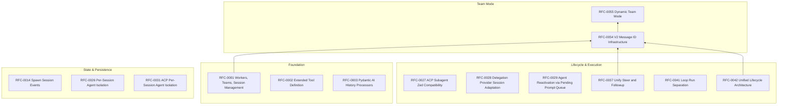

# 06: RFC Roadmap

This document maps the existing RFCs, their dependencies, and how they fit into
the broader architecture. It is a navigation aid, not a replacement for the RFCs
themselves.

## RFC categories

| Category | Meaning | Location |
|---|---|---|
| Implemented | The RFC has been implemented and merged. | `docs/rfcs/implemented/` |
| Accepted | The RFC has been approved but not yet fully implemented. | `docs/rfcs/accepted/` |
| Draft | The RFC is under discussion or waiting for implementation. | `docs/rfcs/draft/` |

## Architectural layers

## RFC dependency table

| RFC | Status | Depends on | Why it matters for Team Mode |
|---|---|---|---|
| RFC-0001 | Implemented | - | Original static team model. Defines `teams:` and session concepts. |
| RFC-0002 | Implemented | - | Tool definition patterns. Team tools follow this model. |
| RFC-0003 | Implemented | - | History processors. Relevant for member prompt construction. |
| RFC-0014 | Implemented | - | Spawn session events. Team member creation emits these events. |
| RFC-0026 | Implemented | - | Per-session agent isolation. Team members are isolated sessions. |
| RFC-0027 | Draft | - | ACP subagent compatibility. May affect team member protocols. |
| RFC-0028 | Draft | - | Delegation session adaptation. Relevant for `subagent` vs. team member lifecycle. |
| RFC-0029 | Draft | - | Pending prompt queue. Could be used for member inbox delivery. |
| RFC-0031 | Implemented | - | ACP per-session agent isolation. Cross-protocol isolation for team members. |
| RFC-0037 | Draft | - | Unify steer and followup. Team `send_message` reuses this delivery model. |
| RFC-0041 | Draft | - | Loop run separation. Clarifies `RunHandle` responsibilities. |
| RFC-0042 | - | - | Unified lifecycle architecture. Provides dimensions like Journal, SnapshotStore. |
| RFC-0054 | Draft | RFC-0037 | V2 message ID infrastructure. Provides `SessionPool.send_message` API. |
| RFC-0055 | Draft | RFC-0054 | Dynamic Team Mode. Built on the public message API. |

## Phase plan for Dynamic Team Mode

### Phase 0: Foundation stabilization (prerequisite)

Before Team Mode is fully implemented, the following must be stable:

- `SessionController` API: `receive_request`, `close_session`, `_get_active_run_handle`
- `SessionPool` public API: `send_message`, `run_agent`, `revoke_message`
- `SessionData.status` state machine
- Storage provider cleanup paths

This is tracked in [RFC-0055 design notes](../team-mode/RFC-0055-design-notes.md)
and GitHub issue #170.

### Phase 1: Team primitives

Add the minimal set of files:

- `TeamModeConfig` model
- `TeamCommCapability` (and related capabilities)
- `TeamService` or direct use of `SessionPool` + `RunHandle`
- File-based inbox, blackboard, task board

### Phase 2: Tool suite

Add LLM-visible tools:

- `team_create`
- `team_delete`
- `send_message`
- `read_blackboard` / `write_blackboard`
- `task_create` / `task_list` / `task_update`

### Phase 3: `auto_init` and polish

- Pre-initialize teams at session startup.
- Add TTL cleanup.
- Add tests and documentation.

## Current status summary

| RFC | Status | Blocker |
|---|---|---|
| RFC-0054 | Draft | Needs finalization of `SessionPool` public API |
| RFC-0055 | Draft | Blocked on RFC-0054 and issue #170 cleanup |

## How to add a new RFC to this map

When a new RFC is created, update this document with:

1. The RFC's position in the architectural layer.
2. Its dependencies.
3. Its relationship to Team Mode if any.
4. Whether it is a prerequisite, a parallel concern, or a future extension.

## Open questions

1. Should RFC-0042 be explicitly revived and linked to Team Mode, or is it
   superseded by later RFCs?
2. Is RFC-0029 (pending prompt queue) a better delivery mechanism for team
   messages than `steer/followup`?
3. Which RFCs should be implemented before `auto_init` can be safely added?
