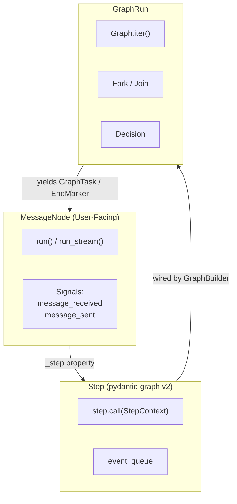

# Graph Architecture

AgentPool compiles agents and teams into pydantic-graph workflows. This provides step-by-step execution, fork/join parallelism, and graph-level observability while preserving the existing `MessageNode` public API.



## Agents as Steps

Every `MessageNode` (including agents and teams) exposes an internal `_step` property that wraps its execution logic as a pydantic-graph `Step`:

```python
class MessageNode[TDeps, TResult](ABC):
    @property
    @abstractmethod
    def _step(self) -> Step[AgentPoolState, TDeps, ChatMessage[Any], ChatMessage[TResult]]: ...
```

The `Step` receives a `StepContext` containing:
- `state`: `AgentPoolState` with prompts, kwargs, and event queue
- `deps`: Node dependencies (e.g., database connections)
- `inputs`: Input message (or `None` for root runs)

For single-node execution, `MessageNode.run()` builds a one-node graph and runs it via `Graph.run()`. `MessageNode.run_stream()` drives the same graph via `Graph.iter()`, draining the event queue after each step to yield `RichAgentStreamEvent` tokens.

## Teams as Graphs

**Sequential teams** compile to chained Steps:

```mermaid
flowchart LR
    start((start)) --> agent1[analyzer]
    agent1 --> agent2[reviewer]
    agent2 --> agent3[formatter]
    agent3 --> end((end))
```

**Parallel teams** compile to Fork + Join:

```mermaid
flowchart TB
    start((start)) --> fork{Fork}
    fork --> agent1[claude]
    fork --> agent2[goose]
    agent1 --> join{Join}
    agent2 --> join
    join --> end((end))
```

The `AgentPool` lazily builds the graph from registered nodes and `Talk` connections. The graph rebuilds automatically when nodes are added or removed.

## New `graph:` YAML Syntax

The `graph:` section maps directly to pydantic-graph's `GraphBuilder` API:

```yaml
graph:
  name: review_pipeline
  steps:
    - id: analyzer
      agent: analyzer
    - id: reviewer
      agent: reviewer
    - id: formatter
      agent: formatter
  # Implicit edges: start -> analyzer -> reviewer -> formatter -> end
```

**Parallel execution** uses list syntax for `to:` and `from:`:

```yaml
graph:
  name: parallel_analysis
  steps:
    - id: researcher
      agent: research_agent
    - id: analyst
      agent: analysis_agent
    - id: summarizer
      agent: summary_agent
  edges:
    - from: start
      to: [researcher, analyst]
    - from: [researcher, analyst]
      to: summarizer
    - from: summarizer
      to: end
```

**Conditional branching** via `condition:`:

```yaml
graph:
  steps:
    - id: classifier
      agent: classifier_agent
    - id: handle_error
      agent: error_agent
    - id: handle_success
      agent: success_agent
  edges:
    - from: classifier
      to: handle_error
      condition:
        type: match
        field: sentiment
        value: negative
    - from: classifier
      to: handle_success
      condition:
        type: match
        field: sentiment
        value: positive
```

**Edge transforms** via `transform:`:

```yaml
graph:
  steps:
    - id: extractor
      agent: extract_agent
    - id: formatter
      agent: format_agent
  edges:
    - from: extractor
      to: formatter
      transform: mymodule.prepare_input
```

**Map (iterable fan-out)**:

```yaml
graph:
  steps:
    - id: url_fetcher
      agent: fetch_agent
    - id: page_processor
      agent: process_agent
    - id: result_aggregator
      agent: aggregate_agent
  edges:
    - from: url_fetcher
      to: page_processor
      map: true
    - from: page_processor
      to: result_aggregator
      join: true
```

## Signal Behavior

AgentPool signals are emulated at pydantic-graph step boundaries via `SignalEmittingGraphRun`:

| Signal | Emission Point |
|---|---|
| `MessageNode.message_received` | When `GraphTask` is yielded (step about to run) |
| `MessageNode.message_sent` | On the next yield (step completed) |
| `Talk.connection_processed` | When edge traversal produces a new `GraphTask` |
| `Talk.message_forwarded` | When a transform is applied before continuing |

The wrapper intercepts `GraphRun.__anext__()` without subclassing, tracks previous tasks across yields, and maps `(source_node_id, destination_node_id)` tuples back to `Talk` instances.

## Streaming Behavior

Graph-based streaming uses `Graph.iter()` and maps yields to existing event types:

| Graph Yield | Event |
|---|---|
| `Sequence[GraphTask]` | `PartStartEvent` (one per task) |
| Step-internal streaming | `PartDeltaEvent` via `StepEventCollector` |
| Tool call invocation | `ToolCallStartEvent` + `ToolCallCompleteEvent` |
| `EndMarker` | `StreamCompleteEvent` with final `ChatMessage` |
| `ErrorMarker` | `RunErrorEvent` then re-raise |

A background task drives `Graph.iter()` and pushes events into an async queue, which `run_stream()` drains. This matches the existing native agent streaming pattern.

## Migration Guide: `teams:` to `graph:`

**Sequential team (legacy)**:
```yaml
# Legacy syntax — still supported
teams:
  review_pipeline:
    mode: sequential
    members: [analyzer, reviewer, formatter]
```

**Equivalent graph syntax**:
```yaml
graph:
  name: review_pipeline
  steps:
    - id: analyzer
      agent: analyzer
    - id: reviewer
      agent: reviewer
    - id: formatter
      agent: formatter
```

**Parallel team (legacy)**:
```yaml
# Legacy syntax — still supported
teams:
  parallel_coders:
    mode: parallel
    members: [claude, goose]
```

**Equivalent graph syntax**:
```yaml
graph:
  name: parallel_coders
  steps:
    - id: claude
      agent: claude
    - id: goose
      agent: goose
  edges:
    - from: start
      to: [claude, goose]
    - from: [claude, goose]
      to: end
```

**Agent connections (legacy)**:
```yaml
# Legacy syntax — still supported
agents:
  picker:
    connections:
      - type: node
        name: analyzer
```

**Equivalent graph syntax**:
```yaml
graph:
  steps:
    - id: picker
      agent: picker
    - id: analyzer
      agent: analyzer
  edges:
    - from: picker
      to: analyzer
```

Old configs with `teams:` or `connections:` are automatically translated to `GraphConfig` at load time. You can mix `graph:` with legacy sections, or migrate incrementally.
