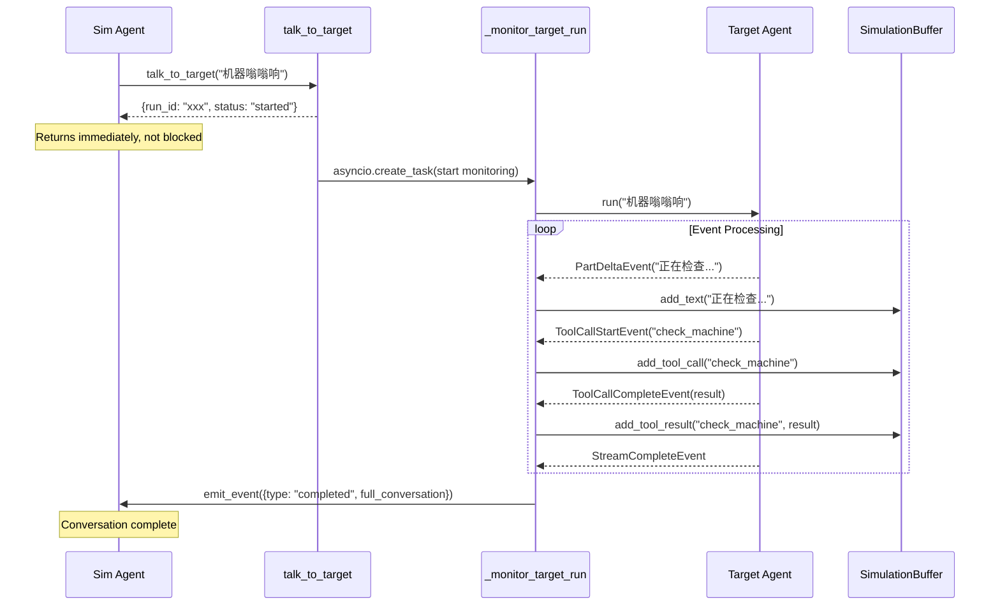
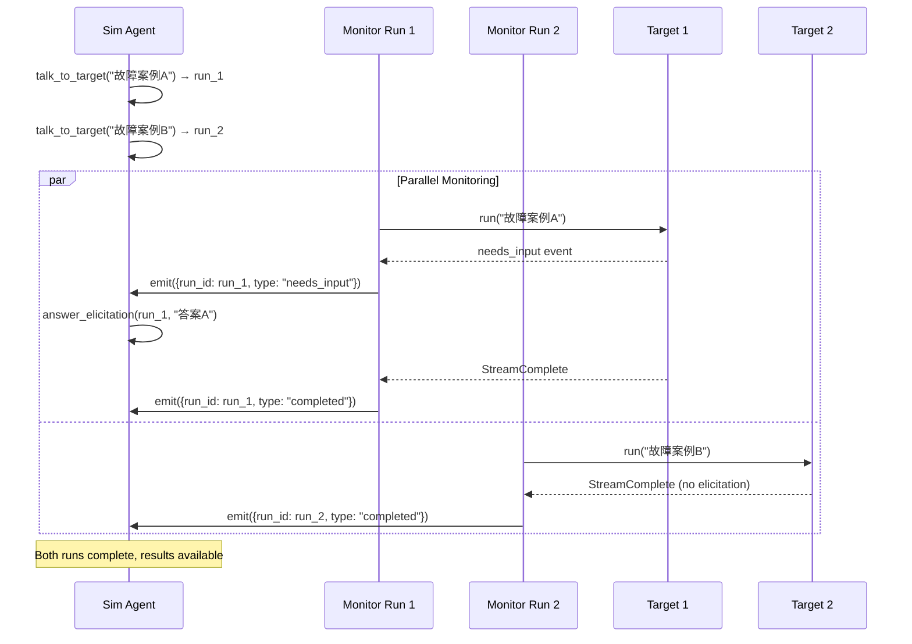

# RFC-0018: Agent Simulation Framework

## Overview

This RFC proposes a simulation framework for testing Agent behaviors through adversarial user simulation. The framework enables automated testing of Agents by simulating realistic user interactions.

**Key Design Choice**: A **simplified non-blocking architecture** combining `InputProvider` interception, `CustomEvent` notification, and text-based progress tracking.

The architecture enables bidirectional agent interaction where:
- Target Agent runs **in background** with elicitation requests intercepted by `InputProvider`
- All execution events are **accumulated as text** in `SimulationBuffer`
- Sim Agent is notified via **2 simple event types** (`needs_input`, `completed`)
- Sim Agent sees **formatted progress text**, not structured events
- Sim Agent submits answers through `answer_elicitation` tool to unblock Target

## Background & Context

### Current State

AgentPool provides powerful abstractions for agent interaction:

- **InputProvider**: Handles user input requests from agents
- **CustomEvent**: Cross-agent notification system
- **Tool System**: Standard pattern for agent delegation

### Problem Statement

When testing agents that require user clarification during task execution:

1. Target Agent may need to "ask the user" for information via tools
2. Simulated user (Sim Agent) must respond realistically
3. The simulation requires bidirectional communication:
   - Sim → Target: Send initial message
   - Target → Sim: Request clarification (elicitation)
   - Sim → Target: Provide answer
4. Multiple conversations may run concurrently

### Key Challenge

How do we intercept Target Agent's elicitation requests and route them to the Sim Agent without breaking AgentPool's standard execution flow?

## Goals & Non-Goals

### Goals

1. Enable automated simulation of user interactions with agents
2. Support multi-turn conversations with elicitation (bidirectional)
3. Maintain clean separation between Target Agent, Sim Agent, and coordination logic
4. Support concurrent simulations
5. Record complete conversation trajectories

### Non-Goals

1. Replace manual testing entirely
2. Simulate system-level load or performance testing
3. Support arbitrary programmatic simulation outside AgentPool patterns
4. Multi-session within single Target Agent instance (use separate instances)

## Recommended Architecture: Hybrid Approach

### Architecture Overview

The simplified solution uses background monitoring with text accumulation:

```
┌──────────────┐
│  Sim Agent  │──▶ talk_to_target("机器坏了") ──▶ 返回 run_id
└──────────────┘
                      │
                      ▼
              ┌──────────────┐
              │ 后台监控任务  │  asyncio.create_task(_monitor_target())
              └──────────────┘
                      │
        ┌─────────────┼─────────────┐
        ▼             ▼             ▼
   ┌─────────┐  ┌──────────┐  ┌──────────┐
   │Text     │  │Tool Call │  │Elicitation│
   │Delta    │  │Info      │  │Request    │
   └────┬────┘  └────┬─────┘  └────┬─────┘
        │            │             │
        └────────────┼─────────────┘
                     ▼
              ┌──────────────┐
              │ Text Buffer  │   Simple text accumulation
              │ "正在诊断... │   - Text deltas appended
              │ 使用了tool X │   - Tool results formatted
              │ 结果是..."   │   - Full context as string
              └──────┬───────┘
                     │
        ┌────────────┼────────────┐
        ▼            ▼            ▼
    继续累积     Elicitation   Run Complete
                  触发
                     │
                     ▼
              ┌──────────────┐
              │ CustomEvent  │   2 simple event types:
              │              │   - needs_input: progress+question
              │              │   - completed: full conversation
              └──────┬───────┘
                     │
                     ▼
              ┌──────────────┐
              │  Sim Agent   │   Sees formatted text progress
              │  Handler     │   Decides how to answer
              └──────────────┘
```

**Core Components:**

1. **`talk_to_target` Tool**: Non-blocking, returns `run_id` immediately, starts background monitoring

2. **SimulationBuffer**: Simple text accumulator - all events converted to readable text

3. **_monitor_target_run**: Background task that monitors Target's stream, fills buffer, emits events at key points

4. **InputProvider**: Intercepts elicitation, blocks Target until Sim Agent provides answer via tool

5. **2 Simple Events**: 
   - `needs_input`: {run_id, progress_so_far, question, request_id}
   - `completed`: {run_id, full_conversation}

### Benefits of This Approach

| Aspect | Benefit |
|--------|---------|
| **Simplicity** | Only 2 event types, text-based progress tracking |
| **Non-Blocking** | Sim Agent not blocked during Target execution |
| **Natural Understanding** | Sim Agent sees text progress like human reading logs |
| **Flexible Response** | Sim Agent's response logic determined by prompt, not hardcoded handlers |
| **Observable** | Full execution visible via CustomEvents |
| **Concurrent Ready** | Multiple runs monitored via different run_ids |

## Options Analysis

### Option 1: Simplified Non-Blocking Architecture (Recommended)

**Description**: Background monitoring with text buffer accumulation.

**Implementation**:
- `talk_to_target` returns `run_id` immediately (non-blocking)
- `_monitor_target_run` runs in background, accumulates all events as text
- Only **2 event types** emitted: `needs_input` and `completed`
- InputProvider still intercepts elicitation and blocks Target
- Sim Agent sees **formatted text progress**, not structured events

**Advantages**:
- ⭐ **Simple**: Only 2 event types vs 5+ in complex approaches
- ⭐ **Non-blocking**: Sim Agent can manage multiple runs concurrently
- ⭐ **Natural text interface**: Sim Agent reads progress like a log
- ⭐ **Flexible**: Response logic controlled by prompt, not hardcoded
- Clean separation of concerns
- Protocol-compliant (Target uses standard InputProvider)

**Disadvantages**:
- Requires custom InputProvider
- Background monitoring adds slight complexity

**Evaluation**: **10/10** - Simple yet powerful

---

### Option 2: Hybrid with Blocking talk_to_target (Previous)

**Description**: `talk_to_target` blocks until complete, only InputProvider blocks.

**Status**: **Replaced by Option 1**. Blocking design simpler but prevents concurrent run management.

---

### Option 3: Tool Detection Only (Fallback)

**Description**: Detect elicitation by monitoring tool calls, no custom InputProvider.

**Status**: Appendix A - when InputProvider cannot be configured.

**Advantages**:
- No custom InputProvider needed
- Simpler setup (2 components vs 3)
- Works with any Target Agent configuration

**Disadvantages**:
- Less clean separation
- Sim Agent must detect elicitation via tool return, not events
- Harder to support concurrent simulations
- Target Agent's tool execution temporarily suspended

**Evaluation**: 6/10 - Acceptable fallback when InputProvider unavailable

### Option 3: Exception-Based Interruption (Removed from primary)

**Description**: Raise custom exception when elicitation detected.

**Status**: Moved to Appendix A. Considered too surprising (exception-based control flow).

### Option 4: Cooperative Multitasking (Removed from primary)

**Description**: Real-time streaming event observation.

**Status**: Moved to Appendix A. Higher complexity, deferred to v2.

### Option 5: InputProvider Without Events (Removed from primary)

**Description**: InputProvider with direct Sim Agent reference, no CustomEvents.

**Status**: Removed. Events provide important observability and decoupling.

## Technical Design

### Component 1: SimulationBuffer - Simple Text Accumulator

```python
class SimulationBuffer:
    """Simple text buffer that accumulates all execution events as readable text.
    
    Sim Agent sees the accumulated context as plain text, not structured events.
    """
    
    def __init__(self, run_id: str):
        self.run_id = run_id
        self.lines: list[str] = []
    
    def add_text(self, text: str) -> None:
        """Add text fragment from PartDeltaEvent."""
        self.lines.append(text)
    
    def add_tool_call(self, name: str, args: dict) -> None:
        """Add tool call notification."""
        self.lines.append(f"\n[Calling tool: {name}]")
        if args:
            args_str = ", ".join(f"{k}={v}" for k, v in args.items())
            self.lines.append(f"  Arguments: {args_str}")
    
    def add_tool_result(self, name: str, result: Any) -> str:
        """Add tool result summary."""
        summary = self._summarize(result)
        self.lines.append(f"[Tool {name} result: {summary}]\n")
    
    def get_context(self) -> str:
        """Get accumulated context as single text block."""
        return "".join(self.lines)
    
    def _summarize(self, result: Any, max_len: int = 200) -> str:
        """Summarize tool result for display."""
        text = str(result)
        if len(text) > max_len:
            return text[:max_len] + "..."
        return text
```

### Component 2: Non-Blocking talk_to_target + Background Monitor

```python
class SimulationToolProvider(ResourceProvider):
    """Provides tools for Sim Agent to interact with Target Agent.
    
    Key design: Non-blocking initiation with background monitoring.
    All execution events accumulated as text, only 2 event types emitted.
    """
    
    def __init__(
        self,
        target_agent: Agent,
        input_provider: SimulationInputProvider,
        timeout: float = 300.0,
    ):
        self.target_agent = target_agent
        self.input_provider = input_provider
        self.timeout = timeout
        self._active_runs: dict[str, SimulationBuffer] = {}
    
    @tool
    async def talk_to_target(
        self,
        ctx: AgentContext,
        message: str,
    ) -> dict:
        """Send message to Target Agent and return immediately.
        
        Returns run_id immediately. Target runs in background,
        events monitored and accumulated as text.
        
        Returns:
            {"status": "started", "run_id": str}
        """
        run_id = str(uuid.uuid4())
        
        # Start background monitoring task
        asyncio.create_task(
            self._monitor_target_run(
                run_id=run_id,
                message=message,
                sim_ctx=ctx,
            )
        )
        
        return {
            "status": "started",
            "run_id": run_id,
            "message": f"Target run {run_id} started, monitoring in background",
        }
    
    async def _monitor_target_run(
        self,
        run_id: str,
        message: str,
        sim_ctx: AgentContext,
    ) -> None:
        """Background task: monitor Target execution, accumulate text, emit events.
        
        This runs independently of Sim Agent's main execution flow.
        """
        buffer = SimulationBuffer(run_id)
        self._active_runs[run_id] = buffer
        
        try:
            async for event in self.target_agent.run_stream(message):
                match event:
                    case PartDeltaEvent(content=text):
                        # Accumulate text
                        buffer.add_text(text)
                    
                    case ToolCallStartEvent(tool_name=name, args=args):
                        # Add tool call to buffer
                        buffer.add_tool_call(name, args)
                    
                    case ToolCallCompleteEvent(tool_name=name, result=result):
                        # Add tool result to buffer
                        buffer.add_tool_result(name, result)
                    
                    case ElicitationEvent(question=q, request_id=rid):
                        # KEY POINT: Emit event with accumulated context
                        await sim_ctx.events.custom({
                            "run_id": run_id,
                            "type": "needs_input",
                            "progress_so_far": buffer.get_context(),
                            "question": q,
                            "request_id": rid,
                        })
                        # Target blocks here in InputProvider until answer_elicitation called
                    
                    case StreamCompleteEvent():
                        # Run completed - emit final event
                        await sim_ctx.events.custom({
                            "run_id": run_id,
                            "type": "completed",
                            "full_conversation": buffer.get_context(),
                        })
        
        except Exception as e:
            # Error during monitoring
            await sim_ctx.events.custom({
                "run_id": run_id,
                "type": "error",
                "error": str(e),
                "partial_progress": buffer.get_context(),
            })
        
        finally:
            # Cleanup
            self._active_runs.pop(run_id, None)
    
    @tool
    async def answer_elicitation(
        self,
        ctx: AgentContext,
        request_id: str,
        answer: str,
        run_id: str | None = None,
    ) -> dict:
        """Answer a pending elicitation request from Target Agent.
        
        This unblocks the Target Agent's input request via InputProvider.
        
        Returns:
            {"status": "submitted" | "not_found"}
        """
        success = self.input_provider.submit_answer(request_id, answer)
        
        return {
            "status": "submitted" if success else "not_found",
            "request_id": request_id,
        }
```

### Component 3: SimulationInputProvider

```python
class SimulationInputProvider(InputProvider):
    """Intercepts Target Agent elicitation and blocks until answer provided.
    
    Used by Target Agent (not Sim Agent). Coordinates with 
    answer_elicitation tool via Future-based synchronization.
    """
    
    def __init__(self, timeout: float = 60.0):
        self.timeout = timeout
        self._pending: dict[str, asyncio.Future[str]] = {}
        self._lock = asyncio.Lock()
    
    async def prompt(
        self,
        message: str,
        request_id: str | None = None,
    ) -> str:
        """Called by Target Agent when it needs user input.
        
        Creates Future, blocks until Sim Agent submits answer via tool.
        """
        request_id = request_id or str(uuid.uuid4())
        future = asyncio.Future()
        
        async with self._lock:
            self._pending[request_id] = future
        
        try:
            # Wait for answer (submitted by answer_elicitation tool)
            return await asyncio.wait_for(future, timeout=self.timeout)
        finally:
            async with self._lock:
                self._pending.pop(request_id, None)
    
    def submit_answer(self, request_id: str, answer: str) -> bool:
        """Called by answer_elicitation tool to unblock Target."""
        future = self._pending.get(request_id)
        if future and not future.done():
            future.set_result(answer)
            return True
        return False
```

### Component 4: Sim Agent Event Handler

```python
async def on_simulation_event(ctx: AgentContext, event: CustomEvent) -> None:
    """Handle simulation events - Sim Agent sees formatted text progress.
    
    This is the only event handler Sim Agent needs. It receives:
    - needs_input: when Target asks a question (with full context)
    - completed: when Target finishes (with full conversation)
    """
    data = event.event_data
    event_type = data.get("type")
    
    if event_type == "needs_input":
        # Sim Agent sees progress as formatted text
        progress = data["progress_so_far"]
        question = data["question"]
        request_id = data["request_id"]
        run_id = data["run_id"]
        
        # Use LLM to decide answer (based on Sim Agent's system prompt/goal)
        # Or direct the Sim Agent to use answer_elicitation tool
        prompt = f"""Current Target Agent progress:
{progress}

Target is asking: {question}

Please provide a realistic answer as a test user would."""
        
        # In actual implementation, this would trigger the Sim Agent
        # to call answer_elicitation tool with the answer
        # The calling code would handle this via agent.run() or tool call
        
    elif event_type == "completed":
        # Target finished - full conversation available
        conversation = data["full_conversation"]
        run_id = data["run_id"]
        
        # Sim Agent can now start a new conversation or evaluate results
        
    elif event_type == "error":
        # Handle error
        error_msg = data.get("error", "Unknown error")
        partial = data.get("partial_progress", "")
```

### Data Flow Sequence Diagrams

#### Flow 1: Normal Response (No Elicitation)



#### Flow 2: Single Elicitation

```mermaid
sequenceDiagram
    participant S as Sim Agent
    participant T as talk_to_target
    participant M as _monitor_target_run
    participant TA as Target Agent
    participant IP as InputProvider
    participant B as SimulationBuffer
    
    S->>T: talk_to_target("机器有问题")
    T-->>S: {run_id: "xxx", status: "started"}
    
    T->>M: Start monitoring (background)
    M->>TA: run("机器有问题")
    
    loop Accumulate to Buffer
        TA-->>M: PartDeltaEvent("诊断中...")
        M->>B: add_text("诊断中...")
    end
    
    TA->>IP: prompt("什么型号？")
    Note over IP: Create Future, block
    
    Note over M: InputProvider triggers event emission
    M->>B: get_context() 获取累积文本
    M->>S: emit_event({
        type: "needs_input",
        progress_so_far: "诊断中...",
        question: "什么型号？",
        request_id: "..."
    })
    
    Note over S: Receives event with formatted progress
    S->>T: answer_elicitation(request_id, "TB-500")
    T->>IP: submit_answer(request_id, "TB-500")
    Note over IP: Future.set_result()
    IP-->>TA: "TB-500"
    Note over TA: Continue processing
    
    TA-->>M: StreamCompleteEvent
    M->>S: emit_event({type: "completed", full_conversation})
```

#### Flow 3: Sim Agent Managing Multiple Runs



### Error Handling

| Error Type | Detection Point | Handling Strategy | Recovery |
|------------|-----------------|-------------------|----------|
| **Sim Agent Not Responding** | `asyncio.wait_for()` in Provider | Return timeout error to Target | Target handles timeout, may retry |
| **Target Agent Crash** | try/except in `_monitor_target_run` | Emit error event to Sim | Sim Agent decides retry/abort |
| **Stale Request** | request_id not in `_pending` | Return `not_found` status | Sim should check event timing |
| **Buffer Leak** | Cleanup in `_monitor` finally | Remove from `_active_runs` | Automatic cleanup on completion/error |
| **Concurrent Access** | Lock in `_pending` access | Serializes access | Thread-safe by design |
| **Nested Elicitation Overflow** | depth tracking | Emit warning event | Log for investigation |
| **Monitor Crash** | try/except wrapper | Emit error event with partial buffer | Sim has partial context for recovery |

### Configuration

**YAML Configuration** (what can be configured):

```yaml
agents:
  # Target Agent
  diagnosis_target:
    type: native
    model: openai:gpt-4o
    # Must use SimulationInputProvider
    input_provider:
      type: simulation
      timeout: 60.0  # seconds to wait for Sim Agent answer
    # Storage for trajectory recording
    storage:
      type: sql
      connection: "sqlite:///simulation.db"
    tools:
      - name: question  # The elicitation tool
        enabled: true
      
  # Sim Agent
  sim_agent:
    type: native
    model: claude-sonnet-4-20250514
    system_prompt: |
      You are a test user simulating realistic interactions.
      
      Tools available:
      - talk_to_target: Send message to Target Agent
      - answer_elicitation: Answer Target Agent's questions
      
      When Target asks questions, answer naturally with realistic
      but not perfect information.
    toolsets:
      - type: simulation
        target: diagnosis_target
        # Simulation-specific config
        timeout: 300.0  # Overall conversation timeout
```

**Code Registration** (what must be done in code):

```python
# Event handler registration (code-only, not YAML)
async def on_elicitation_request(event: ElicitationRequestEvent) -> None:
    """Handle elicitation request from Target Agent.
    
    This is where Sim Agent logic decides how to answer.
    In a real implementation, this might:
    - Queue the question for manual review
    - Use LLM to generate answer based on scenario
    - Look up answer in predefined test data
    """
    if event.event_type != ElicitationRequestEvent.event_type:
        return
    
    # Get Sim Agent instance (from pool or context)
    sim_agent = get_sim_agent_for_target(event.target_agent_id)
    
    # Generate or retrieve answer
    answer = await generate_answer(event.question)
    
    # Submit answer via tool
    await sim_agent.run(
        f"Use answer_elicitation with request_id='{event.request_id}' "
        f"and answer='{answer}'"
    )


# Register handler at AgentPool initialization
async def setup_simulation_framework(pool: AgentPool) -> None:
    """Configure simulation framework with event handlers."""
    pool.register_event_handler(
        ElicitationRequestEvent.event_type,
        on_elicitation_request,
    )
```

**Why Event Handlers Cannot Be YAML-Configured:**

| Reason | Explanation |
|--------|-------------|
| **Code is Logic** | Event handlers contain executable logic for responding to elicitation |
| **Type Safety** | Handlers are typed callables requiring proper imports |
| **Security** | YAML-configured code execution is an anti-pattern |
| **Registration Timing** | Must be set at Agent construction time, not config load time |

### Trajectory Recording

Trajectory recording requires Target Agent to have storage configured:

```yaml
agents:
  diagnosis_target:
    type: native
    model: openai:gpt-4o
    storage:  # ← Required for trajectory recording
      type: sql
      connection: "sqlite:///trajectories.db"
```

Without storage, simulation runs but no trajectory is recorded.

## Implementation Plan

### Phase 1: Core Components (Week 1)

**Step 1: SimulationInputProvider**

```python
# File: src/agentpool/simulation/input_provider.py
class SimulationInputProvider(InputProvider):
    """Step 1 implementation - core blocking mechanism."""
    
    def __init__(self, timeout: float = 60.0):
        self.timeout = timeout
        self._pending: dict[str, asyncio.Future] = {}
        self._lock = asyncio.Lock()
    
    async def prompt(self, message: str, request_id: str | None = None) -> str:
        request_id = request_id or str(uuid.uuid4())
        future = asyncio.Future()
        
        async with self._lock:
            self._pending[request_id] = future
        
        try:
            # TODO: Emit event (Step 2)
            return await asyncio.wait_for(future, timeout=self.timeout)
        finally:
            async with self._lock:
                self._pending.pop(request_id, None)
    
    def submit_answer(self, request_id: str, answer: str) -> bool:
        future = self._pending.get(request_id)
        if future and not future.done():
            future.set_result(answer)
            return True
        return False
```

**Step 2: ElicitationRequestEvent**

```python
# File: src/agentpool/simulation/events.py
from dataclasses import dataclass
from agentpool.models import CustomEvent

@dataclass(frozen=True)
class ElicitationRequestEvent(CustomEvent):
    """Event to notify Sim Agent of pending elicitation."""
    event_type: ClassVar[str] = "simulation.elicitation_request"
    request_id: str
    target_agent_id: str
    question: str
    timestamp: float
```

**Step 3: SimulationToolProvider**

```python
# File: src/agentpool/simulation/tool_provider.py
class SimulationToolProvider(ResourceProvider):
    """Basic tools for Sim Agent."""
    
    def __init__(self, target_agent: Agent, input_provider: SimulationInputProvider):
        self.target_agent = target_agent
        self.input_provider = input_provider
    
    @tool
    async def talk_to_target(self, ctx: AgentContext, message: str) -> dict:
        """Send message to Target Agent."""
        result = await self.target_agent.run(message)
        return {"status": "completed", "response": result.data}
    
    @tool  
    async def answer_elicitation(self, ctx: AgentContext, request_id: str, answer: str) -> dict:
        """Answer Target Agent's pending question."""
        success = self.input_provider.submit_answer(request_id, answer)
        return {"status": "submitted" if success else "not_found"}
```

**Step 4: Integration Example**

```python
# Example: Setting up a complete simulation
async def demo_simulation():
    # 1. Create Target Agent with SimulationInputProvider
    input_provider = SimulationInputProvider(timeout=60.0)
    
    target_agent = Agent(
        name="diagnosis_target",
        model="openai:gpt-4o",
        input_provider=input_provider,
        tools=[question_tool],  # Elicitation tool
    )
    
    # 2. Create Sim Agent with SimulationToolProvider
    sim_provider = SimulationToolProvider(target_agent, input_provider)
    
    sim_agent = Agent(
        name="sim_agent",
        model="claude-sonnet-4",
        tools=sim_provider.get_tools(),
    )
    
    # 3. Register event handler (code-only)
    event_bus.register(ElicitationRequestEvent.event_type, my_handler)
    
    # 4. Run simulation
    async with AgentPool() as pool:
        pool.register_agent(target_agent)
        pool.register_agent(sim_agent)
        
        result = await sim_agent.run("Machine is making noise")
```

### Phase 2: Error Handling & Safety (Week 1-2)

1. **Nested Elicitation Protection**
   - Add `max_elicitation_depth` counter in InputProvider
   - Track depth per conversation context
   - Error on depth exceeded

2. **Timeout Improvements**
   - Per-request timeout configuration
   - Timeout event emission for observability
   - Partial response tracking

3. **Cleanup on Shutdown**
   - Cancel pending Futures
   - Clear `_pending` dict
   - Log warnings for unhandled requests

### Phase 3: Production Features (Week 2-3)

1. **YAML Configuration Support**
   - `input_provider.type: simulation` config
   - `toolsets.type: simulation` config
   - Timeout/deep parameters in YAML

2. **CLI Commands**
   - `agentpool simulate --sim-agent X --target Y`
   - Batch simulation runner
   - Trajectory export

3. **Evaluation Framework**
   - Trajectory analysis tools
   - Success criteria validators
   - Report generation

## Design Decisions Summary

| Decision | Choice | Rationale |
|----------|--------|-----------|
| **Primary Architecture** | Simplified Non-Blocking: Background monitoring + Text buffer | Simplicity, concurrent capability, natural text interface |
| **Event Types** | **2 only**: `needs_input`, `completed` | Minimal complexity for Sim Agent |
| **Sim Agent View** | Formatted text progress (not structured events) | Reads like a log, natural understanding |
| **Synchronization** | asyncio.Future per request in InputProvider | Blocks Target but not Sim Agent |
| **Blocking Model** | Sim Agent non-blocking, InputProvider blocks Target | Enables concurrent run management |
| **Fallback Architecture** | Tool Detection (no InputProvider needed) | When custom InputProvider unavailable |
| **Error Recovery** | Partial progress buffer on error | Sim Agent can recover from mid-run failures |

## Decision Record

**Status**: DRAFT - Updated to Simplified Non-Blocking Architecture

**Decision**: Implement Simplified Non-Blocking Architecture as primary approach:
- `talk_to_target` returns immediately with `run_id`
- Background `_monitor_target_run` accumulates events as text in `SimulationBuffer`
- Only 2 event types: `needs_input` and `completed`
- Sim Agent sees formatted text progress, not structured events
- InputProvider still intercepts elicitation and blocks Target

**Rationale**:
1. **Simplicity**: Only 2 event types vs 5+ in more complex approaches
2. **Non-blocking**: Sim Agent can manage multiple runs concurrently
3. **Natural text interface**: Sim Agent reads progress like a human reading logs
4. **Flexible response**: Logic controlled by prompt, response not in code
5. **Status**: Clean separation maintained, protocol-compliant

**Implementation Priority**:
1. **Phase 1 (v1)**: SimulationBuffer, non-blocking talk_to_target, 2-event monitor
2. **Phase 2 (v1.1)**: Error handling with partial buffer recovery
3. **Phase 3 (v2)**: Concurrent run management, batch simulations

**Out of Scope (for v1)**:
- Complex multi-event approaches (moved to Appendix)
- Real-time streaming observation (deferred)
- Multi-session single Target Agent (use separate instances)

---

## Appendix A: Alternative Approaches

### Approach 2: Tool Detection Without InputProvider

**When to Use**: When you cannot configure a custom InputProvider on Target Agent.

**Implementation**:
```python
class SimpleSimulationToolProvider(ResourceProvider):
    """Simpler version that detects elicitation via tool call monitoring."""
    
    async def talk_to_target(self, ctx: AgentContext, message: str) -> dict:
        """Send message and detect if Target asks questions.
        
        Returns:
            {
                "status": "completed" | "elicitation",
                "response": str | None,
                "questions": list | None,
            }
        """
        questions = []
        response_parts = []
        
        async for event in self.target.run_stream(message):
            if isinstance(event, PartDeltaEvent):
                response_parts.append(event.delta)
            
            # Detect elicitation via tool call
            if isinstance(event, ToolCallStartEvent):
                if event.tool_name in self.elicitation_tools:
                    questions.append({
                        "id": event.tool_call_id,
                        "text": event.args.get("prompt", ""),
                    })
        
        if questions:
            return {
                "status": "elicitation",
                "questions": questions,
                "partial_response": "".join(response_parts),
            }
        
        return {
            "status": "completed",
            "response": "".join(response_parts),
        }
```

**Trade-offs**:
- Simpler: No custom InputProvider needed
- Less clean: Sim Agent must handle detection logic
- Harder: Concurrent simulations more complex

### Approach 3: Exception-Based Interruption

**Idea**: Raise custom exception when elicitation detected.

```python
class ElicitationInterrupt(Exception):
    def __init__(self, questions: list, partial_response: str):
        self.questions = questions
        self.partial_response = partial_response

# In Provider
try:
    async for event in target.run_stream(message):
        if is_elicitation(event):
            raise ElicitationInterrupt(...)
except ElicitationInterrupt as e:
    return RunResult(status="elicitation", questions=e.questions)
```

**Status**: Not recommended. Exception-based control flow can be surprising.

### Approach 4: Cooperative Multitasking with Streaming

**Idea**: Real-time bidirectional streaming without blocking.

```python
# Both agents run concurrently, exchanging messages via queue
async def cooperative_simulation(sim_agent, target_agent):
    queue = asyncio.Queue()
    
    async def run_target():
        async for event in target_agent.run_stream():
            if is_elicitation(event):
                await queue.put(("elicitation", event))
            else:
                await queue.put(("output", event))
    
    async def run_sim():
        while True:
            msg_type, data = await queue.get()
            if msg_type == "elicitation":
                answer = await sim_agent.generate_answer(data)
                target_agent.provide_input(answer)
    
    await asyncio.gather(run_target(), run_sim())
```

**Status**: Higher complexity, deferred to v2.

## Appendix B: CLI Specification

```bash
# Run single simulation
agentpool simulate \
  --sim-agent engineer_sim \
  --target diagnosis \
  --scenario scenarios/motor_failure.yml

# Batch execution
agentpool simulate-batch \
  --sim-agent engineer_sim \
  --target diagnosis \
  --scenarios-dir scenarios/ \
  --output results/ \
  --parallel 4

# View trajectories
agentpool history view --agent diagnosis --session <session_id>

# Evaluate results
agentpool simulate-eval results/ --criteria criteria.yml
```

