# RFC-0050: AgentWolf v1.0 Foundation Architecture — Top-Level Abstractions and Relationships

## Overview

AgentPool has grown organically across 40+ RFCs, accumulating multiple entry points, parallel abstraction layers (ResourceProvider vs pydantic-ai Capability), and fragmented lifecycle management. This RFC defines the **top-level foundation architecture** for AgentPool v1.0 (codename "AgentWolf") — establishing six orthogonal layers, their boundaries, and their relationships.

This is a **baseline architecture RFC**: it does not design any single layer in detail. Instead, it defines the conceptual model that all future sub-RFCs align with. Think of it as the "zoomed-out" view — each layer merits its own deep-dive RFC, but the relationships between layers must be agreed upon first.

**Thesis**: AgentPool v1.0 is decomposed into six layers, each with a single responsibility and a well-defined interface to adjacent layers. All execution modes (standalone, protocol session, long-running task, channel wake-up), all protocol servers (ACP, OpenCode, AG-UI, OpenAI API, MCP), and all configuration patterns (single-file, multi-config, multi-tenant) are expressible as compositions of these six layers.

## Table of Contents

- [Background & Context](#background--context)
- [Problem Statement](#problem-statement)
- [Goals & Non-Goals](#goals--non-goals)
- [Evaluation Criteria](#evaluation-criteria)
- [Options Analysis](#options-analysis)
- [Recommendation](#recommendation)
- [Technical Design](#technical-design)
- [Security Considerations](#security-considerations)
- [Implementation Plan](#implementation-plan)
- [Open Questions](#open-questions)
- [Decision Record](#decision-record)
- [References](#references)

---

## Background & Context

### Current State

AgentPool's current architecture has grown through incremental RFCs, each solving a specific problem but without a unifying top-level model. The result is a system where:

1. **Five entry points** exist for agent execution (standalone `run()`, `SessionController`, `BackgroundTaskProvider`, `WatchCommand`, future channel gateway), each with its own lifecycle management
2. **Two parallel abstraction layers** coexist for tool/capability management: the deprecated `ResourceProvider` system and pydantic-ai's native `Capability`/`Toolset` system
3. **Config-to-runtime mapping** is implicit — `AgentPool` serves as both registry and factory, with no clear boundary between "what the YAML describes" and "what the runtime manages"
4. **Multi-tenant support** is absent — a single `AgentPool` instance loads one config and serves all users identically
5. **Protocol servers** are tightly coupled to Python — no language-agnostic boundary exists

The codebase has 9 top-level packages under `src/`:

| Package | Role |
|---------|------|
| `agentpool/` | Core agent framework (agents, delegation, messaging, tools, models, prompts, storage, hooks, observability) |
| `agentpool_config/` | YAML schema definitions (config models, separated for clean imports) |
| `agentpool_server/` | Protocol servers (ACP, OpenCode, AG-UI, OpenAI API, MCP) |
| `agentpool_toolsets/` | Reusable toolset implementations (builtin, MCP discovery, specialized) |
| `agentpool_storage/` | Storage providers (SQL, Zed, Claude, OpenCode) |
| `agentpool_cli/` | Command-line interface |
| `agentpool_commands/` | Command implementations |
| `agentpool_prompts/` | Prompt templates |
| `acp/` | ACP protocol implementation (client, agent, schema, bridge, transports) |

### Cross-Framework Research Summary

Research across six frameworks (documented in `docs/design/lifecycle-analysis.md`) reveals common patterns:

| Framework | Config Pattern | Runtime Pattern | Protocol Pattern |
|-----------|---------------|-----------------|-----------------|
| **pydantic-ai** | Programmatic + YAML | Agent + Capability/Toolset | None (library) |
| **hermes-agent** | YAML + Python | Narrow waist core + plugins | Gateway adapters |
| **opencode** | Programmatic | Session + Durable EventV2 | Protocol server |
| **ACP v2** | Protocol-defined | Session state machine | Protocol-native |
| **Temporal** | Code-first workflows | Workflow + Activity | gRPC |
| **K8s** | YAML (CRD) | Controller + Reconcile | API server |

**Key insight**: Every mature system separates (1) **configuration** (what to build), (2) **runtime infrastructure** (where to run), and (3) **execution** (how to run). AgentPool currently conflates all three in `AgentPool`.

### Historical Context

| Date | Change | Relevance |
|------|--------|-----------|
| 2026-04-26 | RFC-0029: `inject_prompt()`/`queue_prompt()` | First attempt at idle/wake |
| 2026-06-15 | RFC-0037: Unify steer/followup | Recognized dual-system redundancy |
| 2026-06-27 | RFC-0041: Run vs Turn separation | Restructured RunHandle to persistent state machine |
| 2026-07-08 | RFC-0042: Unified Lifecycle Architecture | Six pluggable dimensions (RunLoop, TriggerSource, Journal, SnapshotStore, CommChannel, EventTransport) |
| 2026-07-08 | RFC-0050 (this document) | Top-level foundation architecture |

### Glossary

| Term | Definition |
|------|------------|
| **ConfigRegistry** | Named pool of versioned configurations. The "etcd" of AgentWolf — stores YAML manifests, handles versioning, emits change notifications. |
| **AgentManifest** | Immutable parsed YAML configuration. The "CRD" — describes what agents, tools, teams, and servers to create. |
| **AgentHost** | Mutable runtime infrastructure for a single config. The "Controller" — owns MCP server processes, storage connections, skill registries, capability caches. One per (config_id, tenant_id). |
| **AgentFactory** | Compiles an AgentManifest + AgentHost into runnable agents. The "Reconcile loop" — creates/updates/deletes agents, teams, and graphs. |
| **RunLoop** | Core execution loop. Owns the idle/running/done state machine. Executes Turns. Defined by RFC-0041/0042. |
| **Turn** | Single reactive cycle: prompt → model → tools → response. Agent-type-specific (NativeTurn, ACPTurn). |
| **RunScope** | Strong-typed request context: `(config_id, tenant_id, user_id, session_id)`. Routes protocol requests to the correct Host + Factory. |
| **Capability** | pydantic-ai's `AbstractCapability` — the plugin primitive. Bundles instructions, tools, toolsets, and lifecycle hooks. |
| **Toolset** | pydantic-ai's `AbstractToolset` — a collection of tools with shared lifecycle. |
| **MessageNode** | Base abstraction for all processing units (Agents, Teams). Provides unified `process()` interface and connection management. |
| **ProtocolServer** | Translates between external wire protocols (ACP, OpenCode, AG-UI, OpenAI API, MCP) and internal RunLoop execution. |
| **StorageProvider** | Analytical storage — interaction history, sessions, messages. Permanent, relational-query-oriented. |
| **Journal** | Event-layer persistence (WAL pattern). Append + upsert. Crash recovery via replay. Owned by CommChannel. |
| **SnapshotStore** | Loop-layer state persistence (checkpoint pattern). Turn boundary snapshots. Idempotency keys. Owned by RunLoop. |

---

## Problem Statement

### Problem 1: No Top-Level Architecture Document

AgentPool has 40+ RFCs each addressing specific features, but no document defines the top-level abstractions and their relationships. New contributors must reverse-engineer the mental model from code. This RFC fills that gap.

### Problem 2: Config/Runtime/Execution Conflation

`AgentPool` currently serves as:
- Config loader (parses YAML)
- Runtime registry (holds agent instances)
- Factory (creates agents from config)
- Infrastructure manager (owns MCP servers, storage)
- Protocol server host (runs ACP/OpenCode/AG-UI)

These five roles are entangled in one class. Multi-tenant support, dynamic config reloading, and independent scaling are all blocked by this conflation.

### Problem 3: Dual Abstraction Layers

The deprecated `ResourceProvider` system coexists with pydantic-ai's `Capability`/`Toolset` system. This creates:
- Conceptual confusion (which to use?)
- Maintenance burden (two parallel code paths)
- A bridge layer (`as_capability()`) that adds complexity without value

### Problem 4: No Multi-Tenant/Multi-Config Support

A single `AgentPool` instance loads one config and serves all users identically. There is no way to:
- Serve multiple configs from one server process
- Isolate tenants (different MCP servers, storage, skills per tenant)
- Dynamically load/unload configs without restart
- Route protocol requests to the correct config

### Problem 5: Protocol Layer Coupled to Python

All protocol servers are Python-only, in-process. No language-agnostic boundary exists for polyglot deployments.

### Impact of Inaction

- Architecture remains undocumented; every new contributor faces the same learning curve
- Multi-tenant support requires ad-hoc hacks rather than structural design
- Dual abstraction layers continue to diverge
- Each new execution mode requires a new entry point
- Protocol layer cannot be replaced or polyglot-deployed

---

## Goals & Non-Goals

### Goals (In Scope)

1. **Define six top-level layers** with clear boundaries and interfaces
2. **Establish the conceptual model** that all future sub-RFCs align with
3. **Map existing concepts** (AgentPool, ResourceProvider, Agent, Protocol) to the new layers
4. **Define multi-tenant architecture** via ConfigRegistry + HostRegistry + RunScope
5. **Establish migration direction** from current architecture to v1.0
6. **Use mermaid diagrams** to make relationships visually clear

### Non-Goals (Out of Scope)

1. **Detailed layer design**: Each layer gets its own deep-dive RFC
2. **Implementation code**: This RFC defines interfaces and relationships, not implementations
3. **Migration plan**: Deferred to individual sub-RFCs
4. **RFC-0042 replacement**: This RFC complements RFC-0042 (lifecycle dimensions) by providing the top-level context RFC-0042 sits within
5. **Specific protocol implementations**: ACP/OpenCode/AG-UI details are separate efforts
6. **Storage schema design**: StorageProvider/Journal/SnapshotStore interfaces only

---

## Evaluation Criteria

| Criterion | Weight | Measurement |
|-----------|--------|-------------|
| **Conceptual clarity** | High | A new contributor can understand the architecture from this RFC alone |
| **Layer orthogonality** | High | Changing one layer doesn't require changing others |
| **Multi-tenant support** | High | Multiple configs + tenants served from one process |
| **Backward compatibility** | High | Existing YAML configs and Python APIs continue to work |
| **Migration feasibility** | Medium | Each layer can be migrated independently |
| **Alignment with pydantic-ai** | High | Leverages native Capability/Toolset, not parallel abstractions |
| **Diagram quality** | Medium | Mermaid diagrams clearly show all key relationships |

---

## Options Analysis

### Option 1: Six-Layer Separation (Recommended)

**Description**: Decompose AgentPool into six orthogonal layers, each with a single responsibility:

```
ConfigRegistry → AgentHost → AgentFactory → RunLoop → Agent Core → ProtocolServer
```

**Advantages**:
- Each layer is independently swappable and testable
- Multi-tenancy is a natural composition (ConfigRegistry holds multiple configs, HostRegistry holds multiple Hosts)
- Aligns with K8s CRD→Controller pattern (proven at scale)
- pydantic-ai Capability/Toolset fits cleanly as the Agent Core's extension mechanism
- RFC-0042's six dimensions sit entirely within the RunLoop layer

**Disadvantages**:
- 6 new abstractions to learn (but each is well-understood from existing frameworks)
- Requires significant refactoring from current monolithic AgentPool
- AgentHost and AgentFactory boundaries may shift during implementation

### Option 2: Monolithic AgentPool with Mode Parameter

**Description**: Keep AgentPool as a single class, add `mode` parameter for different behaviors.

**Advantages**:
- Simpler mental model (one class)
- Less refactoring required
- Easy to understand for new users

**Disadvantages**:
- Not orthogonal: changing one concern requires modifying AgentPool
- Multi-tenancy requires multiple AgentPool instances (heavy)
- Violates open/closed principle
- Does not align with cross-framework research

### Option 3: Plugin-Based Architecture

**Description**: AgentPool has a plugin system; each concern (config, runtime, protocol) is a plugin.

**Advantages**:
- Extensible without code changes
- Community can contribute plugins

**Disadvantages**:
- Plugin discovery and lifecycle adds complexity
- Too loose: no clear contract between plugins
- Overlaps with pydantic-ai Capability system
- Does not solve multi-tenancy

### Comparison Matrix

| Criterion | Option 1 (6 Layers) | Option 2 (Mode Param) | Option 3 (Plugins) |
|-----------|--------------------|-----------------------|-------------------|
| Conceptual clarity | ✅ Clear | ⚠️ One class, many modes | ❌ Too abstract |
| Layer orthogonality | ✅ Full | ❌ Coupled | ⚠️ Partial |
| Multi-tenant support | ✅ Natural | ❌ Multiple instances | ❌ No improvement |
| Backward compatibility | ✅ Wrappers | ✅ Add mode param | ⚠️ Plugin migration |
| Migration feasibility | ✅ Phased | ✅ Simple | ⚠️ Plugin system first |
| pydantic-ai alignment | ✅ Native | ❌ Parallel | ⚠️ Overlaps |

---

## Recommendation

**Option 1: Six-Layer Separation** — ConfigRegistry → AgentHost → AgentFactory → RunLoop → Agent Core → ProtocolServer.

This is the only option that achieves full orthogonality while supporting multi-tenancy structurally rather than as an afterthought. The six-layer model maps cleanly to proven patterns (K8s CRD→Controller, Temporal Workflow→Worker, pydantic-ai Agent→Capability) and provides a natural home for RFC-0042's lifecycle dimensions within the RunLoop layer.

Key design decisions:

1. **ConfigRegistry is the single source of truth** — named, versioned configs. All runtime objects derive from a registered config.
2. **AgentHost is the infrastructure boundary** — one per (config_id, tenant_id). Owns MCP servers, storage connections, skill registries.
3. **AgentFactory is the compilation step** — transforms immutable manifest + host into runnable agents. Pre-compiles graphs by default.
4. **RunLoop is RFC-0042's domain** — the six lifecycle dimensions (TriggerSource, Journal, SnapshotStore, CommChannel, EventTransport) are injected here.
5. **Agent Core is pydantic-ai's domain** — Capability/Toolset system is the extension mechanism. ResourceProvider is deleted.
6. **ProtocolServer is the polyglot boundary** — translates external protocols to RunLoop operations. May be in-process or MQ-decoupled.

---

## Technical Design

### The Six Layers

The following diagram shows the complete architecture from YAML config to protocol client:

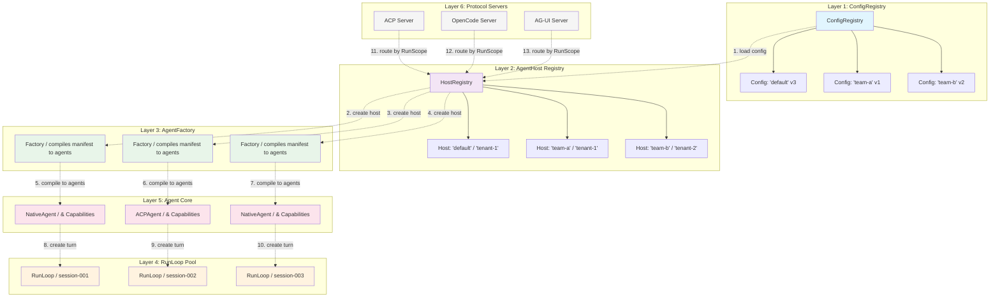

### Layer 1: ConfigRegistry

**Responsibility**: Store, version, and serve YAML configurations.

```mermaid
graph LR
    subgraph ConfigRegistry
        Store["ConfigStore / in-memory / file / etcd"]
        Reg[ConfigRegistry]
        V1["Config 'default' v1"]
        V2["Config 'default' v2"]
        V3["Config 'default' v3"]
        Current["Config 'default' CURRENT = v3"]
        
        Store --> V1
        Store --> V2
        Store --> V3
        V3 --> Current
    end
    
    YAML1["agents.yml (file)"] -->|load| Store
    YAML2["agents.yml (HTTP)"] -->|load| Store
    PY["config.py (programmatic)"] -->|load| Store
    
    Reg -->|get(config_id='default')| Current
    Reg -->|list()| List["['default', 'team-a', 'team-b']"]
    Reg -->|watch()| Notify["change notifications"]
    
    style Store fill:#e1f5fe
    style Reg fill:#e1f5fe
    style Current fill:#b3e5fc
```

**Interface**:
```python
class ConfigRegistry:
    async def register(self, config_id: str, manifest: AgentsManifest) -> ConfigVersion
    async def get(self, config_id: str) -> AgentManifest
    async def list(self) -> list[str]
    async def watch(self, config_id: str) -> AsyncIterator[ConfigChange]
    async def unregister(self, config_id: str) -> None
```

**Key properties**:
- Configs are **immutable** once registered; updates create new versions
- ConfigRegistry is the **single source of truth** — all runtime objects derive from a registered config
- Config changes emit **notifications** → AgentHosts can hot-reload
- Backed by ConfigStore (in-memory for dev, file for standalone, etcd/DB for production)

**Analogy**: K8s etcd — stores CRDs, emits watch events, versioned.

#### Config Split: HostConfig vs AgentManifest

The root config `AgentsManifest` splits into two sections with different owners, change costs, and multi-tenancy implications:

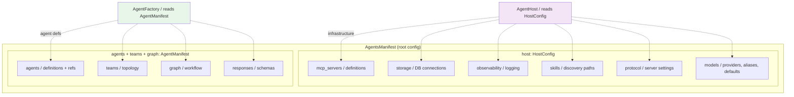

**Separation rationale**:

| Dimension | HostConfig → AgentHost | AgentManifest → AgentFactory |
|-----------|------------------------|------------------------------|
| Manages | Infrastructure (processes, connections, discovery) | Agent definitions (models, capabilities, topology) |
| Change cost | High (restart MCP processes, reconnect DB) | Low (recompile agents, diff-based) |
| Multi-tenant | Per-tenant different (different MCP, storage) | Can be shared across tenants |
| Multi-config | Can be shared across configs | Per-config different |
| Hot-reload | `AgentHost.reload()` — rebuild infrastructure | `AgentFactory.recompile()` — rebuild agents |

**Key design: reference, not definition**. MCP server definitions live in `host.mcp_servers` (infrastructure). Agents reference them by name (`- mcp: filesystem`) in their capability list. This separates "what an MCP server IS" from "which agent uses WHICH server":

```yaml
# === Host Configuration (Layer 1-2: AgentHost) ===
host:
  mcp_servers:
    filesystem:                    # DEFINITION: command, args, lifecycle
      command: "uvx mcp-server-filesystem"
      args: ["/tmp"]
    git:
      command: "uvx mcp-server-git"
  
  storage:
    provider: sql
    database: "sqlite:///agentpool.db"
  
  observability:
    logfire: {enabled: true}
  
  skills:
    discovery_paths:
      - "~/.claude/skills"
      - ".claude/skills"
  
  protocol:
    acp: {port: 8080}
    opencode: {port: 8081}
  
  models:
    providers: ...     # see Model Configuration below
    aliases: ...       # see Model Configuration below
    defaults: ...      # see Model Configuration below

# === Agent Manifest (Layer 3: AgentFactory) ===
agents:
  coder:
    type: native
    model: smart                   # REFERENCE: alias, resolved by host
    capabilities:
      - mcp: filesystem            # REFERENCE: name, resolved by host
      - mcp: git
      - skill: example-skill
      - subagent: true
  
  reviewer:
    type: native
    model: claude                  # different alias
    capabilities:
      - mcp: filesystem            # same server, shared connection

teams:
  review_pipeline:
    mode: sequential
    members: [coder, reviewer]
```

**Config model**:

```python
class AgentsManifest(BaseModel):
    """Root config. Contains both host and agent sections."""
    host: HostConfig = HostConfig()
    agents: dict[str, AgentConfig] = {}
    teams: dict[str, TeamConfig] = {}
    graph: GraphConfig | None = None
    responses: dict[str, ResponseSchema] = {}


class HostConfig(BaseModel):
    """Infrastructure config. Maps to AgentHost (Layer 2).
    
    Changes trigger AgentHost.reload() — expensive:
    restart MCP processes, reconnect storage, re-scan skills.
    """
    mcp_servers: dict[str, MCPServerConfig] = {}
    storage: StorageConfig = StorageConfig()
    observability: ObservabilityConfig = ObservabilityConfig()
    skills: SkillsConfig = SkillsConfig()
    protocol: ProtocolConfig = ProtocolConfig()
    models: ModelsConfig = ModelsConfig()


class AgentConfig(BaseModel):
    """Agent definition. Maps to AgentFactory.compile() (Layer 3).
    
    Changes trigger AgentFactory.recompile() — cheap:
    diff old vs new, recreate only affected agents.
    """
    type: Literal["native", "acp", "file"]
    model: str | ModelSpec | None = None  # alias or full spec, None = host default
    capabilities: list[CapabilityRef] = []  # references, not definitions
    # ...
```

**Backward compatibility**: v0.x flat config (no `host:` section) auto-migrates. `mcp_servers`, `storage`, `observability` at root level are extracted into `HostConfig` by a model validator.

!!! note "Implementation Timing"
    The config split (HostConfig vs AgentManifest) is **deferred to Phase 3** of the implementation plan. Phase 1a extracts only the runtime structures (`HostContext` dataclass + `AgentFactory`) from `AgentPool` without modifying the config model. The flat `AgentsManifest` works throughout Phase 1 and Phase 2 — `AgentFactory.compile()` reads agent/team/graph sections from the flat manifest. When Phase 3 introduces multi-config versioning, the `host:` section is added as an optional field with auto-migration. See Implementation Plan for details.

**Multi-tenancy value**: Different tenants can share the same `AgentManifest` with different `HostConfig` (different MCP servers, storage, API keys). Different configs can share the same `HostConfig` with different `AgentManifest` (same infrastructure, different agents).

#### Model Configuration

Model config has three layers of concern that must not be mixed:

| Layer | Concern | Location | Example |
|-------|---------|----------|---------|
| Provider config | API keys, base URLs, proxies, timeouts | `host.models.providers` | `openai: {api_key: ...}` |
| Model aliases | Name resolution, fallback chains, defaults | `host.models.aliases` | `smart: openai:gpt-4o` |
| Agent selection | Which alias to use, temperature, max_tokens | `agent.model`, `agent.temperature` | `model: smart, temperature: 0.2` |

```yaml
host:
  models:
    # === Provider config (infrastructure: secrets, connections) ===
    providers:
      openai:
        api_key: ${OPENAI_API_KEY}
        base_url: https://api.openai.com/v1
      anthropic:
        api_key: ${ANTHROPIC_API_KEY}
      azure:
        api_key: ${AZURE_API_KEY}
        base_url: https://myazure.openai.azure.com
        api_version: "2024-06-01"
    
    # === Model aliases (shared definitions: change once, affects all) ===
    aliases:
      fast: openai:gpt-4o-mini
      smart: openai:gpt-4o
      claude: anthropic:claude-sonnet-4-0
      resilient:
        type: fallback
        models: [openai:gpt-4o, anthropic:claude-sonnet-4-0]
    
    # === Defaults (used when agent doesn't specify) ===
    defaults:
      model: smart
      temperature: 0.7
      max_tokens: 4096

agents:
  coder:
    model: smart              # alias → resolved by host
    temperature: 0.2          # override default
    
  reviewer:
    model: claude             # different alias
    max_tokens: 8192
    
  simple_task:
    # no model specified → uses host.models.defaults.model (smart)
    # no temperature → uses defaults.temperature (0.7)
```

**Resolution flow**:

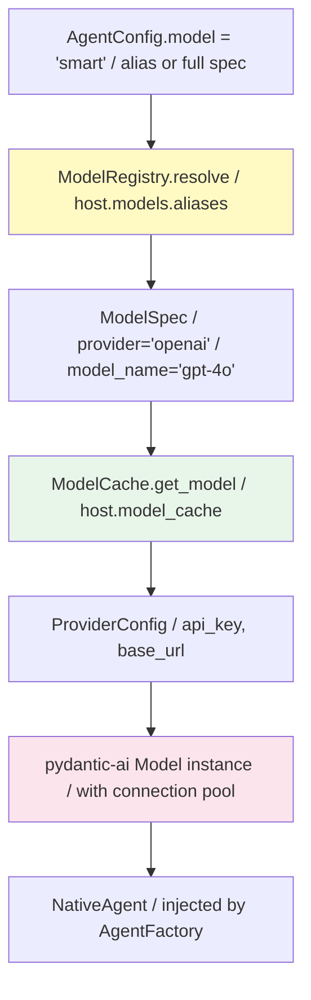

AgentFactory is the resolution point — it reads both AgentConfig and HostConfig to produce a pydantic-ai Model instance:

```python
class AgentFactory:
    async def compile(self, manifest, host_context):
        for name, agent_config in manifest.agents.items():
            # 1. Resolve model alias → full spec
            model_spec = host_context.model_registry.resolve(
                agent_config.model or host_context.model_registry.default_model
            )
            # 2. Get/create Model instance (cached, shared)
            model = await host_context.model_cache.get_model(model_spec)
            # 3. Merge parameters: agent override > host default
            params = {
                "temperature": agent_config.temperature
                    or host_context.model_registry.default_temperature,
                "max_tokens": agent_config.max_tokens
                    or host_context.model_registry.default_max_tokens,
            }
            # 4. Construct agent
            agent = NativeAgent(model=model, model_params=params, ...)
```

**ModelCache — connection sharing**:

Model instances are expensive to create (HTTP client init, connection pooling). Same-host agents using the same model share a single Model instance:

```python
class ModelCache:
    """Lazy-created, shared pydantic-ai Model instances.
    
    Owned by AgentHost (Layer 2). AgentFactory (Layer 3) calls get_model().
    Keyed by (provider, model_name) — not by alias.
    Two agents using aliases 'smart' and 'gpt4' that both resolve to
    'openai:gpt-4o' share the same Model instance.
    """
    
    def __init__(self, providers: dict[str, ProviderConfig]):
        self._providers = providers
        self._cache: dict[tuple[str, str], Model] = {}
    
    async def get_model(self, spec: ModelSpec) -> Model:
        key = (spec.provider, spec.model_name)
        if key not in self._cache:
            provider_config = self._providers[spec.provider]
            self._cache[key] = self._construct(spec, provider_config)
        return self._cache[key]
```

**Fallback models**: Fallback is model composition, not a separate provider. AgentFactory resolves the fallback chain from the alias, then uses ModelCache for each individual model:

```python
class AgentFactory:
    async def _resolve_model(self, spec, host_context):
        if spec.type == "fallback":
            models = [
                await host_context.model_cache.get_model(s) 
                for s in spec.models
            ]
            return FallbackModel(models)
        return await host_context.model_cache.get_model(spec)
```

**Multi-tenant model isolation**: Different tenants can have different API keys or providers while sharing the same AgentManifest. Agent `model: smart` resolves differently per tenant:

```yaml
# Tenant A: direct OpenAI
host:
  models:
    providers:
      openai: {api_key: ${TENANT_A_OPENAI_KEY}}

# Tenant B: Azure OpenAI (same model name, different endpoint)
host:
  models:
    providers:
      openai: {api_key: ${TENANT_B_AZURE_KEY}, base_url: https://tenant-b.openai.azure.com}

# Both tenants share the same AgentManifest — agent writes model: smart
```

**Dynamic model selection (runtime)**: If an agent needs to switch models based on task complexity, this is runtime behavior handled by a Capability, not config:

```python
class ModelRoutingCapability(AbstractCapability):
    """Dynamically selects model based on task complexity.
    NOT config — it's runtime behavior. Agent still has a default
    model in config; this capability can override it per-turn.
    """
    async def before_model_request(self, ctx, prompt):
        complexity = assess_complexity(prompt)
        if complexity == "high":
            ctx.deps.session.override_model = "smart"
        else:
            ctx.deps.session.override_model = "fast"
```

**Backward compatibility**: v0.x `model: "openai:gpt-4o"` (direct string) still works. ModelRegistry detects strings that aren't aliases and treats them as `provider:model` specs directly.

### Layer 2: AgentHost (via HostRegistry)

**Responsibility**: Own mutable runtime infrastructure for one (config_id, tenant_id) pair.

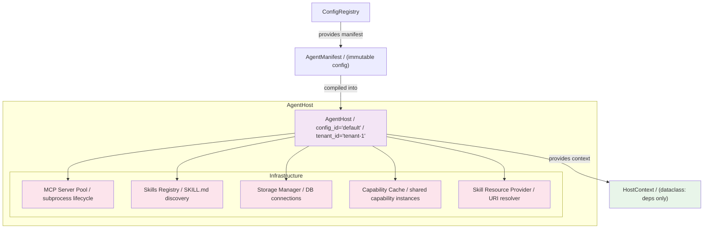

**Interface**:
```python
class AgentHost:
    config_id: str
    tenant_id: str
    manifest: AgentManifest  # immutable reference
    
    # Infrastructure (mutable, shared across all agents in this host)
    mcp_servers: MCPServerPool
    skills_registry: SkillsRegistry
    storage: StorageManager
    capability_cache: CapabilityCache
    prompt_manager: PromptManager
    model_registry: ModelRegistry      # alias resolution + defaults
    model_cache: ModelCache            # shared pydantic-ai Model instances
    
    # NOTE: AgentFactory is NOT owned by AgentHost.
    # It is a standalone service that receives (manifest, host_context) as parameters.
    # See Layer 3 for details.
    
    async def start(self) -> None
    async def stop(self) -> None
    async def reload(self, new_manifest: AgentManifest) -> None  # hot-reload
    def get_context(self) -> HostContext  # produce dependency injection bundle
```

**HostContext** — the dependency injection bundle that replaces `MessageNode.agent_pool`:

```python
@dataclass(frozen=True)
class HostContext:
    """Carries only what agents need — not the full AgentHost.
    
    This replaces the v0.x `MessageNode.agent_pool` backdoor where every agent
    could reach the entire pool (storage, mcp, skills, connection_registry).
    HostContext carries only specific dependency handles, enforcing layer
    boundaries and enabling tenant isolation.
    """
    mcp: MCPServerPool
    storage: StorageManager
    skills_registry: SkillsRegistry
    capability_cache: CapabilityCache
    prompt_manager: PromptManager
    model_registry: ModelRegistry   # alias resolution
    model_cache: ModelCache         # shared Model instances
    config_id: str
    tenant_id: str
```

**Key properties**:
- One AgentHost per (config_id, tenant_id) pair — **tenant isolation boundary**
- Owns **shared infrastructure**: MCP server processes, storage connections, skill registries
- **Mutable**: can hot-reload when config changes (stop old agents, start new ones)
- **HostRegistry** manages lifecycle: create on demand, cache, evict on idle
- The `AgentPool` class from v0.x becomes a thin wrapper around a single AgentHost
- **Does NOT own AgentFactory** — Factory is a standalone service (see Layer 3)
- **HostContext replaces `agent_pool` reference** — agents receive `HostContext`, not `AgentHost`, preventing backdoor access to pool-wide state

**Critical migration blocker**: `MessageNode.agent_pool` is currently a direct reference to the full `AgentPool` on every agent and team. This backdoor spans Layers 2-5 and must be replaced with `HostContext` injection before tenant isolation is meaningful. This is the single highest-priority refactor in Phase 1.

**Analogy**: K8s Controller — one controller per CRD instance, owns reconciler loop, manages child resources.

### Layer 3: AgentFactory

**Responsibility**: Compile an AgentManifest + AgentHost into runnable agents, teams, and graphs.

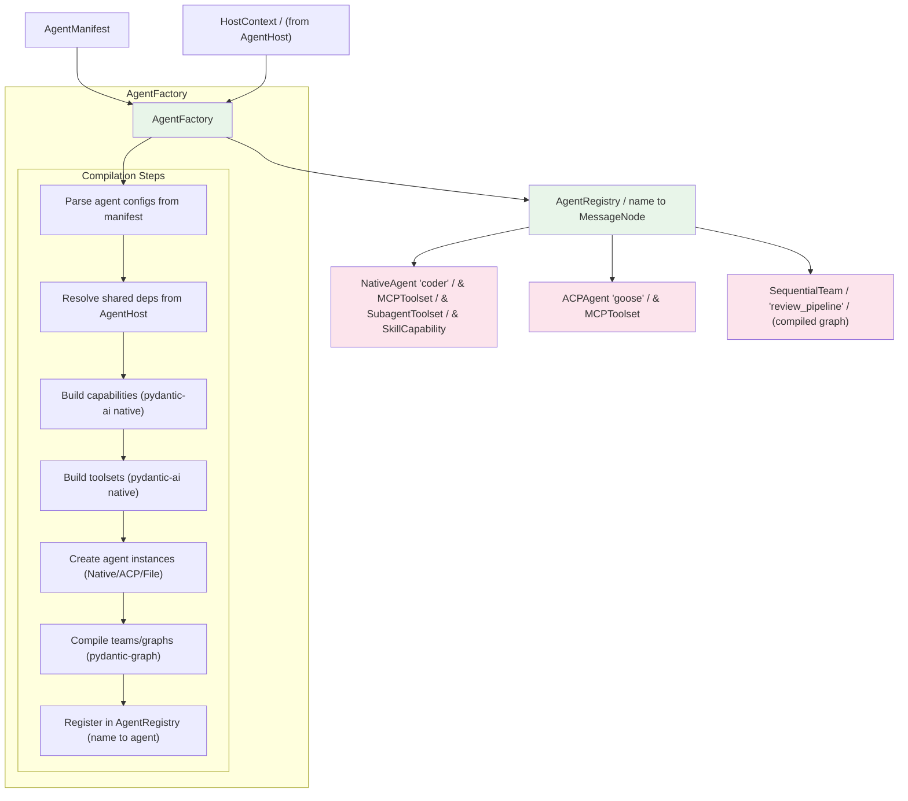

**Interface**:
```python
class AgentFactory:
    """Standalone compilation service — NOT owned by AgentHost.
    
    Receives (manifest, host_context) as method parameters.
    Maintains an internal compilation cache (read-only state) for
    diff-based recompile efficiency. This is NOT 'pure function' —
    caching is necessary because pydantic-graph compilation is expensive.
    """
    
    async def compile(
        self, manifest: AgentManifest, host: HostContext
    ) -> AgentRegistry:
        """Full compilation from manifest + host context."""
        ...
    
    async def recompile(
        self, new_manifest: AgentManifest, host: HostContext
    ) -> AgentRegistry:
        """Diff-based hot-reload. Only recreate agents whose config changed.
        Uses internal cache to diff old vs new manifest.
        """
        ...
```

**Key properties**:
- **Standalone service** — not owned by AgentHost. Receives `(manifest, host_context)` as parameters.
- **Compilation cache** — maintains previous compilation results internally for diff-based recompile. This is read-only state, not mutable infrastructure. A truly stateless factory would recompile everything on every call — unacceptable for hot-reload performance.
- **No I/O side effects** — compilation is pure transformation: manifest + host_context → registry. Does not start MCP servers, open database connections, or write to storage.
- **Pre-compiles graphs** by default — teams become pydantic-graph workflows at compile time, not runtime.
- **Capability-based** — uses pydantic-ai's `AbstractCapability` and `AbstractToolset` natively. No ResourceProvider.
- **Diff-based recompile** — on config change, only affected agents are recreated.
- The factory is the **only** place where config → runtime mapping happens.

**Design clarification**: "Standalone service" means lifecycle decoupling — Factory's lifecycle is not tied to Host's. It does NOT mean "pure function with no internal state". The compilation cache is essential for performance. The distinction that matters is: Factory doesn't own infrastructure (MCP processes, storage connections) — it only transforms config + dependency handles into agent instances.

**Analogy**: K8s Reconcile loop — watches config changes, creates/updates/deletes runtime objects to match desired state.

### Layer 4: RunLoop

**Responsibility**: Drive the idle → running → idle | done cycle for a single session.

This layer is **entirely defined by RFC-0042**. The six pluggable dimensions (TriggerSource, Journal, SnapshotStore, CommChannel, EventTransport) are injected into the RunLoop.

```mermaid
graph TB
    subgraph RunLoop
        RL["RunLoop / session_id='session-001'"]
        
        subgraph "State Machine"
            Idle[("idle")]
            Running[("running")]
            Done[("done")]
            Idle -->|prompt arrives| Running
            Running -->|turn complete| Idle
            Idle -->|close()| Done
            Running -->|close()| Done
        end
        
        subgraph "RFC-0042 Six Dimensions (injected)"
            TS["TriggerSource / how prompts arrive"]
            J["Journal / event persistence"]
            SS["SnapshotStore / state checkpoints"]
            CC["CommChannel / event delivery & feedback"]
            ET["EventTransport / wire protocol"]
        end
        
        RL --> Idle
        RL --> TS
        RL --> J
        RL --> SS
        RL --> CC
        RL --> ET
    end
    
    Agent["Agent Core / (from Factory)"] -->|create_turn()| RL
    RL -->|turn.execute()| Agent
    
    Scope["RunScope / config_id / tenant_id / / user_id / session_id"] --> RL
    
    style RL fill:#fff3e0
    style TS fill:#ffe0b2
    style J fill:#ffe0b2
    style SS fill:#ffe0b2
    style CC fill:#ffe0b2
    style ET fill:#ffe0b2
```

**Key properties**:
- RunLoop is **session-scoped** — one per session, created on demand, destroyed on session end.
- The six dimensions are **configuration choices**, not architectural decisions.
- RunLoop owns SnapshotStore; CommChannel owns Journal. (RFC-0042 Revision 4.)
- RunLoop is **identical** across all execution modes — standalone, protocol, long-running, channel wake-up.
- See RFC-0042 for full design.

### Layer 5: Agent Core

**Responsibility**: The agent itself — model interaction, tool execution, streaming.

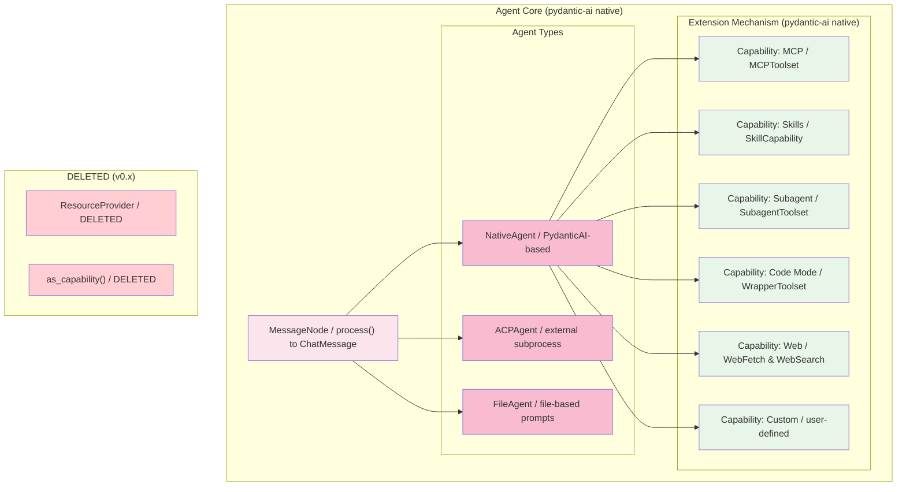

**Key properties**:
- **MessageNode** is the base abstraction — both agents and teams inherit from it.
- **pydantic-ai Capability/Toolset** is the **only** extension mechanism. ResourceProvider is deleted.
- Each agent type (Native, ACP, File) implements `create_turn()` which returns a Turn.
- Turns are executed by RunLoop — the agent itself doesn't drive the loop.
- Skills are a Capability (`SkillCapability`), not a separate system.
- Subagent delegation is a Capability (`SubagentCapability` with `SubagentToolset`).

**Migration from ResourceProvider**:

| v0.x ResourceProvider | v1.0 pydantic-ai Equivalent |
|----------------------|-----------------------------|
| `MCPResourceProvider` | `MCPToolset` + `MCP` capability |
| `StaticResourceProvider` | `FunctionToolset` (direct @tool functions) |
| `FilteringResourceProvider` | `FilteredToolset` (pydantic-ai native) |
| `AggregatingResourceProvider` | `CombinedToolset` (pydantic-ai native) |
| `PoolResourceProvider` | `SubagentCapability` + `SubagentToolset` (new) |
| `CodeModeResourceProvider` | `CodeModeCapability` + `WrapperToolset` (new) |
| `LocalResourceProvider` | `SkillCapability` (already exists) |

**Dynamic change notification** — replacing ResourceProvider signals:

ResourceProvider had 4 signal types (`tools_changed`, `prompts_changed`, `resources_changed`, `skills_changed`). pydantic-ai's `AbstractCapability` has no equivalent. Rather than building a central `CapabilityRegistry` (which would recreate ResourceProvider's pattern under a new name), we extend `AbstractCapability` itself:

```python
class AbstractCapability:
    # Existing: 40+ lifecycle hooks, middleware chain, ordering
    
    # NEW: optional change notification — delegated to Capability, not centralized
    def on_change(self) -> AsyncIterator[ChangeEvent] | None:
        """If this capability supports dynamic changes, yield ChangeEvents.
        Returns None for static capabilities (default).
        
        Only dynamic capabilities implement this:
        - MCPToolset: yields when MCP server tool list changes
        - SkillCapability: yields when SKILL.md files are added/removed
        - Static capabilities (FunctionToolset, etc.): return None
        """
        return None
```

AgentFactory subscribes to `on_change()` streams from compiled capabilities. When a change event arrives, Factory performs a **local hot-swap** — only the affected agent's capability is replaced, not the entire Host. This is finer-grained than the old ResourceProvider signal system, which triggered full rebuilds.

**Why not a central CapabilityRegistry**: A central registry that tracks all capabilities and broadcasts change events is architecturally identical to `AggregatingResourceProvider` + signal forwarding — the exact pattern we're deleting. Change notification should be the responsibility of the Capability that knows when its own tools change, not a central authority.

**Knowledge management** — future consideration:

Domain knowledge (vector retrieval, graph reasoning, episodic memory) is NOT a Layer 2 infrastructure component in v1.0. It starts as a Capability (`KnowledgeCapability`) at Layer 5, accessed per-agent. This follows YAGNI — don't build infrastructure abstraction until there's a proven cross-agent sharing requirement. When multiple agents demonstrably need to share the same vector store / knowledge graph, promote to Layer 2 as `KnowledgeProvider` alongside `StorageManager`. Premature abstraction risks recreating the ResourceProvider dual-abstraction problem.

### ResourceSource — Orthogonal Data Abstraction

pydantic-ai's Capability system manages **behavior** (tools, hooks, instructions). But agents also need access to **data** — MCP resources, skill content, files, knowledge base entries. pydantic-ai has no data abstraction. This gap forces resources to be awkwardly wrapped as tools, losing semantic clarity.

`ResourceSource` is a **new protocol orthogonal to Capability** — not parallel to it. An object CAN implement both: `MCPCapability` provides tools (behavior, via Capability) AND resources (data, via ResourceSource). Two interfaces, two concerns, same object.

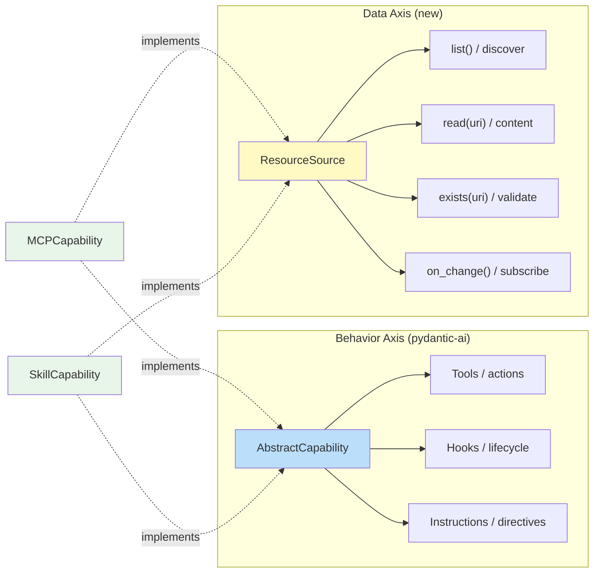

**Protocol definition**:

```python
@runtime_checkable
class ResourceSource(Protocol):
    """Unified read-only data access. Orthogonal to Capability.
    
    NOT a Capability — it's a separate concern:
    - Capability = behavior (tools, hooks, instructions)
    - ResourceSource = data (files, knowledge, skill content)
    
    An object CAN implement both (e.g., MCPCapability provides tools
    AND is a ResourceSource for its MCP resources).
    """

    async def list(self) -> list[Resource]:
        """List all available resources from this source."""
        ...

    async def read(self, uri: str) -> ResourceContent:
        """Read resource content by URI."""
        ...

    async def exists(self, uri: str) -> bool:
        """Check if a resource exists."""
        ...

    def on_change(self) -> AsyncIterator[ResourceChange] | None:
        """Subscribe to resource changes. None for static sources."""
        ...


@dataclass(frozen=True)
class Resource:
    """A discoverable data item."""
    uri: str           # e.g. "mcp://filesystem/path", "skill://my-skill"
    name: str
    mime_type: str
    source: str        # which ResourceSource provided this


@dataclass(frozen=True)
class ResourceContent:
    """Content of a read resource."""
    uri: str
    content: str | bytes
    mime_type: str
```

**Implementations**:

| Implementation | Wraps | URI Scheme | Source of Data |
|----------------|-------|------------|----------------|
| `MCPResourceSource` | `MCPCapability` | `mcp://{server_name}/{path}` | MCP server `resources/list` + `resources/read` |
| `SkillResourceSource` | `SkillCapability` | `skill://{skill_name}` | SKILL.md file content |
| `FileResourceSource` (future) | `UPath` root | `file://{path}` | Local or remote filesystem |

`MCPCapability` implements **both** `AbstractCapability` and `ResourceSource`. The same object exposes tools (behavior) and resources (data) through two interfaces. This is not dual-abstraction — it's two axes on one object:

```python
class MCPCapability(AbstractCapability, ResourceSource):
    """Owns one MCP server connection.
    
    Two orthogonal interfaces:
    - AbstractCapability: provides tools, hooks, instructions (behavior)
    - ResourceSource: provides resources (data)
    """
    
    def __init__(self, mcp_server: MCPServer):
        self._server = mcp_server
    
    # --- AbstractCapability (behavior) ---
    def get_toolset(self) -> AbstractToolset:
        return MCPToolset(self._server)  # auto-discovers MCP tools
    
    async def get_instructions(self) -> list[str]:
        prompts = await self._server.list_prompts()
        return [p.description for p in prompts]
    
    def on_change(self) -> AsyncIterator[ChangeEvent] | None:
        # Capability change: MCP tool list changed
        ...
    
    # --- ResourceSource (data) ---
    async def list(self) -> list[Resource]:
        resources = await self._server.list_resources()
        return [
            Resource(
                uri=f"mcp://{self._server.name}/{r.uri}",
                name=r.name,
                mime_type=r.mime_type,
                source=self._server.name,
            )
            for r in resources
        ]
    
    async def read(self, uri: str) -> ResourceContent:
        # Strip prefix, delegate to MCP server
        mcp_uri = uri.removeprefix(f"mcp://{self._server.name}/")
        content = await self._server.read_resource(mcp_uri)
        return ResourceContent(uri=uri, content=content, mime_type="text/plain")
    
    async def exists(self, uri: str) -> bool:
        resources = await self._server.list_resources()
        mcp_uri = uri.removeprefix(f"mcp://{self._server.name}/")
        return any(r.uri == mcp_uri for r in resources)
```

**Composition — AggregatedResourceSource**:

AgentFactory collects all `ResourceSource` implementations from the agent's compiled capabilities and composes them into a unified interface:

```python
class AggregatedResourceSource(ResourceSource):
    """Unified resource access across all sources.
    
    Created by AgentFactory at compile time — scoped to the agent's
    authorized resources. NOT a global registry.
    """
    
    def __init__(self, sources: list[ResourceSource]):
        self._sources = sources
    
    async def list(self) -> list[Resource]:
        all_resources = []
        for source in self._sources:
            all_resources.extend(await source.list())
        return all_resources
    
    async def exists(self, uri: str) -> bool:
        return any(await s.exists(uri) for s in self._sources)
    
    async def read(self, uri: str) -> ResourceContent:
        for source in self._sources:
            if await source.exists(uri):
                return await source.read(uri)
        raise ResourceNotFound(uri)
```

Factory wiring:

```python
class AgentFactory:
    async def compile(self, manifest, host_context):
        mcp_cap = MCPCapability(server)       # is-a Capability AND ResourceSource
        skill_cap = SkillCapability(registry)  # is-a Capability AND ResourceSource
        
        # Collect ResourceSources from capabilities that implement it
        resource_sources = [
            rs for rs in [mcp_cap, skill_cap]
            if isinstance(rs, ResourceSource)
        ]
        aggregated = AggregatedResourceSource(resource_sources)
        
        # AgentContext receives the aggregated source
        agent = NativeAgent(
            capabilities=[mcp_cap, skill_cap],
            resource_source=aggregated,
        )
```

**AgentContext update**:

```python
@dataclass(frozen=True)
class AgentContext:
    # ... existing fields (delegation, session, scope) ...
    
    # Resource access (compile-time scoped, read-only)
    resources: ResourceSource | None = None
    # None if agent has no resource sources (e.g., pure computation agent)
```

**Usage scenarios**:

```python
# 1. URI validation in capability hook (cross-capability query)
class URIValidationCapability(AbstractCapability):
    async def after_model_response(
        self, ctx: RunContext[AgentContext], response: str
    ) -> str:
        if ctx.deps.resources is None:
            return response
        for uri in extract_uris(response):
            if not await ctx.deps.resources.exists(uri):
                response = response.replace(uri, f"{uri} [INVALID]")
        return response

# 2. Context injection (RAG-like)
class ContextInjectionCapability(AbstractCapability):
    async def before_model_request(
        self, ctx: RunContext[AgentContext], prompt: str
    ) -> str:
        if ctx.deps.resources is None:
            return prompt
        all_resources = await ctx.deps.resources.list()
        relevant = [r for r in all_resources if matches(prompt, r.name)]
        if relevant:
            contents = [await ctx.deps.resources.read(r.uri) for r in relevant[:3]]
            context_block = "\n".join(c.content for c in contents)
            return f"Context:\n{context_block}\n\n{prompt}"
        return prompt

# 3. Tool that searches resources
@tool
async def search_resources(
    ctx: RunContext[AgentContext], query: str
) -> str:
    """Search available resources."""
    if ctx.deps.resources is None:
        return "No resources available"
    resources = await ctx.deps.resources.list()
    matched = [r for r in resources if query.lower() in r.name.lower()]
    return "\n".join(f"- {r.uri}: {r.name}" for r in matched)
```

**ResourceSource vs deleted ResourceProvider**:

| Dimension | ResourceProvider (v0.x, DELETED) | ResourceSource (proposed) |
|-----------|----------------------------------|--------------------------|
| What it manages | Tools + prompts + resources (all) | Only resources (data) |
| Relationship to Capability | **Parallel** (duplicates, needs as_capability() bridge) | **Orthogonal** (data vs behavior, same object implements both) |
| Construction | Runtime registration + signal broadcast | Compile-time composition by Factory |
| Scope | Global (pool-level) | Per-agent (compile-time scoped) |
| Change notification | Central signal system (4 signal types) | Per-source on_change() (delegated, not centralized) |
| pydantic-ai overlap | YES (tool management duplicated) | NO (pydantic-ai has no data abstraction) |

**Implementation strategy (YAGNI incremental)**:

1. Define `ResourceSource` + `Resource` + `ResourceContent` protocols — zero cost
2. Implement `ResourceSource` on `MCPCapability` — MCP resources no longer伪装 as tools
3. Implement `ResourceSource` on `SkillCapability` — skill content queryable as data
4. Build `AggregatedResourceSource` when 2+ implementations exist and cross-source queries are needed
5. `AgentContext.resources` defaults to `None` — only injected when agent has ResourceSource capabilities
6. `FileResourceSource`, `KnowledgeResourceSource` etc. — when concrete use cases emerge

### Layer 6: ProtocolServer

**Responsibility**: Translate between external wire protocols and internal RunLoop operations.

```mermaid
graph TB
    subgraph "Protocol Layer"
        subgraph "In-Process (Python)"
            ACP["ACP Server / serve-acp"]
            OC["OpenCode Server / serve-opencode"]
            AGUI["AG-UI Server / serve-agui"]
            OAI["OpenAI API Server / serve-api"]
            MCP_S["MCP Server / serve-mcp"]
        end
        
        subgraph "Remote (Language-Agnostic, future)"
            MQ["MessageQueue Transport / via EventTransport"]
            RS["Rust/Go/TS Server / consumes EventEnvelopes"]
        end
    end
    
    subgraph "Protocol Request Flow"
        Client["Protocol Client / Zed / OpenCode TUI / curl"] 
        -->|initialize(config_id, tenant_id)| Server[ProtocolServer]
        Server -->|extract RunScope| HR[HostRegistry]
        HR -->|get/create Host| Host[AgentHost]
        Host -->|get Factory| Factory[AgentFactory]
        Factory -->|get agent| Agent[Agent Core]
        Server -->|create RunLoop| RL[RunLoop]
        RL -->|run(session_id, prompt)| Agent
    end
    
    style ACP fill:#f5f5f5
    style OC fill:#f5f5f5
    style AGUI fill:#f5f5f5
    style OAI fill:#f5f5f5
    style MCP_S fill:#f5f5f5
    style MQ fill:#e1f5fe
    style RS fill:#e1f5fe
```

**Key properties**:
- ProtocolServer is a **thin translation layer** — it does not own agents or state.
- Each protocol `initialize` call carries a **RunScope** (config_id, tenant_id, user_id).
- RunScope routes to the correct AgentHost via HostRegistry.
- ProtocolServer creates a RunLoop per session, injects appropriate dimensions.
- **Future**: EventTransport + EventEnvelope enables language-agnostic protocol servers via message queue.

### RunScope: The Request Router

RunScope is the **cross-cutting context** that flows through all layers:

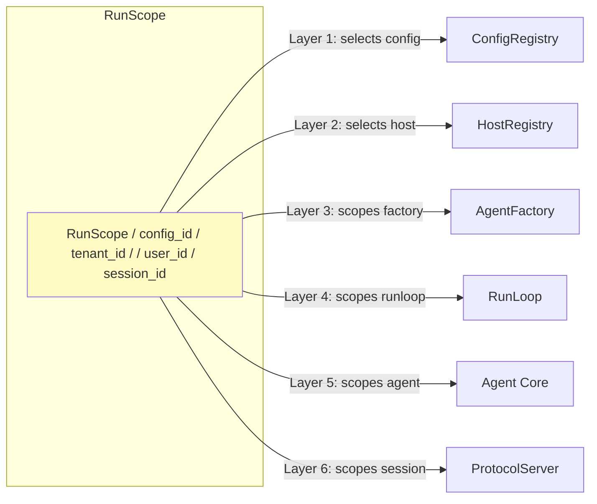

**Isolation levels**:

| Level | Scope | Isolation |
|-------|-------|-----------|
| Config-level | `config_id` | Different agent definitions, teams, MCP servers |
| Tenant-level | `config_id + tenant_id` | Different infrastructure (MCP processes, storage, skills) |
| User-level | `config_id + tenant_id + user_id` | Different sessions, interaction history |
| Session-level | `session_id` | Different RunLoop, message queue, Turn state |

### Complete Request Flow

The following sequence diagram shows a typical protocol request from client to response:

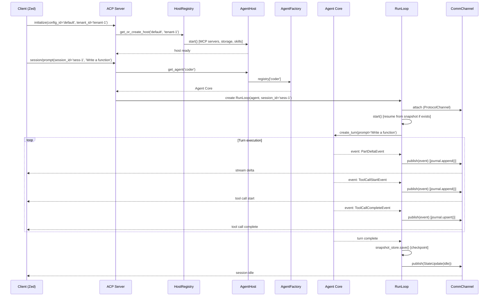

### Storage Architecture

Three separate persistence layers, each with a distinct purpose:

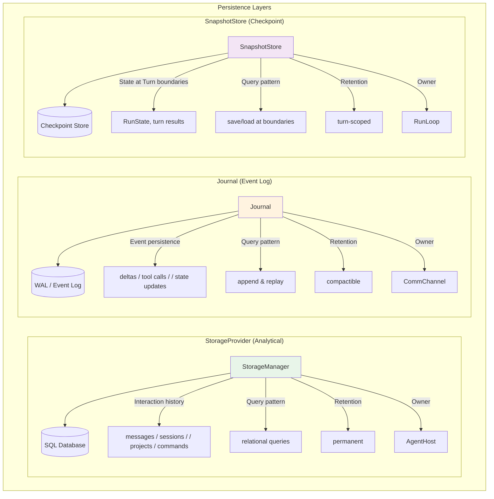

**Database analogy**:
- StorageProvider = Database tables (permanent, queryable, relational)
- Journal = WAL / transaction log (append-only, replayable, compactible)
- SnapshotStore = Checkpoint file (periodic state image, fast recovery)

These three are **complementary, not conflicting**. They serve different access patterns, have different owners, and use different retention strategies. Keep separate in v1.0.

**Tiered consistency model**:

Journal is the source of truth for crash recovery, but NOT all events require synchronous journaling. A blanket "journal every event before delivery" policy creates unacceptable write amplification for high-frequency streaming deltas. Instead, consistency is tiered by event importance:

| Event Type | Journal | StorageProvider | SnapshotStore | Consistency |
|------------|---------|-----------------|---------------|-------------|
| Turn-level (StateUpdate, StreamComplete) | Synchronous | Synchronous | Save after Turn | Strong — Turn not complete until both write |
| Tool execution records | Synchronous | Async projection | — | Journal authoritative |
| Delta-level (PartDelta, ToolCallProgress) | Async batch | Not written | — | Eventual — lost on crash, acceptable |
| Session metadata (title, summary) | — | Synchronous | — | StorageProvider authoritative |

**Turn commit protocol**:
```
1. CommChannel.journal.append(turn_complete_event)  ← MUST succeed, else Turn not complete
2. RunLoop.snapshot_store.save(state)                ← Failure tolerated: next recovery replays from Journal
3. StorageProvider.write(turn_result)                ← Synchronous for turn-level; async for deltas
```

**Conflict resolution**: On crash recovery, Journal is authoritative. If Journal has entries but SnapshotStore has no turn_result → Turn was in-flight, replay events to consumer. If StorageProvider is behind Journal → re-project from Journal replay. StorageProvider never leads Journal — it is a read model, not a write-ahead store.

**Why not "Journal as absolute truth for everything"**: Delta events (PartDelta — streaming text chunks) can fire dozens per second. Synchronous journaling of every delta would add ~1-5ms latency per token, making streaming unresponsive. Deltas are ephemeral — losing the last few tokens of an interrupted stream on crash is acceptable. Turn-level events (completion, state transitions) are NOT ephemeral and must be strongly consistent.

### Package Structure (v1.0)

The proposed package structure maps to the six layers:

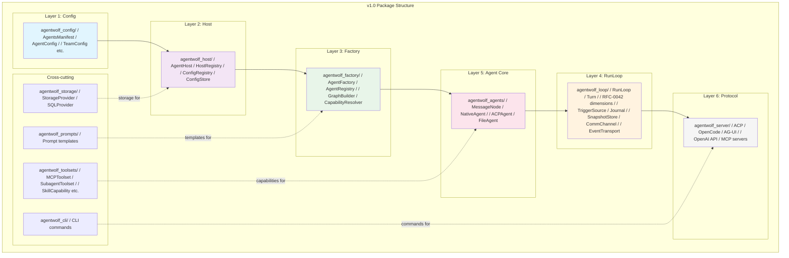

### Relationship to RFC-0042

RFC-0042 (Unified Lifecycle Architecture) sits **entirely within Layer 4 (RunLoop)**:

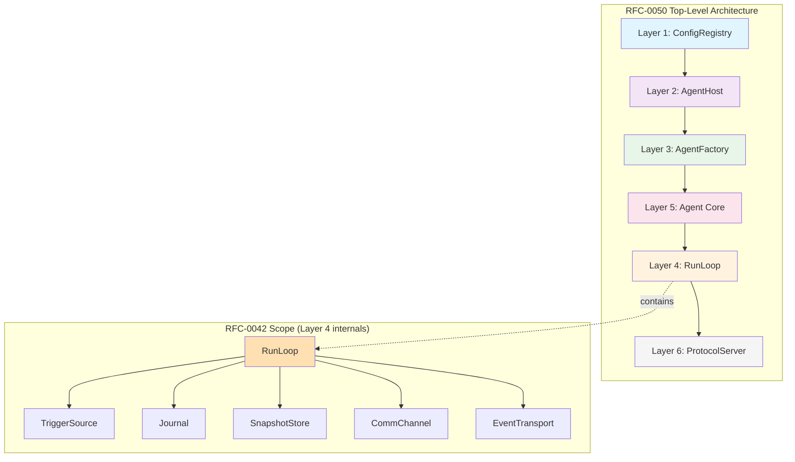

RFC-0042 defines the six pluggable dimensions **inside** the RunLoop. RFC-0050 defines the six layers **around** the RunLoop. Together, they form a complete 12-dimension architecture:

| Layer (RFC-0050) | Dimension (RFC-0042) |
|------------------|---------------------|
| 1. ConfigRegistry | — |
| 2. AgentHost | — |
| 3. AgentFactory | — |
| 4. RunLoop | TriggerSource, Journal, SnapshotStore, CommChannel, EventTransport |
| 5. Agent Core | — (extension via pydantic-ai Capability) |
| 6. ProtocolServer | — (uses CommChannel + EventTransport) |

### Multi-Tenant Architecture

The six-layer model enables multi-tenancy through registries at each layer:

```mermaid
graph TB
    subgraph "Single Process, Multiple Tenants"
        subgraph "Protocol Layer"
            ACP["ACP Server / :3000"]
            OC["OpenCode Server / :3001"]
        end
        
        subgraph "Host Registry"
            HR[HostRegistry]
            H1["Host: 'default' / 'tenant-1' / MCP servers, storage, skills"]
            H2["Host: 'default' / 'tenant-2' / MCP servers, storage, skills"]
            H3["Host: 'team-a' / 'tenant-1' / MCP servers, storage, skills"]
            HR --> H1
            HR --> H2
            HR --> H3
        end
        
        subgraph "Config Registry"
            CR[ConfigRegistry]
            C1["Config: 'default' v3"]
            C2["Config: 'team-a' v1"]
            CR --> C1
            CR --> C2
        end
    end
    
    Client1["Tenant-1 User / (config=default)"] -->|initialize(default, tenant-1)| ACP
    Client2["Tenant-2 User / (config=default)"] -->|initialize(default, tenant-2)| ACP
    Client3["Tenant-1 User / (config=team-a)"] -->|initialize(team-a, tenant-1)| OC
    
    ACP --> HR
    OC --> HR
    HR -.-> CR
    
    style HR fill:#f3e5f5
    style CR fill:#e1f5fe
    style H1 fill:#e8f5e9
    style H2 fill:#e8f5e9
    style H3 fill:#e8f5e9
```

**Key points**:
- One process serves multiple tenants and multiple configs
- Each (config_id, tenant_id) pair gets an isolated AgentHost
- AgentHost isolation: separate MCP server processes, storage connections, skill registries
- Session isolation: each session gets its own RunLoop with independent state
- Config changes in ConfigRegistry trigger Host reload via watch notifications

### Plugin / Extension Architecture

pydantic-ai's Capability system IS the plugin system. No separate plugin registry needed:

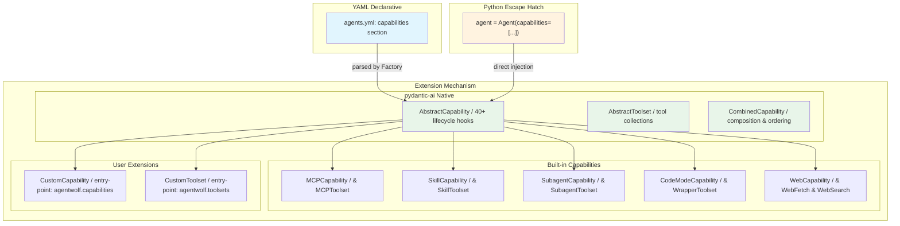

**Key points**:
- `AbstractCapability` is the plugin primitive — 40+ lifecycle hooks, middleware chain, ordering constraints
- `CombinedCapability` handles composition with topological sort
- Entry-point registration: `agentwolf.capabilities` and `agentwolf.toolsets` groups
- YAML-first (95% of cases), Python escape hatch for advanced (4% hooks, 1% custom capability)
- ResourceProvider is **deleted** — all its functionality is replaced by native pydantic-ai equivalents

### Concurrency Model: Asyncio, Multi-Process, Distributed

The six-layer architecture supports three levels of concurrency. Each level is a **configuration choice at a specific layer boundary**, not a separate architecture.

```mermaid
graph TB
    subgraph "Level 1: Asyncio (Single Process)"
        L1A["Layer 1: ConfigRegistry / (async interface)"]
        L2A["Layer 2: AgentHost / (async MCP subprocess mgmt)"]
        L3A["Layer 3: AgentFactory / (async compile)"]
        L4A["Layer 4: RunLoop / (async event loop)"]
        L5A["Layer 5: Agent Core / (async model calls)"]
        L6A["Layer 6: ProtocolServer / (async I/O)"]
        L1A --> L2A --> L3A --> L5A --> L4A --> L6A
    end

    subgraph "Level 2: Multi-Process (Single Machine)"
        L6B["Layer 6: ProtocolServer / (Process A)"]
        L2B["Layer 2: AgentHost / (Process B) / MCP subprocesses (Process C, D)"]
        ET_IPC["EventTransport / (IPC / Unix socket / shared memory)"]
        L6B -->|EventTransport| ET_IPC
        ET_IPC -->|EventTransport| L2B
    end

    subgraph "Level 3: Distributed (Multi-Machine)"
        L6C["Layer 6: ProtocolServer / (Machine A)"]
        L1C["Layer 1: ConfigRegistry / ConfigStore = etcd/DB / (Machine B)"]
        L2C["Layer 2: HostRegistry / routes to remote Hosts / (Machine C)"]
        ET_MQ["EventTransport / (MessageQueueTransport / Redis/NATS/Kafka)"]
        L6C -->|EventEnvelope via MQ| ET_MQ
        ET_MQ -->|EventEnvelope via MQ| L2C
        L1C -.->|watch notifications| L2C
    end

    style L1A fill:#e1f5fe
    style L2A fill:#f3e5f5
    style L3A fill:#e8f5e9
    style L4A fill:#fff3e0
    style L5A fill:#fce4ec
    style L6A fill:#f5f5f5
    style L6B fill:#f5f5f5
    style L2B fill:#f3e5f5
    style ET_IPC fill:#fff9c4
    style L6C fill:#f5f5f5
    style L1C fill:#e1f5fe
    style L2C fill:#f3e5f5
    style ET_MQ fill:#fff9c4
```

#### Level 1: Asyncio (Single Process) — Default

All six layers run in a single asyncio event loop. This is the default and the current behavior.

| Layer | Asyncio Role |
|-------|-------------|
| **ConfigRegistry** | Async interface (`async def get/register/watch`) |
| **AgentHost** | Manages MCP subprocesses via `asyncio.create_subprocess_exec()` |
| **AgentFactory** | Async compile (MCP server initialization, skill discovery) |
| **RunLoop** | Async event loop — `async for event in turn.execute()` |
| **Agent Core** | Async model calls (PydanticAI native), async tool execution |
| **ProtocolServer** | Async I/O — handles multiple concurrent sessions via asyncio |

**Key constraint**: RunLoop is **always single-process, single-event-loop** by design. It owns a state machine (idle/running/done) that is not safe to share across processes. This is an explicit design decision — the RunLoop is the "narrow waist" that stays simple.

#### Level 2: Multi-Process (Single Machine)

Multi-process support exists at **two layer boundaries**:

**Boundary A: AgentHost → MCP Subprocesses (already exists)**

AgentHost (Layer 2) spawns MCP servers as separate OS processes via `ProcessManager`. This is the existing pattern — each MCP server runs as a subprocess with stdio communication.

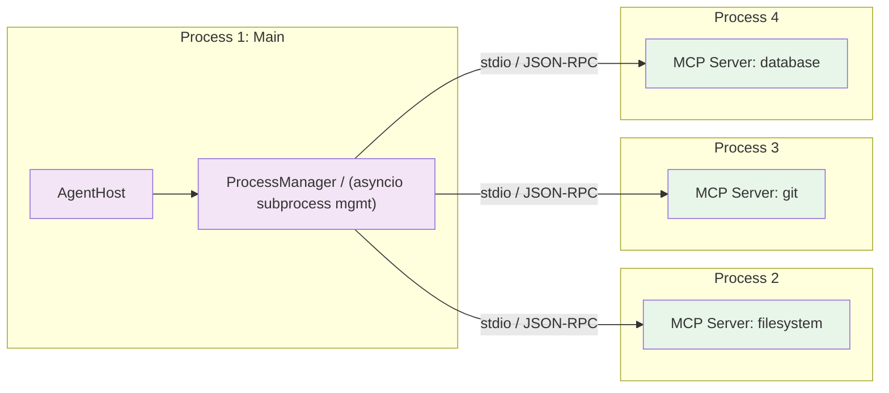

**Boundary B: ProtocolServer ↔ RunLoop via EventTransport (RFC-0042)**

ProtocolServer (Layer 6) and RunLoop (Layer 4) can run in separate processes, connected by EventTransport with IPC (Unix domain socket, shared memory, or named pipe).

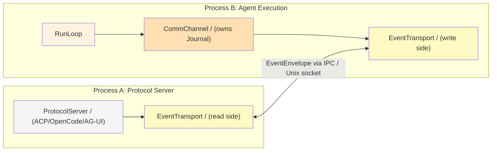

**Why split processes?**
- **Isolation**: Protocol parsing bugs don't crash agent execution
- **CPU parallelism**: Each process has its own GIL — CPU-bound tool execution doesn't block protocol I/O
- **Resource isolation**: Memory limits, CPU affinity per process
- **Crash recovery**: Protocol server crash doesn't lose agent state (Journal persists)

#### Level 3: Distributed (Multi-Machine)

Distributed support exists at **three layer boundaries**:

```mermaid
graph TB
    subgraph "Machine A: Edge"
        Client["Client / (Zed / curl / TUI)"]
        PS["ProtocolServer / (Layer 6)"]
        Client --> PS
    end
    
    subgraph "Machine B: Config"
        CR["ConfigRegistry / (Layer 1) / ConfigStore = etcd cluster"]
        PS -.->|load config| CR
    end
    
    subgraph "Machine C: Execution"
        HR["HostRegistry / (Layer 2)"]
        Host["AgentHost / + AgentFactory / + RunLoop / + Agent Core"]
        HR --> Host
    end
    
    subgraph "Message Queue"
        MQ["Redis / NATS / Kafka / (EventTransport backend)"]
    end
    
    PS -->|EventEnvelope / via MQ| MQ
    MQ -->|EventEnvelope / via MQ| HR
    
    CR -.->|watch notifications / via MQ| HR
    
    style PS fill:#f5f5f5
    style CR fill:#e1f5fe
    style HR fill:#f3e5f5
    style Host fill:#e8f5e9
    style MQ fill:#fff9c4
```

**Boundary 1: Layer 1 (ConfigRegistry) — Distributed Config Store**

ConfigRegistry's ConfigStore can be backed by etcd or a distributed database. Config changes propagate to all AgentHosts via watch notifications (pub/sub).

| ConfigStore Implementation | Scope | Use Case |
|---------------------------|-------|----------|
| `MemoryConfigStore` | Single process | Development, testing |
| `FileConfigStore` | Single machine | Standalone deployment |
| `EtcdConfigStore` | Multi-machine | Production, HA config |
| `DBConfigStore` | Multi-machine | Production with audit trail |

**Boundary 2: Layer 6 ↔ Layer 4 (EventTransport) — Distributed Protocol**

ProtocolServer (Layer 6) and RunLoop (Layer 4) communicate via EventTransport. When EventTransport is `MessageQueueTransport`, they can be on different machines.

| EventTransport Implementation | Scope | Latency | Use Case |
|-------------------------------|-------|---------|----------|
| `InProcessTransport` | Single process | <0.1ms | Default, development |
| `IPCTransport` | Single machine | ~0.5ms | Multi-process isolation |
| `MessageQueueTransport` | Multi-machine | ~2-5ms | Distributed, polyglot |

The **EventEnvelope** (JSON + schema versioning) is the wire format. Any language can consume it — a Rust/Go/TypeScript protocol server reads EventEnvelopes from the message queue and translates to its own protocol.

**Boundary 3: Layer 2 (HostRegistry) — Distributed Host Routing**

HostRegistry can route to AgentHosts on remote machines. When a ProtocolServer receives a request, it queries HostRegistry for the correct Host — which may be local or remote.

```mermaid
graph TB
    subgraph "Machine A"
        PS["ProtocolServer"]
        HR["HostRegistry"]
        PS --> HR
    end
    
    subgraph "Machine B"
        H1["AgentHost / config='default' tenant='t1'"]
        RL1["RunLoop / session='s1'"]
        H1 --> RL1
    end
    
    subgraph "Machine C"
        H2["AgentHost / config='default' tenant='t2'"]
        RL2["RunLoop / session='s2'"]
        H2 --> RL2
    end
    
    HR -->|route to local| H1
    HR -->|route to remote / via EventTransport| H2
    
    style PS fill:#f5f5f5
    style HR fill:#f3e5f5
    style H1 fill:#e8f5e9
    style H2 fill:#e8f5e9
    style RL1 fill:#fff3e0
    style RL2 fill:#fff3e0
```

#### What Stays Single-Process?

| Component | Why It Stays Single-Process |
|-----------|---------------------------|
| **RunLoop** | Owns a state machine (idle/running/done) — not safe to share. One event loop per session. |
| **Turn** | Single reactive cycle — prompt → model → tools → response. Must be atomic. |
| **Agent Core** | PydanticAI agent runs in a single event loop. Model calls are async but not parallel. |
| **CommChannel** | Owns Journal (append/upsert). Must be co-located with RunLoop for crash safety. |
| **SnapshotStore** | Called by RunLoop at Turn boundaries. Must be co-located for consistency. |

The invariant: **one RunLoop = one process = one session**. Distribution happens *around* the RunLoop, not *within* it.

#### Concurrency Level Selection Matrix

| Deployment Mode | ConfigRegistry | AgentHost | RunLoop | ProtocolServer | EventTransport |
|----------------|---------------|-----------|---------|---------------|----------------|
| **Dev / Testing** | Memory | Single process | Asyncio | In-process | InProcess |
| **Standalone** | File | Single process | Asyncio | In-process | InProcess |
| **Server (current)** | File | Single process | Asyncio | In-process | InProcess |
| **Server (isolated)** | File | Multi-process | Asyncio | Separate process | IPC |
| **Multi-tenant server** | File/DB | Per-tenant process | Asyncio | In-process | InProcess |
| **Distributed (future)** | etcd | Per-machine | Asyncio | Separate machine | MessageQueue |
| **Polyglot (future)** | etcd | Any language | Asyncio | Rust/Go/TS | MessageQueue |

**Progressive adoption**: Each level is opt-in. The default is Level 1 (asyncio, single process). Level 2 (multi-process) is a configuration change to EventTransport. Level 3 (distributed) requires ConfigStore + EventTransport + HostRegistry changes — but no RunLoop or Agent Core changes.

### Tenant Isolation

- Each AgentHost is a **process-level isolation boundary** — separate MCP server subprocesses, separate storage connections
- RunScope is validated at every layer boundary — a tenant-1 request cannot access tenant-2's Host
- StorageProvider enforces tenant_id filtering at the query level

### Config Provenance

- ConfigRegistry tracks config versions and provenance (source: file, HTTP, programmatic)
- Config changes are auditable — who changed what, when
- Unsigned remote configs should be rejected in production (future: config signing)

### Protocol Security

- ProtocolServer validates RunScope from protocol `initialize` message
- ACP session tokens include tenant_id and config_id — cannot be forged
- EventTransport (future MQ) uses TLS + auth for cross-process communication

---

## Implementation Plan

### Phased Migration

The migration uses **Adapter Pattern + Gradual Migration** (not Strangler Fig — there is no request-level routing; migration is per-Agent-instance). The existing `AdapterToolsetFactory` already serves as the bridge between old and new abstraction layers.

```mermaid
gantt
    title AgentWolf v1.0 Migration Phases
    dateFormat  YYYY-MM-DD
    axisFormat  %b
    
    section Phase 1a Runtime Extraction
    Extract HostContext dataclass from AgentPool fields    :p1a, 2026-07-01, 7d
    Extract AgentFactory from agent creation logic         :p1a2, 2026-07-01, 10d
    AgentPool becomes facade delegating to Factory         :p1a3, 2026-07-08, 7d
    
    section Phase 1b Backdoor Removal
    Replace MessageNode.agent_pool with HostContext         :p1b, 2026-07-15, 21d
    25 call sites across messagenode agent base_team        :p1b2, 2026-07-15, 14d
    
    section Phase 1c Capability Bridge
    Build 7 ToolsetFactory equivalents                      :p1c, 2026-07-15, 21d
    AdapterToolsetFactory bridges un-migrated providers     :p1c2, 2026-07-15, 7d
    
    section Phase 2 Lifecycle
    RFC-0041 Run vs Turn separation                         :p2a, 2026-07-15, 30d
    RFC-0042 six pluggable dimensions                       :p2b, 2026-08-01, 45d
    
    section Phase 1d Cleanup
    Delete ResourceProvider all call sites migrated         :p1d, 2026-09-01, 7d
    
    section Phase 3 Multi-Config and Config Split
    Split HostConfig and AgentManifest in YAML schema       :p3a, 2026-10-01, 14d
    ConfigRegistry versioning and watch                     :p3b, 2026-10-01, 21d
    HostRegistry lazy creation and eviction                 :p3c, 2026-10-08, 21d
    RunScope routing in ProtocolServer                      :p3d, 2026-10-22, 14d
    
    section Phase 4 Multi-Tenant
    Tenant isolation per-host EventBus and storage          :p4a, 2026-11-01, 21d
    Tenant filtering in StorageProvider                     :p4b, 2026-11-01, 14d
    
    section Phase 5 Polyglot
    gRPCTransport for multi-process isolation               :p5a, 2026-12-01, 21d
    MessageQueueTransport for distributed polyglot          :p5b, 2026-12-15, 30d
```

**Phase 1a split rationale (Oracle revision)**: The original Phase 1a conflated two independent concerns:
- **1a-runtime**: Extract `HostContext` dataclass + `AgentFactory` from `AgentPool` (runtime restructuring)
- **1a-config**: Split `AgentsManifest` into `HostConfig` + `AgentManifest` (YAML schema separation)

Oracle analysis found that **1b, 1c, and Phase 2 depend on 1a-runtime only**. The config split (1a-config) is only needed by Phase 3 (multi-config versioning + hot-reload granularity). Deferring config split to Phase 3:
- Reduces Phase 1a from 21d to ~14d (no config model refactoring, no YAML migration, no backward-compat validator)
- Allows Phase 2 to start ~7 days earlier
- Simplifies blast radius — Phase 1 touches only runtime code, not config schema

**Phase 1 sub-phases**:
- **1a (runtime extraction, 14d)**: Create `HostContext` dataclass from existing AgentPool fields. Extract `AgentFactory`. AgentPool becomes facade. NO config model changes, NO YAML schema changes.
- **1b (backdoor removal, 21d)**: Replace `MessageNode.agent_pool` with `HostContext`. 25 call sites across 4 files. Can overlap with Phase 2.
- **1c (capability bridge, 21d)**: Build ToolsetFactory equivalents using `AdapterToolsetFactory` as bridge. Can overlap with Phase 2.
- **1d (cleanup, 7d)**: Delete ResourceProvider after all call sites migrated.

**Critical path**: `Phase 1a (14d) → Phase 2 (30d)` = **44 days** to RunLoop. Phase 1b and 1c run in parallel with early Phase 2.

### Dependencies

**Real dependency graph** (Oracle-revised):

```
1a-runtime (HostContext + AgentFactory extraction)
  ├──→ 1b (backdoor removal: needs HostContext to exist)
  ├──→ 1c (capability bridge: needs AgentFactory to exist)
  └──→ Phase 2 (RunLoop: needs AgentFactory to create turns)

1a-config (HostConfig/AgentManifest split) — DEFERRED to Phase 3
  └──→ Phase 3 (multi-config: needs config versioning + split for hot-reload)
       └──→ Phase 4 (multi-tenant: needs config split for per-tenant HostConfig)

1c → 1d (ResourceProvider deletion)
```

- **Phase 1a** has no dependencies — can start immediately. Only extracts runtime structures, no config changes.
- **Phase 1b** depends on 1a (HostContext must exist). Does NOT depend on config split. Can overlap with Phase 2.
- **Phase 1c** depends on 1a (AgentFactory must exist). Does NOT depend on config split. Can overlap with Phase 2.
- **Phase 1d** depends on 1c (all call sites must have replacements before deletion).
- **Phase 2** depends on 1a only (AgentFactory must exist before RunLoop can be injected). Phase 2 does NOT depend on 1b, 1c, or config split — RunLoop calls `agent.create_turn()` regardless of how agents get their dependencies.
- **Phase 2a and 2b can partially overlap** — RFC-0041 defines RunLoop skeleton with dimension injection points, RFC-0042 fills them in.
- **Phase 3** depends on Phase 2 (RunLoop must be stable). THIS is where config split happens — `HostConfig`/`AgentManifest` separation is introduced for multi-config versioning and hot-reload granularity.
- **Phase 4** depends on Phase 3 (multi-config must work before multi-tenant).
- **Phase 5a** (gRPC) depends on Phase 2 (EventTransport is an RFC-0042 dimension).
- **Phase 5b** (MQ) depends on Phase 5a (gRPC transport proves the interface before adding MQ).
- RFC-0041 is a **prerequisite** for Phase 2.
- RFC-0042 is a **prerequisite** for Phase 2 and Phase 5.

**Why config split can be deferred**: `HostContext` is a runtime bundle carrying handles to already-instantiated infrastructure objects. Whether those objects were configured from a flat `AgentsManifest` or a split `HostConfig` + `AgentManifest` is irrelevant to the consumer. `AgentFactory.compile(manifest, host_context)` works with a flat manifest — Factory only reads agent/team/graph sections. When the split happens in Phase 3, `manifest` narrows from `AgentsManifest` to `AgentManifest` (a subset) — a parameter type refinement, not a signature change.

### Rollback Strategy

Each phase is independently deployable:
- Phase 1a: `AgentPool` class remains as a facade wrapper — existing `async with AgentPool(...)` API unchanged. Config model is NOT modified — flat `AgentsManifest` still works.
- Phase 1b: `MessageNode.agent_pool` property remains as a compatibility shim returning `HostContext` — gradual migration per agent subclass.
- Phase 1c: `AdapterToolsetFactory` bridges old ResourceProvider to new ToolsetFactory — both paths work in parallel.
- Phase 1d: ResourceProvider code remains in tree (deprecated) for one release cycle before physical deletion.
- Phase 2: Old `RunHandle` path remains as fallback until RunLoop is stable.
- Phase 3: Single-config mode (current behavior) is the default; multi-config is opt-in. Config split is additive — `host:` section is optional, flat config auto-migrates via model validator.
- Phase 4: Single-tenant mode (current behavior) is the default; multi-tenant is opt-in.
- Phase 5a: In-process transport is the default; gRPC transport is opt-in.
- Phase 5b: gRPC is the default distributed transport; MQ is opt-in for polyglot scenarios.

**Fallback if config deferral fails**: If some code path genuinely needs the config split before Phase 3, add the `host:` section as OPTIONAL to `AgentsManifest` with auto-migration via model validator. This is a ~2 day addition, not a phase rewrite.

---

## Open Questions

1. **AgentHost lifecycle**: Should Hosts be eagerly created at startup or lazily created on first request? (Recommendation: lazy with warm pool for known-active tenants.)

2. **Config hot-reload granularity**: When a config changes, should the entire Host reload, or only affected agents? (Recommendation: diff-based — only recreate agents whose config section changed.)

3. **RunScope propagation**: Should RunScope be explicitly passed to every method, or stored in a context variable (contextvars)? (Recommendation: context variable for ergonomics, explicitly passed at layer boundaries.)

4. **Package naming**: Should v1.0 use `agentwolf_*` or keep `agentpool_*` package names? (Recommendation: keep `agentpool_*` for backward compatibility; `agentwolf` is an internal codename.)

5. **AgentFactory pre-compilation**: Should teams/graphs always be pre-compiled, or allow lazy compilation for dynamic topologies? (Recommendation: pre-compile by default, `factory_mode: lazy` opt-in for dynamic use cases.)

6. **EventEnvelope versioning**: How should EventEnvelope schema versions be negotiated between RunLoop and remote consumers? (Deferred to RFC-0042 Phase 5.)

7. **StorageProvider tenant isolation**: Should tenant_id be a column in shared tables, or separate databases per tenant? (Recommendation: column for v1.0, separate DB option for v1.1.)

8. **EventTransport ownership**: Is EventTransport owned by RunLoop (Layer 4) and configured by ProtocolServer at creation time, or owned by ProtocolServer (Layer 6) with RunLoop publishing to it? (Recommendation: RunLoop-owned, ProtocolServer configures at creation, then consumes via read-only interface. This keeps the state machine single-owner.)

9. **EventBus → CommChannel migration**: 4 protocol servers use `ProtocolEventConsumerMixin` which subscribes to EventBus directly. Should CommChannel replace EventBus entirely, or coexist? (Recommendation: coexist initially — Journal is append-only for crash recovery, EventBus is in-memory pub/sub for real-time streaming. Converge post-v1.0.)

10. **TurnRunner extraction**: Turn execution logic is currently scattered across SessionController and SessionPool (no standalone TurnRunner class exists). Should TurnRunner be extracted before or during RFC-0041 implementation? (Recommendation: during — RFC-0041 defines the Turn boundary, extraction happens as part of that work.)

---

## Decision Record

| Date | Decision | Rationale |
|------|----------|-----------|
| 2026-07-08 | Six-layer architecture (ConfigRegistry → AgentHost → AgentFactory → RunLoop → Agent Core → ProtocolServer) | Achieves full orthogonality, supports multi-tenancy structurally, aligns with K8s/Temporal proven patterns |
| 2026-07-08 | Delete ResourceProvider, adopt pydantic-ai Capability/Toolset | ResourceProvider already deprecated; pydantic-ai system is richer, native, and eliminates bridge layer |
| 2026-07-08 | Keep StorageProvider, Journal, SnapshotStore separate | Three different access patterns, owners, and retention strategies; database analogy (tables vs WAL vs checkpoint) |
| 2026-07-08 | RunScope as cross-cutting context (config_id, tenant_id, user_id, session_id) | Enables multi-tenancy without structural changes; each layer becomes a registry |
| 2026-07-08 | pydantic-ai Capability system IS the plugin system | No separate plugin registry needed; entry-point registration + YAML declarative + Python escape hatch |
| 2026-07-09 | AgentFactory is standalone service, NOT owned by AgentHost | Prevents config/runtime boundary blur; Factory receives (manifest, host_context) as parameters; has internal compilation cache but no infrastructure ownership |
| 2026-07-09 | HostContext dataclass replaces MessageNode.agent_pool | Eliminates backdoor from Layer 5 to Layer 1/2; carries only dependency handles, not full pool reference; prerequisite for tenant isolation |
| 2026-07-09 | Change notification via AbstractCapability.on_change(), NOT central CapabilityRegistry | Avoids recreating ResourceProvider signal pattern under new name; change notification is Capability's own responsibility, not a central authority's |
| 2026-07-09 | Tiered consistency for Journal/Storage/Snapshot | Turn-level events: strong consistency (synchronous dual-write). Delta events: eventual consistency (async batch journal). Avoids write amplification while preserving crash recovery |
| 2026-07-09 | Knowledge management starts as Capability (Layer 5), not Layer 2 infrastructure | YAGNI — no proven cross-agent sharing requirement yet. Promote to Layer 2 KnowledgeProvider when sharing is demonstrated. Prevents premature abstraction |
| 2026-07-09 | EventTransport evolution: InProcess → gRPC → MessageQueue | Not a binary choice. gRPC for single-machine multi-process (low latency, strong typing). MQ for multi-machine polyglot (multi-consumer, persistence). Each step is opt-in |
| 2026-07-09 | Migration uses Adapter + Gradual Migration, not Strangler Fig | No request-level routing; migration is per-Agent-instance. AdapterToolsetFactory already exists as bridge. Phase 1 split into 1a/1b/1c/1d to reduce blast radius |
| 2026-07-09 | ResourceSource protocol — orthogonal data abstraction | pydantic-ai has no data concept (only tools/instructions). ResourceSource fills the gap without recreating ResourceProvider: orthogonal (data vs behavior) not parallel. MCPCapability implements both interfaces. Compile-time scoped, per-agent |
| 2026-07-09 | Config split: HostConfig + AgentManifest in AgentsManifest | Different change costs (infrastructure reload vs agent recompile), different multi-tenancy semantics. MCP/model definitions in host, agent references in manifest. v0.x flat config auto-migrates |
| 2026-07-09 | Model config three-layer: providers + aliases + agent selection | Secrets in providers (host), name resolution in aliases (host), per-agent tuning in AgentConfig. ModelCache shares Model instances across agents. Alias enables model migration in one place |
| 2026-07-09 | Defer config split (HostConfig/AgentManifest) to Phase 3 | Oracle analysis: Phase 1b/1c/Phase 2 depend on 1a-runtime only (HostContext + AgentFactory extraction), NOT on config schema split. Config split only needed for Phase 3 (multi-config versioning). Deferring reduces Phase 1a from 21d to 14d, simplifies blast radius. Flat config works throughout Phase 1-2 |
| 2026-07-09 | HostContext includes prompt_manager | Oracle found 2 call sites accessing agent_pool.prompt_manager in native_agent. Original RFC omitted this field. Added to HostContext and AgentHost |

---

## References

- [RFC-0042: Unified Lifecycle Architecture](./RFC-0042-unified-lifecycle-architecture.md) — Six pluggable dimensions within RunLoop
- [RFC-0041: Run vs Turn Separation](./RFC-0041-loop-run-separation.md) — Phase 1 prerequisite
- [Lifecycle Analysis](../../design/lifecycle-analysis.md) — Cross-framework research
- [pydantic-ai Documentation](https://ai.pydantic.dev/) — Capability/Toolset system
- [K8s Controller Pattern](https://kubernetes.io/docs/concepts/architecture/controller/) — CRD → Controller analogy
- [Akka Persistence](https://doc.akka.io/docs/akka/current/typed/persistence.html) — Journal + SnapshotStore model
- [Temporal Workflow Model](https://docs.temporal.io/workflows) — Workflow + Activity + Worker pattern

---

## Appendix A: Architecture Feasibility Assessment

> Evaluated by Oracle (read-only high-IQ reasoning specialist) against the current codebase.

### Dimension A: Layer Boundary Soundness — MEDIUM RISK

**Key findings**:
- The six-layer chain is conceptually sound and maps cleanly to K8s CRD→Controller analogy
- **Layer 4/5 numbering inconsistency**: the data flow is `Factory → Agent Core → RunLoop → Protocol` (L3→L5→L4→L6), not strictly sequential. This is a documentation issue, not a design flaw
- **`MessageNode.agent_pool` backdoor**: every agent holds a reference to the full `AgentPool`, accessing storage, MCP, skills, and connection registry through it. This spans Layers 2-5 and prevents clean separation
- **AgentHost ↔ AgentFactory boundary is blurry**: the RFC says Host "owns" Factory, but Factory also needs the immutable manifest. If Host owns Factory, Host has both config and infra — blurring the config/runtime separation

**Recommendations**:
1. Fix layer numbering or document the non-linear flow explicitly
2. Define a `HostContext` dataclass replacing `MessageNode.agent_pool` — carries only what the agent needs (mcp, storage, skills_registry, connection_registry)
3. Make `AgentFactory` standalone (not owned by AgentHost) — receives `(manifest, host)` as method parameters

**Cost**: L (Large) — MessageNode decoupling touches every agent and team subclass

### Dimension B: Dependency Order & Phasing — MEDIUM RISK

**Key findings**:
- Phase dependency chain is mostly correct
- **RFC-0041 and RFC-0042 can be partially parallelized** (~50% overlap): RFC-0041 defines the RunLoop skeleton with dimension injection points, RFC-0042 fills them in
- **Phase 1 is overloaded**: splitting AgentPool AND deleting ResourceProvider (7 providers, 19 `as_capability()` call sites) simultaneously creates massive blast radius
- `ToolsetFactory` protocol + `AdapterToolsetFactory` already exist as a bridge — migration can be incremental

**Recommendations**:
1. Split Phase 1 into: 1a (AgentPool split), 1b (remove `MessageNode.agent_pool` backdoor), 1c (build all 7 ToolsetFactory equivalents), 1d (delete ResourceProvider)
2. Parallelize RFC-0041 and RFC-0042

**Cost**: L (Large) — Phase 1 is the critical path

### Dimension C: ResourceProvider Deletion Risk — HIGH RISK

**Key findings**:
- 5 of 7 providers have clean pydantic-ai equivalents
- **PoolResourceProvider → SubagentToolset is riskiest**: deeply coupled to session orchestration (`ctx.create_child_session()`, `session_pool.sessions.get_or_create_session_agent()`)
- **CodeModeResourceProvider has no pydantic-ai equivalent**: wraps all tools into single meta-tool — `WrapperToolset` doesn't exist yet
- **Change signals are the critical gap**: ResourceProvider has 4 signal types (`tools_changed`, `prompts_changed`, `resources_changed`, `skills_changed`). `AbstractCapability` has no equivalent. Dynamic skill registration (`register_skill_provider` → `skills_changed` → `_rebuild_skill_capabilities`) breaks without a replacement

**Recommendations**:
1. Don't delete ResourceProvider until all 7 ToolsetFactory equivalents are built and tested
2. Design a `ChangeNotifier` mixin for ToolsetFactory implementations, replacing the 4 signal types
3. Build `SubagentToolset` (highest risk) and `CodeModeCapability` (second highest) first
4. Move XML wrapping logic from `SkillsInstructionProvider` into a `SkillsInjectionCapability`

**Cost**: XL (Extra Large) — single riskiest part of the entire RFC

### Dimension D: Multi-Tenancy Structural Soundness — MEDIUM RISK

**Key findings**:
- Process-level isolation is sufficient for MCP subprocesses (already per-pool)
- **Storage isolation is the main concern**: `StorageManager` has no tenant_id awareness. Every query method needs a tenant_id parameter
- **SessionPool → HostRegistry mapping is non-trivial**: `SessionController` (1460 lines) deeply depends on `pool.manifest`, `pool.storage`, `pool.skills`, `pool.mcp`
- **Shared EventBus is a risk**: if multiple tenants share a process, they share an EventBus — session-scoped subscriptions could leak if session IDs collide
- **`MessageNode.agent_pool` backdoor** (again): tenant isolation is fiction as long as agents can reach the shared pool

**Recommendations**:
1. Give each AgentHost its own EventBus, ProcessManager, and StorageManager
2. Add `tenant_id` as required parameter to all StorageManager query methods
3. Remove `MessageNode.agent_pool` reference (prerequisite for real isolation)
4. Scope SessionController and SessionPool per-host

**Cost**: L (Large) — touches storage, session management, and event bus

### Dimension E: RFC-0042 Integration Risk — MEDIUM RISK

**Key findings**:
- Layer 4 correctly contains RFC-0042's six dimensions
- CommChannel owns Journal, RunLoop owns SnapshotStore — sound split
- **EventTransport dual-role conflict**: listed as RunLoop dimension (L4) but also "enables polyglot ProtocolServer" (L6). If RunLoop owns it, ProtocolServer can't independently choose transport
- **EventBus already partially implements EventTransport**: scoped subscriptions, bounded queues, replay buffers — migration is more rename + interface extraction than new implementation
- `ProtocolEventConsumerMixin` currently subscribes to EventBus directly — would need rewriting to consume from CommChannel

**Recommendations**:
1. Clarify EventTransport ownership: RunLoop-owned, ProtocolServer *configures* at creation time, then *consumes* via read-only interface
2. Design CommChannel as EventBus replacement, not wrapper
3. Keep Journal and EventBus separate initially — Journal is append-only (crash recovery), EventBus is in-memory pub/sub (real-time streaming)

**Cost**: M (Medium) — containment is sound, main work is EventTransport ownership clarification

### Overall Assessment

**Top 3 risks**:
1. ResourceProvider change signals have no pydantic-ai equivalent — breaks dynamic tool/skill management
2. `MessageNode.agent_pool` backdoor spans Layers 2-5 — prevents clean separation and tenant isolation
3. Phase 1 is overloaded with simultaneous structural + abstraction changes

**Top 3 opportunities**:
1. `SkillCapability` already exists and works (362 lines) — LocalResourceProvider migration is essentially done
2. `ToolsetFactory` + `AdapterToolsetFactory` already exist as a bridge — incremental migration is possible
3. EventBus → EventTransport is mostly a rename — the current implementation already has the needed features

**Recommended phase reordering**:
```
Phase 1a: Split AgentPool → ConfigRegistry + AgentHost + AgentFactory    [3-4 weeks]
Phase 1b: Remove MessageNode.agent_pool backdoor, inject HostContext     [2-3 weeks]
Phase 1c: Build all 7 ToolsetFactory equivalents                         [2-3 weeks]
Phase 1d: Delete ResourceProvider (all call sites have replacements)     [1 week]
Phase 2a: RFC-0041 Run vs Turn separation (can start during 1c)         [3-4 weeks]
Phase 2b: RFC-0042 six dimensions (stubs during 2a, full impl after)     [4-6 weeks]
Phase 3:  Multi-config (ConfigRegistry + HostRegistry + RunScope)        [2-3 weeks]
Phase 4:  Multi-tenant (per-host EventBus, storage tenant_id, isolation) [2-3 weeks]
Phase 5:  Polyglot (EventTransport MQ, EventEnvelope)                    [4-5 weeks]
```

**Go/No-Go**: **CONDITIONAL GO**. Three conditions:
1. Design a change-notification mechanism for ToolsetFactory before ResourceProvider deletion
2. Split Phase 1 into structural refactor (1a/1b) and abstraction migration (1c/1d)
3. Resolve EventTransport ownership question (RunLoop-owned vs ProtocolServer-owned)

---

## Appendix B: Codebase Migration Cost Assessment

> Evaluated by Explore agent against the actual codebase file counts and references.

### Migration Cost Matrix

| Dimension | Files Affected | Classes Modified | Tests Updated | Risk | Effort |
|-----------|---------------|-----------------|---------------|------|--------|
| D1: AgentPool → 3-layer split | 151+ files import AgentPool | 18+ responsibilities in 825-line class | ~85 test files | HIGH | XL (2-3 weeks) |
| D2: ResourceProvider deletion | 14 files (~3,860 LOC) + 52 consumers | 10 providers + 19 `as_capability()` | Many integration tests | MED-HIGH | L (1-2 weeks) |
| D3: SessionController → RunLoop | ~4,960 LOC orchestrator + ~2,886 LOC server | SessionController (1460), SessionPool (1391), RunHandle (610), EventBus (613), Turn (251) | Most orchestrator + server tests | VERY HIGH | XL (3-4 weeks) |
| D4: ProtocolServer RunScope | 6 servers (~12,500 LOC total) | 6 server classes + 8 manager classes | All E2E/integration tests | VERY HIGH | XL (3-5 weeks) |
| D5: Storage 3-layer separation | ~2,400 LOC storage code | StorageProvider (615) + 6 subclasses + StorageManager (1095) + CheckpointManager (297) | Minimal if interface stable | LOW-MED | L (1-2 weeks) |

### Key Codebase Metrics

**AgentPool (pool.py)**:
- 825 lines, 18+ responsibilities
- 151+ files import it across the codebase
- 85 test files directly use `async with AgentPool(...)`
- Partially decomposed already: pool-level agent creation removed, SessionPool separated

**ResourceProvider**:
- 10 implementations across 14 files (~3,860 LOC)
- 19 `as_capability()` implementations
- 52 files import from `resource_providers/`
- 14 entry-point registrations in `pyproject.toml`
- `ToolsetFactory` protocol already exists (194 LOC) with `AdapterToolsetFactory` as bridge
- `SkillCapability` already exists (362 LOC)

**Orchestrator (RFC-0042 target)**:
- SessionController: 1,460 lines
- SessionPool: 1,391 lines
- RunHandle: 610 lines
- EventBus: 613 lines
- Turn ABC: 251 lines
- Total: ~4,960 LOC across 11 files
- 22 server files directly reference SessionController
- OpenCode `session_pool_integration.py`: 1,442 lines (largest server file)

**Protocol Servers**:
- 6 servers, ~12,500 LOC total
- All take single `pool: AgentPool[Any]` in constructor
- No `config_id` or `tenant_id` support anywhere
- All share one AgentPool instance across all sessions
- All use `ProtocolEventConsumerMixin` (assumes single EventBus)

**Storage**:
- StorageProvider base: 615 lines, 7 method families
- 6 implementations (SQL, Memory, OpenCode, Zed, ACP, File)
- StorageManager: 1,095 lines
- CheckpointManager: 297 lines (already exists, maps to SnapshotStore)
- Checkpoint infrastructure already active in 3 providers

### Critical Blockers

1. **MCP connections are pool-scoped, not session-scoped** — multi-tenancy requires per-host MCP process partitioning
2. **Skill registration is pool-level** — skill MCP servers are keyed by pool, not by tenant
3. **`AggregatingResourceProvider` change signals** (`skills_changed`) cannot map to multi-pool targets without redesign
4. **No `TurnRunner` class exists** — turn execution logic is embedded across overlapping methods in SessionController and SessionPool

### Total Estimate

**9-15 developer-weeks** (optimistic, for someone familiar with the codebase):
- Code migration: 3-5 weeks
- Test cleanup: 3-5 weeks (~85 test files need `AgentPool(...)` boilerplate rewritten)
- Backward compatibility shims: 1-2 weeks
- Integration verification: 2-3 weeks

---

## Appendix C: Cross-Framework Reference — DeerFlow

> Source: `~/src/deer-flow/` — ~228K LOC Python, 306 files under `backend/packages/harness/deerflow/`

### Architecture Summary

DeerFlow is a monolithic package + singleton-config architecture built on LangGraph. Key characteristics:

| Aspect | DeerFlow Pattern | AgentPool Comparison |
|--------|-----------------|---------------------|
| **Config** | Single `config.yaml` (~1200 lines) with 38 sections, reflection-based loading (`use: module:Class`) | AgentPool uses Pydantic-based YAML models — better type safety |
| **Execution** | Single LangGraph compiled graph with 9-middleware chain | AgentPool uses pydantic-graph with Step abstraction |
| **Sub-agents** | ThreadPoolExecutor-based, max 3 concurrent, 30-min timeout (1,043 LOC executor) | AgentPool uses asyncio throughout |
| **Session** | LangGraph checkpointer (SQLite/Postgres) + in-memory RunManager | AgentPool has SessionController + SessionPool + EventBus |
| **Multi-tenancy** | Per-user agent configs (`users/{user_id}/agents/`), OIDC auth | AgentPool has no multi-tenant support (this RFC adds it) |
| **Extension** | Community tools (`community/<provider>/tools.py`), MCP, SOUL.md agents | AgentPool has ResourceProvider → pydantic-ai Capability |

### Patterns to Adopt

1. **Reflection-based DI for provider initialization**: DeerFlow's `use: module:Class` pattern in YAML allows swapping implementations in pure config. AgentPool could add this for custom providers without forking.

2. **Pre-computed budget and execution termination**: DeerFlow has recursion limits, token budget with soft/hard stops, loop detection (`warn_threshold: 3, hard_limit: 5`), and tool progress state machines. AgentPool v1.0 needs all of these for production readiness.

3. **Tool output externalization**: When tool results exceed 12K chars, DeerFlow persists to disk and replaces with file reference. AgentPool should bake this into Layer 4 as a `ToolResultExternalizationMiddleware`.

4. **Middleware chain as core loop architecture**: DeerFlow's 9-middleware pipeline ensures single responsibility per middleware. AgentPool's hook system should move toward fully orderable middleware, not just `pre_turn`/`post_turn`.

### Anti-Patterns to Avoid

1. **Global singleton config access**: `get_app_config()` is called everywhere, destroying testability and isolation. AgentPool must inject config explicitly, never use module-level singletons.

2. **Monolithic execution files**: `subagents/executor.py` (1,043 LOC) and `runtime/runs/worker.py` (1,383 LOC) mix config, tool building, message handling, and error handling. AgentPool's six-layer separation prevents this.

3. **No formal provider contract**: Community tools have no consistent interface base class — failures are runtime-only. AgentPool's `AbstractCapability` + Pydantic schema generation enforces contracts at definition time.

---

## Appendix D: Cross-Framework Reference — Zed

> Source: `~/src/zed/` — Rust codebase, agent system spans ~15 crates

### Architecture Summary

Zed's agent system follows an entity-component model built on GPUI (their GUI framework). Key characteristics:

| Aspect | Zed Pattern | AgentPool Comparison |
|--------|-------------|---------------------|
| **Config** | Layered settings (defaults < user < project), JSON-based, hot-reloadable | AgentPool uses single YAML manifest — less flexible |
| **Profiles** | Built-in profiles (write/ask/minimal), per-profile tool toggles, context servers, model defaults | AgentPool has no profile concept — agent config is fixed at definition |
| **Session** | `Thread` entity: messages, tools, model, subagents, compaction in one struct | AgentPool has SessionController + RunHandle dual-track |
| **Protocol** | ACP v1 only, stdio-based, 7,600-line `AcpThread` | AgentPool supports ACP, OpenCode, AG-UI, OpenAI API, MCP |
| **Skills** | SKILL.md discovery, 50KB catalog budget, `<skill_content>` envelope, project-overrides-global | AgentPool has `SkillsInstructionProvider` — similar but less disciplined |
| **Persistence** | `ThreadStore` SQLite, write-amplified via GPUI frame observation | AgentPool uses event-driven persistence with explicit save points |

### Patterns to Adopt

1. **Profile overlay as runtime-dynamic selection**: Zed's `AgentProfile` decouples "what an agent is" from "how it's configured right now." AgentPool could add execution-time profiles that swap tool sets, models, and context servers per-run without rebuilding the graph.

2. **Thread as unified session primitive**: Zed's `Thread` is a single struct holding conversation state, model, tools, subagent references, permissions, and compaction. AgentPool's SessionController + TurnRunner dual-track could be simplified into a single `AgentRunState`.

3. **SettingsStore layered config cascade**: Three-tier settings (defaults → user → project) with reactive subscriptions and hot reload. AgentPool could adopt cascading config where `pool.yml` overrides `defaults.yml`, overridden by environment variables.

4. **Skills progressive disclosure**: Zed's 50KB catalog budget, on-demand body loading, `disable-model-invocation` flag, and project-overrides-global are more disciplined than AgentPool's skill injection modes. The `<skill_content>` envelope is directly adaptable.

5. **Tool permission system with regex-based rules**: Per-tool regex patterns with precedence chain: hardcoded deny > always deny > always confirm > always allow > default confirm. More sophisticated than AgentPool's hook-based permission flow.

### Anti-Patterns to Avoid

1. **GPUI coupling prevents standalone serving**: Zed's entire agent infrastructure requires a GPUI `App` context. `NativeAgent` is a GPUI `Entity`. This makes it impossible to run as a standalone server. AgentPool's protocol-agnostic design is fundamentally superior here.

2. **Session object duality**: `Session` holds both `Thread` AND `AcpThread`. For native agents, `AcpThread` is synthetic; for external agents, `Thread` doesn't exist. This creates persistent synchronization problems. AgentPool's single `Session` design is cleaner.

3. **Frame-bound persistence write amplification**: `ThreadStore` is exercised on every GPUI frame update via `cx.observe`, coupling persistence to render cycles. AgentPool's event-driven persistence with explicit save points is better.

4. **No test seam for agents**: Zed lacks a `TestModel` equivalent. All agent tests spin up real GPUI contexts and simulate UI interactions. AgentPool's `TestModel` (from PydanticAI) is a significant advantage.
