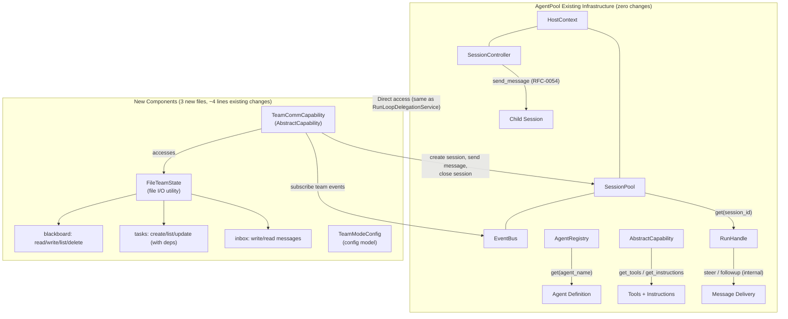
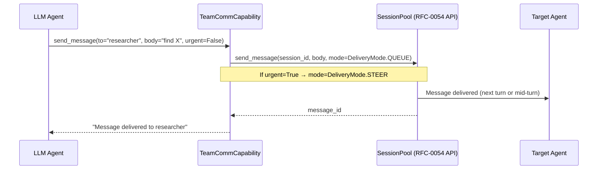
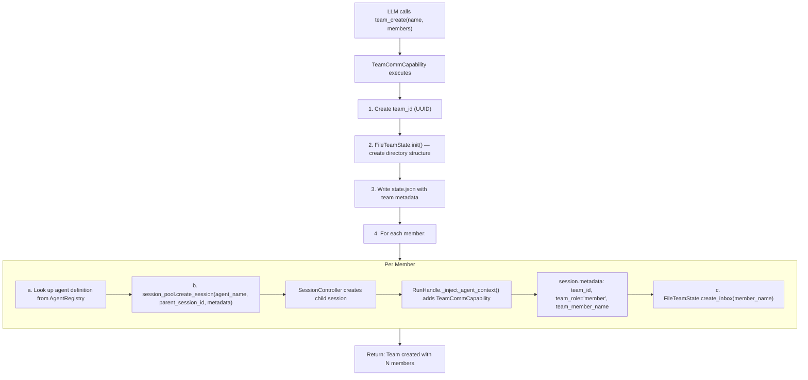
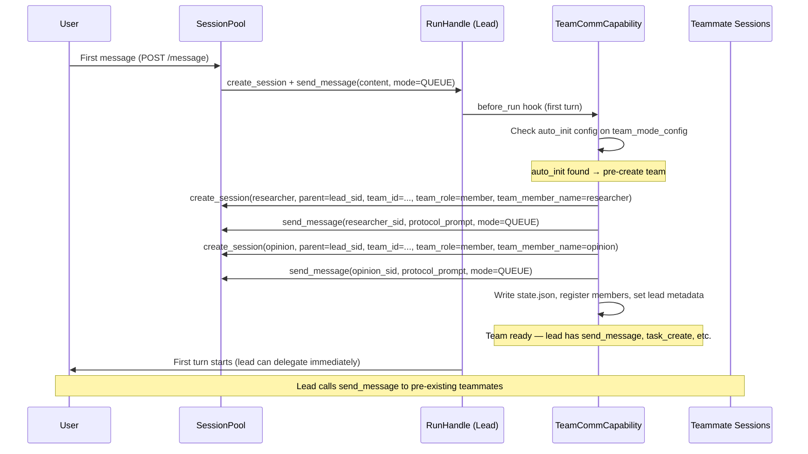
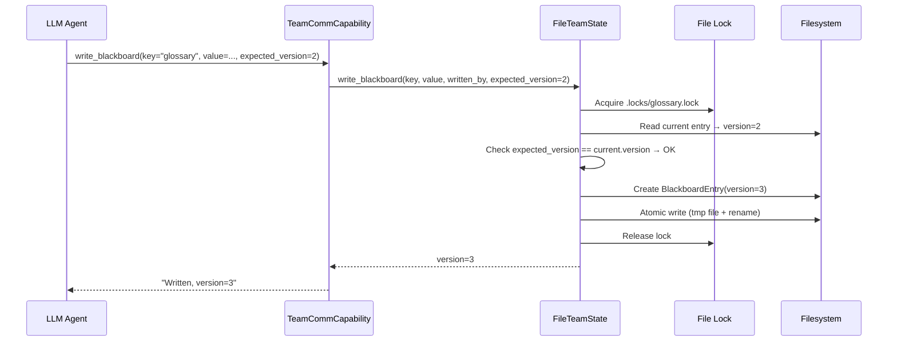

# RFC-0055: Dynamic Team Mode — LLM-Driven Multi-Agent Team Creation and Coordination

## Overview

AgentPool currently supports static team definitions via `teams:` (legacy) and `graph:` (current) YAML sections. These produce deterministic DAGs with program-controlled execution — suitable for known pipelines but unable to handle tasks where team composition and coordination strategy must be decided at runtime based on the task itself.

This RFC proposes a **dynamic team mode** (`team_mode:`) that enables LLM agents to create, coordinate, and dissolve teams at runtime through tool calls. The design is inspired by Qwen Code's team mode and cross-referenced with 7 other frameworks (see `docs/survey/multi-agent-orchestration/`). AgentPool positions as a **harness** — providing primitives, configuring constraints, and letting the LLM drive orchestration — rather than a **framework** where users write orchestration code.

The expected outcome is a minimal, capability-based extension that reuses existing infrastructure (SessionController, SessionPool, RunHandle, EventBus, AbstractCapability) with approximately 3 new files and ~4 lines of changes to existing files. **This RFC depends on RFC-0054** (V2 Message ID Infrastructure), which provides the `SessionPool.send_message()` / `run_agent()` / `DeliveryMode` public API that team_mode tools use.

## Table of Contents

- [Background & Context](#background--context)
- [Problem Statement](#problem-statement)
- [Goals & Non-Goals](#goals--non-goals)
- [Evaluation Criteria](#evaluation-criteria)
- [Options Analysis](#options-analysis)
- [Recommendation](#recommendation)
- [Technical Design](#technical-design)
- [Security Considerations](#security-considerations)
- [Implementation Plan](#implementation-plan)
- [Open Questions](#open-questions)
- [Decision Record](#decision-record)
- [References](#references)

---

## Background & Context

### Current State

AgentPool supports three team-related mechanisms:

| Mechanism | YAML Section | Control | Execution |
|-----------|-------------|---------|-----------|
| Static sequential/parallel teams | `teams:` (legacy) | Program | `BaseTeam._execute_sequential` / `_execute_parallel` |
| Static graph teams | `graph:` (current) | Program | pydantic-graph Fork/Join compilation |
| Agent delegation | `subagent` tool | LLM (single delegate) | `RunLoopDelegationService.spawn_subagent` (blocking) |

The `subagent` tool allows an LLM to delegate a single task to another agent, but the delegation is **blocking** (the LLM waits for the result) and **one-shot** (no persistent peer relationship). There is no mechanism for:
- Creating persistent teammates that can receive multiple messages
- Peer-to-peer communication between agents
- Shared state across agents (blackboard)
- Shared task board with dependency tracking

### Cross-Framework Research

A comparative survey of 8 multi-agent frameworks was conducted (see `docs/survey/multi-agent-orchestration/`). Key findings relevant to this RFC:

| Framework | Team Creation | Communication | Persistence | Message Priority |
|-----------|--------------|---------------|-------------|-----------------|
| **Qwen Code** | LLM-driven, fully dynamic | `send_message` tool (LLM-visible) | File-based (tempdir) | SHUTDOWN > LEADER > PEER |
| **OMO (oh-my-openagent)** | LLM-driven, from declared specs | `team_send_message` tool | File-based (3-phase delivery) | No explicit priority (FIFO) |
| **Hermes** | Program-defined | `delegate_task` (batch) | SQLite+FTS5 | N/A (synchronous) |
| **OpenCode** | Program-defined | Event-sourced | SQLite events | N/A |
| **Zed** | User-initiated | ACP protocol | In-memory | N/A |

Qwen Code and OMO both use **LLM-driven team creation with file-based persistence and tool-based communication**. This RFC adopts the same approach for AgentPool, with AgentPool-specific adaptations:

1. AgentPool's Capability system provides a natural injection point for team tools
2. AgentPool's SessionController/SessionPool provide session management infrastructure
3. AgentPool's RunHandle.steer/followup provide message delivery mechanisms
4. AgentPool's M2 lifecycle dimensions (Journal, SnapshotStore) provide persistence patterns

### Glossary

| Term | Definition |
|------|------------|
| **Harness** | A system that provides primitives and constraints, letting the LLM drive orchestration (vs. framework where users write orchestration code) |
| **Lead** | The agent that creates a team and coordinates its members |
| **Member/Teammate** | A persistent agent spawned by the Lead that can receive multiple messages |
| **Blackboard** | A shared key-value store readable and writable by all team members |
| **Task Board** | A shared task list with dependency tracking and auto-claim support |
| **Inbox** | A per-member message queue persisted as files |
| **Team Protocol** | Instructions injected into a member's system prompt describing how to behave as a teammate |

---

## Problem Statement

### The Problem

AgentPool's static team mechanisms (`teams:`, `graph:`) require the user to know team composition at configuration time. For complex tasks — industrial diagnosis, manual translation, sales assistance — the optimal team composition depends on the task content, which is only available at runtime.

**Example scenario**: A user asks an orchestrator agent to "translate this 500-page technical manual ensuring terminology consistency." The orchestrator needs to:
1. Create a terminology manager + N translators + a consistency checker
2. Assign chapters to translators with dependency on glossary initialization
3. Arbitrate terminology disputes via escalation
4. Track progress via a shared task board
5. Dissolve the team when complete

This workflow cannot be expressed as a static DAG because:
- The number of translators depends on the manual's length (runtime decision)
- Task dependencies (glossary → chapters → consistency check) are task-specific
- Escalation handling requires bidirectional communication
- The team lifecycle spans hours (longer than a single turn)

### Evidence

- GitHub Discussion #160 (Leoyzen/agentpool) documents the architectural proposal and received community feedback
- The comparative survey (`docs/survey/multi-agent-orchestration/`) identified LLM-driven team creation as the dominant pattern in production frameworks (Qwen Code, OMO)
- Three real-world scenarios (industrial diagnosis, manual translation, sales assistant) were analyzed and all require dynamic team composition

### Impact of Inaction

- **Cost**: Users must manually define team composition in YAML for each task type, even when the LLM could determine it more efficiently
- **Risk**: AgentPool falls behind competing frameworks (Qwen Code, OMO) that already support dynamic team creation
- **Opportunity**: Without dynamic teams, AgentPool cannot serve as a harness for LLM-driven multi-agent orchestration, limiting it to static pipeline use cases

---

## Goals & Non-Goals

### Goals (In Scope)

1. Enable LLM agents to create and dissolve teams at runtime via tool calls
2. Provide inter-agent communication via `send_message` tool (LLM-visible, not program-level)
3. Provide shared task board with dependency tracking and auto-claim
4. Provide shared blackboard (key-value store) with dedicated read/write tools
5. Inject team protocol into member system prompts via configurable template
6. File-based persistence in configurable tempdir with TTL cleanup
7. Reuse existing infrastructure (SessionController, SessionPool, RunHandle, AbstractCapability) with minimal changes
8. Reference existing `agents:` definitions (no duplicate member template definitions)
9. Support `auto_init` for pre-initializing teams at session startup — team members are spawned before the first user message, eliminating the `team_create` round-trip for fixed business scenarios

### Non-Goals (Out of Scope)

1. **Inline agent definition in team_create** — Members must reference pre-defined agents in `agents:` section (future work: allow LLM to define agent inline)
2. **ACP external agents as team members** — Only native (PydanticAI) agents supported (future work: ACP agent membership)
3. **Cross-team blackboard sharing** — Each team has isolated blackboard (future work: cross-team data sharing)
4. **Multi-user authentication** — User identification is handled by front-end proxy/protocol layer, not AgentPool. team_id (UUID) provides session-level isolation
5. **Tmux visualization** — No built-in UI for team visualization (future work)
6. **Worktree-per-member** — No automatic git worktree creation per member (future work)
7. **Message priority levels** — No multi-level priority queue; reuse steer/followup binary urgency
8. **Replacing `graph:` or `teams:`** — Static and dynamic teams coexist for different use cases

### Success Criteria

- [ ] LLM can call `team_create(name, members)` to spawn a team with persistent members
- [ ] LLM can call `send_message(to, body, urgent)` to deliver messages between members
- [ ] LLM can call `task_create/list/update` to manage shared tasks with dependency tracking
- [ ] LLM can call `read_blackboard/write_blackboard` to share structured state
- [ ] Team state persists to filesystem and survives process restart within TTL window
- [ ] `team_delete` cleanly closes all member sessions and removes file state
- [ ] Existing static team mechanisms (`graph:`, `teams:`) continue to work unchanged
- [ ] `auto_init` config creates team + spawns members before first user message (no `team_create` tool call needed)
- [ ] With `auto_init`, lead agent can `send_message` to pre-existing teammates in its first turn
- [ ] `auto_init` team can be dissolved by LLM calling `team_delete`, and a new team created via `team_create`
- [ ] Total changes to existing files: ≤ 5 lines across ≤ 3 files

---

## Evaluation Criteria

| Criterion | Weight | Description | Minimum Threshold |
|-----------|--------|-------------|-------------------|
| Pattern consistency | High | Follows existing capability/delegation patterns | Must use AbstractCapability + Protocol pattern |
| Infrastructure reuse | High | Reuses SessionController/SessionPool/RunHandle without modification | ≤ 10 lines changed in existing files |
| Minimal abstraction surface | High | No new architectural abstractions (only new Capability subclass + config model) | 0 new base classes/protocols beyond TeamCommCapability |
| Isolation | Medium | Team state isolated by team_id; no cross-team leakage | File paths scoped by team_id |
| Persistence | Medium | Team state survives process crash | File-based with TTL cleanup |
| LLM autonomy | Medium | LLM decides team composition, task assignment, coordination | Tools are LLM-visible, not program-level |
| Configurability | Medium | User can constrain team bounds, eligible agents, protocol template | All constraints in YAML `team_mode:` section |

---

## Options Analysis

### Option 1: TeamService Protocol (Mirror DelegationService Pattern) — REJECTED

**Description**

Create a new `TeamService` Protocol with 4 methods (`spawn_teammate`, `route_message`, `close_teammate`, `get_session_status`), backed by `RunLoopTeamService` implementation that wraps `HostContext.session_pool`. Add `team_service: TeamService | None` field to `AgentContext`. `TeamCommCapability` accesses team operations through `ctx.team_service`.

**Advantages**

- Mirrors the established `DelegationService` → `RunLoopDelegationService` → `ctx.delegation` pattern exactly (1:1 correspondence)
- `HostContext.session_pool` already exists (line 77 of `host/context.py`) — no HostContext changes needed
- Protocol limits capability power to 4 methods (Interface Segregation) — capabilities cannot close arbitrary sessions
- `RunLoopDelegationService` already accesses `SessionPool`/`SessionController` through `HostContext.session_pool` — the access path is proven
- Clean separation: `DelegationService` = parent→child blocking delegation, `TeamService` = peer-to-peer async team operations

**Disadvantages**

- **Creates a competing abstraction with SessionPool** — TeamService is a thin rename of SessionPool methods (`receive_request` → `send_message(wait=False)`, `run_stream` → `send_message(wait=True)`, `steer` → `send_message(urgent=True)`). Two abstractions for the same operations is architectural noise.
- **The limited-power argument is already broken** — `RunLoopDelegationService` (in `runloop_delegation.py:78`) already accesses `self._host.session_pool` directly without a Protocol wrapper. Adding a Protocol for team tools when the existing delegation service uses direct access is inconsistent.
- **Protocol servers need the full SessionPool API** — TeamService (5 methods) cannot cover protocol server needs (event_bus subscription with scopes, session creation with full config, reconnection handling). If TeamService expanded to cover them, it becomes SessionPool 2.0.
- **Migration cost with no consumer benefit** — Unifying DelegationService + TeamService into a single service requires renaming + migrating ~10 files, but all consumers already use the same underlying SessionPool methods.
- `AgentContext` gains a new field (though it's optional with default `None`)
- `RunHandle._inject_agent_context()` needs 2 lines to construct `RunLoopTeamService`

**Rejection Rationale**

See Appendix D6 for the full analysis. Summary: TeamService conflicts with SessionPool — it's the same operations under a different name. The existing pattern of `RunLoopDelegationService` directly accessing `self._host.session_pool` proves that services can use SessionPool without a wrapping Protocol. Adding a Protocol only for team tools creates an inconsistency with RunLoopDelegationService, not a pattern.

**Evaluation Against Criteria**

| Criterion | Rating | Notes |
|-----------|--------|-------|
| Pattern consistency | Fair | Mirrors DelegationService, but conflicts with RunLoopDelegationService's direct access pattern |
| Infrastructure reuse | Fair | Reuses session_pool, but adds redundant Protocol layer |
| Minimal abstraction surface | Poor | 1 new Protocol that duplicates SessionPool API |
| Isolation | Good | Protocol limits access to 4 methods (but RunLoopDelegationService already has full access) |
| Persistence | Good | File I/O handled by FileTeamState utility, not Protocol |
| LLM autonomy | Good | Tools exposed via capability, LLM-visible |
| Configurability | Good | TeamModeConfig model, YAML section |

**Effort Estimate**

- Complexity: Medium (Protocol + impl + AgentContext migration)
- New files: 5 (TeamService Protocol, RunLoopTeamService, TeamCommCapability, FileTeamState, TeamModeConfig)
- Modified files: 3 (agent_context.py +1 field, run.py +2 lines, manifest.py +1 field)
- Dependencies: None beyond existing infrastructure

**Risk Assessment**

| Risk | Likelihood | Impact | Mitigation |
|------|------------|--------|------------|
| TeamService/SessionPool dual abstraction confusion | High | Medium | Rejected — use Option 2 instead |
| Protocol drift from DelegationService pattern | Low | Low | N/A (rejected) |

---

### Option 2: Direct HostContext.session_pool Access — RECOMMENDED

**Description**

`TeamCommCapability` accesses `ctx.host.session_pool` directly, without a wrapping Protocol. The capability calls `session_pool.send_message()`, `session_pool.create_session()`, `session_pool.close_session()` directly (using RFC-0054's public API) — the same pattern already used by `RunLoopDelegationService` (in `runloop_delegation.py:78`).

**Advantages**

- **Zero new abstractions** — no Protocol, no implementation class, no AgentContext field
- **Architecturally consistent with RunLoopDelegationService** — `RunLoopDelegationService` already accesses `self._host.session_pool` directly for session operations (runloop_delegation.py:78). `BackgroundTaskCapability` (planned future migration from `../xeno-agent`) will follow the same pattern. `TeamCommCapability` follows the same established pattern.
- **No competing abstraction** — SessionPool remains the single session management interface. No "TeamService vs SessionPool" confusion.
- **Fewest new files** (only TeamCommCapability + FileTeamState + TeamModeConfig)
- **No migration needed** — DelegationService stays unchanged, AgentContext unchanged
- **EventBus access is natural** — `session_pool.event_bus.subscribe()` is already used by RunLoopDelegationService. TeamCommCapability can use it for team event aggregation without needing a Protocol method.

**Disadvantages**

- Exposes full `SessionController` API to capabilities — but this is already the case with `RunLoopDelegationService`. The limited-power principle was already relaxed for service-level session access.
- Couples `TeamCommCapability` to `SessionPool` method names — but SessionPool's API is stable (receive_request, run_stream, steer, close_session are core methods unlikely to change).
- `SubagentCapability` uses `ctx.delegation` (Protocol) — but that's for blocking one-shot delegation, a different use case. Team operations (persistent sessions, async messaging) are more similar to RunLoopDelegationService's direct access pattern than to SubagentCapability's Protocol pattern.

**Evaluation Against Criteria**

| Criterion | Rating | Notes |
|-----------|--------|-------|
| Pattern consistency | Excellent | Same pattern as RunLoopDelegationService (direct session_pool access) |
| Infrastructure reuse | Excellent | No infrastructure changes, direct use of existing API |
| Minimal abstraction surface | Excellent | 0 new Protocols, 0 new AgentContext fields |
| Isolation | Fair | Full SessionPool API exposed, but consistent with RunLoopDelegationService precedent |
| Persistence | Good | File I/O handled by FileTeamState utility |
| LLM autonomy | Good | Tools exposed via capability, LLM-visible |
| Configurability | Good | TeamModeConfig model, YAML section |

**Effort Estimate**

- Complexity: Low
- New files: 3 (TeamCommCapability, FileTeamState, TeamModeConfig)
- Modified files: 1 (manifest.py +1 field for team_mode config)
- Dependencies: None

**Risk Assessment**

| Risk | Likelihood | Impact | Mitigation |
|------|------------|--------|------------|
| SessionPool API changes break capability | Low | Low | SessionPool core methods (receive_request, steer, close_session) are stable infrastructure |
| Capability uses SessionPool methods outside team scope | Low | Low | TeamCommCapability only calls session methods for team-member sessions it created |

---

### Option 3: Extend DelegationService Protocol

**Description**

Add `spawn_teammate()`, `route_message()`, `close_teammate()`, `get_session_status()` methods to the existing `DelegationService` Protocol. `RunLoopDelegationService` implements them. `TeamCommCapability` accesses these through `ctx.delegation`.

**Advantages**

- No new Protocol — extends existing one
- `AgentContext` unchanged (no new field)
- `SubagentCapability` and `TeamCommCapability` share the same access path

**Disadvantages**

- Violates Interface Segregation: `DelegationService` mixes blocking subagent delegation with async team messaging
- All `DelegationService` implementations must add team methods (breaking change for any custom implementations)
- Semantically unclear: `spawn_subagent` (blocking, one-shot) and `spawn_teammate` (non-blocking, persistent) on the same Protocol
- Future team operations would further bloat `DelegationService`

**Evaluation Against Criteria**

| Criterion | Rating | Notes |
|-----------|--------|-------|
| Pattern consistency | Fair | Extends existing Protocol but violates its single responsibility |
| Infrastructure reuse | Good | No new infrastructure access paths |
| Minimal abstraction surface | Excellent | 0 new Protocols |
| Isolation | Fair | Methods are on shared Protocol, but capability still only calls team methods |
| Persistence | Good | Same as Option 1 |
| LLM autonomy | Good | Same as Option 1 |
| Configurability | Good | Same as Option 1 |

**Effort Estimate**

- Complexity: Low-Medium
- New files: 3 (TeamCommCapability, FileTeamState, TeamModeConfig)
- Modified files: 2 (delegation.py +4 methods, runloop_delegation.py +4 implementations)
- Dependencies: All DelegationService consumers must verify compatibility

**Risk Assessment**

| Risk | Likelihood | Impact | Mitigation |
|------|------------|--------|------------|
| Custom DelegationService implementations break | Medium | Medium | Add default implementations (but Protocol can't have defaults) |
| Protocol bloat over time | High | Medium | Split into separate Protocol instead |

---

### Option 4: EventBus as Message Transport

**Description**

Use the existing `EventBus` for inter-agent messaging. `send_message` publishes a `TeamMessageEvent` to the EventBus; recipient sessions subscribe to their team's events. No direct `RunHandle.steer/followup` access needed.

**Advantages**

- EventBus already exists with scoped subscriptions (session/descendants/subtree/all)
- No need to find target sessions — EventBus routes by scope
- Event-driven architecture, naturally async

**Disadvantages**

- EventBus is one-way event streaming, not request-response. `send_message` semantics (deliver to a specific agent, get confirmation) don't map cleanly to pub/sub
- Would need a new event type (`TeamMessageEvent`) and subscription management per member
- Messages would need to be converted from events back to prompts for injection — adds complexity
- `steer()` (urgent, mid-turn interruption) cannot be replicated through EventBus (events are consumed between turns, not mid-turn)
- Losing the `steer` capability means no urgent message delivery — a key feature

**Evaluation Against Criteria**

| Criterion | Rating | Notes |
|-----------|--------|-------|
| Pattern consistency | Fair | EventBus is for event streaming, not message delivery |
| Infrastructure reuse | Good | EventBus exists, but needs new event type + subscription logic |
| Minimal abstraction surface | Fair | No new Protocol, but new event type + subscription management |
| Isolation | Good | EventBus scopes handle isolation |
| Persistence | Poor | EventBus is in-memory, no file persistence |
| LLM autonomy | Fair | LLM calls send_message, but delivery mechanism is indirect |
| Configurability | Good | Same as Option 1 |

**Effort Estimate**

- Complexity: Medium (new event type, subscription management, prompt injection from events)
- New files: 4 (TeamMessageEvent, event-to-prompt converter, TeamCommCapability, TeamModeConfig)
- Modified files: 2 (event_bus.py +1 event type, agent.py +subscription setup)
- Dependencies: EventBus subscription lifecycle must be managed per team member

**Risk Assessment**

| Risk | Likelihood | Impact | Mitigation |
|------|------------|--------|------------|
| Cannot replicate steer (urgent) delivery | High | High | Fall back to direct RunHandle access, defeating the purpose |
| Event subscription lifecycle complexity | Medium | Medium | Need explicit subscribe/unsubscribe on team create/delete |

---

### Options Comparison Summary

| Criterion | Option 1: TeamService Protocol (REJECTED) | Option 2: Direct HostContext (RECOMMENDED) | Option 3: Extend DelegationService | Option 4: EventBus Transport |
|-----------|-------------------------------|----------------------------|-----------------------------------|----------------------------|
| Pattern consistency | Fair (conflicts with RunLoopDelegationService direct-access pattern) | Excellent (same as RunLoopDelegationService) | Fair | Fair |
| Infrastructure reuse | Fair (adds redundant Protocol) | Excellent (0 new layers) | Good | Good |
| Minimal abstraction surface | Poor (1 new Protocol duplicating SessionPool) | Excellent (0 new Protocols) | Excellent | Fair |
| Isolation | Good (but RunLoopDelegationService already has full access) | Fair (consistent with RunLoopDelegationService precedent) | Fair | Good |
| Persistence | Good | Good | Good | Poor |
| LLM autonomy | Good | Good | Good | Fair |
| Configurability | Good | Good | Good | Good |
| **Overall** | **Rejected** (competes with SessionPool) | **Best** (consistent, minimal) | Marginal | Poor |

---

## Recommendation

### Recommended Option

**Option 2: Direct HostContext.session_pool Access**

### Justification

Option 2 scores highest across evaluation criteria because it:

1. **Is architecturally consistent with RunLoopDelegationService** — `RunLoopDelegationService` (in `runloop_delegation.py:78`) already accesses `self._host.session_pool` directly for session operations. `BackgroundTaskCapability` (planned future migration from `../xeno-agent`) will follow the same pattern when ported. `TeamCommCapability` follows the same established pattern. This is the proven, working pattern for service-level session access in AgentPool.

2. **Avoids competing abstraction with SessionPool** — SessionPool's API (create_session, receive_request, run_stream, steer, close_session, event_bus) is already the right abstraction. Creating TeamService would just rename these methods (`receive_request` → `send_message(wait=False)`, `run_stream` → `send_message(wait=True)`, `steer` → `send_message(urgent=True)`) without adding value. Two abstractions for the same operations creates confusion, not clarity. See Appendix D6 for full analysis.

3. **Requires zero changes to existing files** — No AgentContext modification, no RunHandle injection, no DelegationService migration. Only 1 existing file changes (manifest.py +1 field for team_mode config). All other work is in new files.

4. **DelegationService stays focused** — DelegationService remains a 2-method Protocol for blocking one-shot subagent delegation. Team operations (persistent sessions, async messaging, peer communication) are semantically different and access SessionPool directly, same as RunLoopDelegationService.

### Accepted Trade-offs

1. **Full SessionPool API exposed to TeamCommCapability**: Acceptable because RunLoopDelegationService already has the same level of access. The limited-power principle was already relaxed for service-level session operations. If power-limiting becomes a requirement in the future, a Protocol can be retrofitted — but it should cover both RunLoopDelegationService and TeamCommCapability, not just team tools.

2. **Coupling to SessionPool method names**: Acceptable because SessionPool's core methods (receive_request, run_stream, steer, close_session) are stable infrastructure that hasn't changed since M2. The risk of API churn is low.

3. **Inconsistency with SubagentCapability's Protocol pattern**: Acceptable because SubagentCapability does blocking one-shot delegation (fundamentally different from team operations). The correct comparison is with RunLoopDelegationService (same direct-access pattern), not SubagentCapability (different use case).

### Conditions

- `HostContext.session_pool` must remain available on `ctx.host` (not removed in M4 cleanup)
- `SessionPool.send_message()` and `DeliveryMode` must be available (RFC-0054 Phase 4)
- `RunHandle.steer()` and `RunHandle.followup()` must remain as internal API (used by send_message)
- `SessionController.receive_request()` must support creating child sessions with `parent_session_id`
- `RunLoopDelegationService` continues to access SessionPool directly (pattern precedent)

---

## Technical Design

### Architecture Overview



### Key Components

#### 1. TeamCommCapability (Direct SessionPool Access)

```python
# capabilities/team_comm_capability.py
from __future__ import annotations
from collections.abc import Sequence
from agentpool.capabilities.abstract_capability import AbstractCapability
from agentpool.capabilities.function_toolset import FunctionToolsetCapability

class TeamCommCapability(FunctionToolsetCapability[AgentDepsT]):
    """Exposes team communication tools to agents.

    Accesses SessionPool directly via ctx.host.session_pool — same pattern
    as RunLoopDelegationService (runloop_delegation.py:78). No wrapping
    Protocol needed. BackgroundTaskCapability (future migration from
    xeno-agent) will follow the same pattern when ported.

    Tools are conditionally registered based on:
    - ctx.host.session_pool availability (None → standalone mode, no tools)
    - session.metadata["team_id"] presence (None → no tools)
    - session.metadata["team_role"] value ("lead" gets extra tools)
    """

    def __init__(self, config: TeamModeConfig) -> None:
        self._config = config

    async def get_tools(self) -> Sequence[Tool]:
        # Tools access ctx via PydanticAI's RunContext[AgentContext] at
        # execution time. The toolset is constructed at capability init time
        # with the config; team_id and base_dir are resolved per-operation
        # from ctx.session.metadata and ctx.team_mode_config.
        session_pool = ctx.host.session_pool
        if session_pool is None:
            return []  # standalone mode — no team tools
        team_id = ctx.session.metadata.get("team_id")
        if team_id is None:
            return []

        role = ctx.session.metadata.get("team_role", "member")
        member_name = ctx.session.metadata.get("team_member_name", "unknown")

        # Universal tools (all members)
        tools = [
            self._make_send_message_tool(session_pool, self._config),
            self._make_task_create_tool(self._config, member_name),
            self._make_task_list_tool(self._config),
            self._make_task_update_tool(self._config, member_name),
            self._make_read_blackboard_tool(self._config),
            self._make_write_blackboard_tool(
                self._config, member_name,
                self._config.blackboard.write_policy,
            ),
            self._make_list_blackboard_tool(self._config),
            self._make_team_status_tool(session_pool, self._config),
        ]

        # Lead-only tools
        if role == "lead":
            tools.extend([
                self._make_team_create_tool(
                    session_pool, ctx.agent_registry, self._config,
                ),
                self._make_team_delete_tool(session_pool, self._config),
                self._make_delete_blackboard_tool(self._config),
                self._make_shutdown_request_tool(session_pool, self._config),
            ])

        return tools

    def get_instructions(self, ctx: AgentContext) -> str:
        team_id = ctx.session.metadata.get("team_id")
        if team_id is None:
            return ""
        role = ctx.session.metadata.get("team_role", "member")
        team_name = ctx.session.metadata.get("team_name", "")
        member_name = ctx.session.metadata.get("team_member_name", "")
        config = ctx.team_mode_config
        if config is None:
            return ""
        return config.protocol_template.format(
            team_name=team_name,
            role=role,
            member_name=member_name,
        )
```

### Capability Registration

`TeamCommCapability` is auto-registered in the agent factory (`host/factory.py`) when:
1. `team_mode.enabled` is `true` in the pool config, AND
2. The agent is listed in `team_mode.lead_eligible` or `team_mode.member_eligible`.

The factory checks these conditions when building the capability list for each agent. If the agent is lead-eligible, the capability is added with `role="lead"` metadata. If member-eligible, with `role="member"`. The `team_mode_config` is passed from the pool config to the capability constructor.

This means TeamCommCapability is NOT manually added via YAML `tools:` config — it is auto-injected by the factory based on eligibility.

#### 2. SessionPool Access Pattern (Inside TeamCommCapability Tool Implementations)

```python
# Tool implementations inside TeamCommCapability — direct SessionPool access,
# using RFC-0054's public API (send_message, DeliveryMode, run_agent, create_session)
#
# Tools access ctx via PydanticAI's RunContext[AgentContext] at execution time.
# FileTeamState is constructed per-operation from config + session metadata.

async def _send_message_impl(
    ctx: RunContext[AgentContext],
    session_pool: SessionPool,
    config: TeamModeConfig,
    to: str,
    body: str,
    urgent: bool,  # Maps to DeliveryMode.STEER (urgent) or DeliveryMode.QUEUE (normal)
) -> str:
    """Send message to teammate via SessionPool.send_message (RFC-0054 API)."""
    # Construct FileTeamState per-operation from config + session metadata
    base_dir = config.base_dir
    team_id = ctx.deps.session.metadata.get("team_id")
    if team_id is None:
        return "Error: not in a team context"
    state = FileTeamState(base_dir, team_id)
    target_session_id = state.get_member_session_id(to)
    if target_session_id is None:
        return f"Member '{to}' not found"

    # Direct SessionPool access — RFC-0054 public API
    mode = DeliveryMode.STEER if urgent else DeliveryMode.QUEUE
    message_id = await session_pool.send_message(target_session_id, body, mode=mode)

    # Persist to inbox
    member_name = ctx.deps.session.metadata.get("team_member_name", "unknown")
    state.write_message(to, {
        "from": member_name, "body": body, "urgent": urgent,
        "message_id": message_id, ...
    })
    return f"Message delivered to {to}"

async def _team_create_impl(
    ctx: RunContext[AgentContext],
    session_pool: SessionPool,
    registry: AgentRegistry,
    config: TeamModeConfig,
    name: str,
    members: list[dict],
    parent_session_id: str,
) -> str:
    """Create team by spawning member sessions via SessionPool.create_session + send_message."""
    team_id = str(uuid4())
    base_dir = config.base_dir
    state = FileTeamState(base_dir, team_id)
    state.init()

    for member in members:
        agent_name = member["agent"]
        member_name = member.get("name", agent_name)
        # Create child session with team metadata
        child_session_id = await session_pool.create_session(
            agent_name=agent_name,
            parent_session_id=parent_session_id,
            team_id=team_id,
            team_role="member",
            team_member_name=member_name,
        )
        # Render the protocol template for this member
        protocol_prompt = config.protocol_template.format(
            team_name=name,
            role="member",
            member_name=member_name,
        )
        # protocol_prompt is the rendered protocol_template with variables
        # (team_name, role, member_name) substituted.
        # Start agent with protocol prompt via send_message (RFC-0054 API)
        await session_pool.send_message(child_session_id, protocol_prompt, mode=DeliveryMode.QUEUE)
        state.register_member(member_name, child_session_id)

    return f"Team '{name}' created with {len(members)} members. team_id={team_id}"

async def _shutdown_request_impl(
    ctx: RunContext[AgentContext],
    session_pool: SessionPool,
    config: TeamModeConfig,
    member_name: str,
) -> str:
    """Close teammate session via SessionPool.close_session."""
    base_dir = config.base_dir
    team_id = ctx.deps.session.metadata.get("team_id")
    if team_id is None:
        return "Error: not in a team context"
    state = FileTeamState(base_dir, team_id)
    session_id = state.get_member_session_id(member_name)
    if session_id is None:
        return f"Member '{member_name}' not found"
    await session_pool.close_session(session_id)
    return f"Shutdown completed for {member_name}"
```

#### 3. FileTeamState

```python
# capabilities/file_team_state.py
from __future__ import annotations
from pathlib import Path
import json, time, re, filelock

@dataclass
class BlackboardEntry:
    key: str
    value: Any  # JSON-serializable
    written_by: str
    written_at: float
    version: int

@dataclass
class Task:
    id: str
    subject: str
    description: str
    status: str  # pending | claimed | in_progress | completed | failed
    owner: str | None
    blocks: list[str]
    blocked_by: list[str]
    created_at: float
    updated_at: float

class FileTeamState:
    """File-based persistence for team state: inbox, tasks, blackboard.

    NOT an architectural abstraction — pure file I/O utility.
    All paths scoped by team_id for isolation.
    Key-to-path mapping prevents directory traversal.
    """

    KEY_PATTERN = re.compile(r'^[a-zA-Z0-9_/]+$')

    def __init__(self, base_dir: Path, team_id: str):
        self._dir = base_dir / team_id
        self._inboxes = self._dir / "inboxes"
        self._tasks = self._dir / "tasks"
        self._blackboard = self._dir / "blackboard"
        self._locks = self._blackboard / ".locks"

    def init(self) -> None:
        """Create directory structure."""
        for d in [self._inboxes, self._tasks, self._blackboard, self._locks]:
            d.mkdir(parents=True, exist_ok=True)

    # --- Inbox ---
    def write_message(self, member: str, msg: dict) -> None: ...
    def read_messages(self, member: str) -> list[dict]: ...

    # --- Tasks ---
    def create_task(self, task: Task) -> None: ...
    def list_tasks(self) -> list[Task]: ...
    def update_task(self, task_id: str, **fields) -> Task: ...

    # --- Blackboard ---
    def read_blackboard(self, key: str) -> BlackboardEntry: ...
    def write_blackboard(
        self, key: str, value: Any, written_by: str,
        expected_version: int | None = None,
    ) -> int: ...
    def list_blackboard(self, prefix: str = "") -> list[str]: ...
    def delete_blackboard(self, key: str) -> None: ...

    # --- Lifecycle ---
    def cleanup(self) -> None:
        """Remove all team state (called on team_delete)."""
        import shutil
        shutil.rmtree(self._dir, ignore_errors=True)

    def _key_to_path(self, key: str) -> Path:
        """Safe key → file path mapping, preventing directory traversal."""
        if not self.KEY_PATTERN.match(key):
            raise ValueError(f"Invalid blackboard key: {key}")
        path = self._blackboard / f"{key}.json"
        path.resolve().relative_to(self._blackboard.resolve())
        return path
```

#### 4. AgentContext Extension (Minimal)

```python
# capabilities/agent_context.py (modified)
@dataclass(frozen=True)
class AgentContext:
    agent_registry: AgentRegistry
    delegation: DelegationService
    session: SessionState      # required, not Optional
    scope: str
    host: HostContext          # required, not Optional
    extension_registry: ExtensionRegistry | None
    # TeamCommCapability accesses session_pool via ctx.host.session_pool (RFC-0054 API)
    # No team_service field needed — direct SessionPool access, same as RunLoopDelegationService
    team_mode_config: TeamModeConfig | None = None  # NEW
```

#### 5. RunHandle Injection (Minimal)

```python
# orchestrator/run.py _inject_agent_context() (modified, +1 line)
delegation = RunLoopDelegationService(registry, host, session_id)
ctx = AgentContext(
    agent_registry=registry,
    delegation=delegation,
    session=session_state,
    scope=scope,
    host=host,
    extension_registry=extension_registry,
    team_mode_config=team_mode_config,   # NEW (from pool config)
)
```

### Data Model

#### Team State (file-based)

```
{base_dir}/teams/{team_id}/
├── state.json                    # Team runtime state
├── inboxes/
│   ├── lead/
│   │   └── {uuid}.json           # Individual message files
│   └── {member_name}/
│       └── {uuid}.json
├── tasks/
│   ├── {task_id}.json            # Individual task files
│   └── .highwatermark            # ID counter
└── blackboard/
    ├── glossary.json             # Per-key files
    ├── outline.json
    ├── findings/
    │   ├── ch1.json
    │   └── ch2.json
    └── .locks/
        └── glossary.lock         # File locks (open write policy)
```

#### state.json Schema

```json
{
  "version": 1,
  "team_id": "uuid",
  "team_name": "translation-team",
  "status": "active",
  "created_at": 1234567890,
  "ended_at": null,
  "members": [
    {"name": "lead", "session_id": "ses_...", "agent": "orchestrator", "role": "lead"},
    {"name": "terminology", "session_id": "ses_...", "agent": "researcher", "role": "member"}
  ],
  "bounds": {
    "max_members": 10,
    "max_parallel_members": 4,
    "max_wall_clock_minutes": 120,
    "max_member_turns": 500
  }
}
```

#### Message Schema

```json
{
  "version": 1,
  "message_id": "uuid",
  "from": "terminology",
  "to": "lead",
  "kind": "message",
  "body": "Glossary initialized with 247 terms.",
  "timestamp": 1234567890,
  "urgent": false
}
```

#### Task Schema

```json
{
  "version": 1,
  "id": "task_001",
  "subject": "Initialize glossary",
  "description": "Extract and standardize terminology from the manual.",
  "status": "pending",
  "owner": null,
  "blocks": ["task_002", "task_003"],
  "blocked_by": [],
  "created_at": 1234567890,
  "updated_at": 1234567890
}
```

#### BlackboardEntry Schema

```json
{
  "key": "glossary",
  "value": {"accumulator": "蓄能器", "hydraulic": "液压"},
  "written_by": "terminology",
  "written_at": 1234567890.123,
  "version": 3
}
```

### Tool API

#### Universal Tools (all team members)

```python
send_message(to: str, body: str, urgent: bool = False, message_type: str = "message") -> str
    """Send a message to a teammate. urgent=True interrupts current turn."""
    # to: teammate name or "*" (broadcast, lead-only)
    # Returns: "Message delivered to {to}" or error string
    #
    # **`message_type`**: Optional categorization of the message (default: `"message"`). When `message_type` matches an entry in the `auto_urgent` config list, `urgent` is automatically set to `True` unless explicitly overridden by the caller.

task_create(subject: str, description: str, blocked_by: list[str] | None = None) -> str
    """Create a task on the shared task board."""
    # Returns: "Task created: {task_id}"

task_list() -> str
    """List all tasks with their status and dependencies."""
    # Returns: JSON array of tasks

task_update(task_id: str, status: str | None = None, owner: str | None = None) -> str
    """Update a task. Members can claim (set owner + status=claimed) or complete tasks."""
    # status: pending | claimed | in_progress | completed | failed
    # Returns: "Task {task_id} updated"

read_blackboard(key: str) -> str
    """Read a value from the shared blackboard. Supports '/' for hierarchical keys."""
    # Returns: JSON {"value": ..., "version": N, "written_by": "..."} or "Key not found"

write_blackboard(key: str, value: str, expected_version: int | None = None) -> str
    """Write a value to the shared blackboard. Returns new version number."""
    # expected_version: optimistic concurrency check (None = force overwrite)
    # Returns: "Written, version={N}" or "Conflict: current version is {N}"

list_blackboard(prefix: str = "") -> str
    """List blackboard keys under a prefix."""
    # Returns: JSON array of key strings

team_status() -> str
    """Show team status: members, their session status, task summary."""
    # Returns: JSON with members array and task counts
```

#### Lead-Only Tools

```python
team_create(name: str, members: list[dict]) -> str
    """Create a team. members: [{"role": "researcher", "agent": "researcher"}, ...]"""
    # agent names reference agents defined in YAML agents: section
    # Returns: "Team '{name}' created with {N} members. team_id={id}"

team_delete() -> str
    """Delete the current team. Closes all member sessions and removes file state."""
    # Returns: "Team deleted"
    # **Cancellation semantics**: `team_delete` calls `SessionPool.close_session()` for each member,
    # which calls `RunHandle.cancel()` (hard cancel). Member agents mid-turn are immediately
    # cancelled — they do NOT finish their current turn. This is intentional: `team_delete`
    # is an emergency operation.

delete_blackboard(key: str) -> str
    """Delete a blackboard entry. Lead only."""
    # Returns: "Deleted" or "Key not found"

shutdown_request(member_name: str) -> str
    """Request shutdown of a specific teammate."""
    # Returns: "Shutdown requested for {member_name}"
    # **Semantics**: Despite the name "request", `shutdown_request` is an immediate
    # (non-negotiable) session close. The teammate has no opportunity to reject or
    # delay. The name is aspirational — in v1, the lead's shutdown decision is final.
```

### Configuration

```yaml
# agents/manifest.yml

agents:
  researcher:
    model: openai:gpt-4o
    tools: [read, grep, web_search]
    system_prompt: "You are a research specialist."
  coder:
    model: openai:gpt-4o
    tools: [bash, read, write, edit]
    system_prompt: "You are a code implementation specialist."
  reviewer:
    model: openai:gpt-4o
    tools: [read, grep]
    system_prompt: "You are a code review specialist."
  orchestrator:
    model: openai:gpt-4o
    tools: [read, grep]
    system_prompt: "You are an orchestrator. You coordinate teams."
    # Per-agent team_mode with auto_init
    team_mode:
      enabled: true
      auto_init:
        team_name: "dev-squad"
        members:
          - name: researcher
            agent: researcher
          - name: coder
            agent: coder
          - name: reviewer
            agent: reviewer

# Per-agent team_mode overlay semantics:
# - Per-agent team_mode is a shallow merge with global team_mode.
# - Per-agent fields override the corresponding global fields.
# - Unspecified per-agent fields inherit from global config.
# - `enabled` is per-agent (global `enabled` is a master switch — if global is
#   `false`, per-agent `enabled: true` has no effect).
# - `base_dir` is typically global (per-agent override is rare but supported).

# Global team_mode config (applies to all agents with team_mode.enabled)
team_mode:
  enabled: true

  # Agent eligibility (references agents: section, no duplication)
  member_eligible: [researcher, coder, reviewer]
  lead_eligible: [orchestrator]

  # Storage (tempdir-based, not .omo/)
  base_dir: /tmp/agentpool/teams
  ttl_hours: 72

  # Bounds (guardrails for LLM-driven team creation)
  bounds:
    max_members: 10
    max_parallel_members: 4
    max_wall_clock_minutes: 120
    max_member_turns: 500

  # Blackboard
  blackboard:
    write_policy: open              # open (all write + optimistic lock) | lead_only
    max_size_mb: 100

  # Message
  message_max_bytes: 32768
  inbox_max_bytes: 262144
  auto_urgent: [escalation]         # message types that default to urgent=True

  # Protocol injection (user-configurable template)
  protocol_template: |
    你是团队 "{team_name}" 的成员, 角色是 {role} ({member_name})。

    工作流程:
    1. 调用 task_list 查看可用任务
    2. 认领未阻塞的任务 (task_update → in_progress, owner=你的名字)
    3. 执行任务, 可调用 read_blackboard 获取共享上下文
    4. 完成后 send_message(to="lead", body="结果摘要") 上报
    5. 遇到问题 send_message(to="lead", body="问题描述", urgent=True) 请求仲裁
    6. 标记任务完成 (task_update → completed), 回到步骤 1
    7. 无可用任务时等待 lead 分配
```

### Message Delivery Flow



### Team Creation Flow



### Team Auto-Initialization Flow (auto_init)

For fixed business scenarios where team composition is known at config time, `auto_init` pre-creates the team at session startup — before the first user message reaches the lead agent. This eliminates the `team_create` tool-call round-trip, reducing first-response latency.



**Key properties**:

- `auto_init` only affects **creation timing** — runtime capabilities are identical to manually created teams
- Lead agent can still `team_delete` the auto-initialized team and create a different one via `team_create`
- If `auto_init` is omitted, the LLM must call `team_create` manually (default behavior)
- `auto_init` runs in `TeamCommCapability.before_run()` — a lifecycle hook for per-run initialization

**Idempotency**: `before_run()` checks `ctx.session.metadata.get("team_id")` before creating. If a `team_id` already exists, auto_init is skipped (team was already created in a previous turn).

**Failure handling**: If any `create_session()` or `send_message()` call fails during auto_init:
1. All already-created member sessions are closed (best-effort, errors logged).
2. An error is logged with the failure reason.
3. The lead agent's first turn proceeds WITHOUT a team — `get_tools()` returns `[]` for team tools.
4. The error is injected as a system message in the lead's first turn: "Warning: auto_init failed: {error}. Team tools are disabled."

This is graceful degradation — the lead can still function without team tools.

### Blackboard Write Flow (open policy with optimistic lock)



### TTL Cleanup

```python
# Background task (runs every 10 minutes)
async def cleanup_expired_teams(base_dir: Path, ttl_hours: int):
    cutoff = time.time() - ttl_hours * 3600
    for team_dir in base_dir.iterdir():
            state = read_state(team_dir / "state.json")
            if state is None:
                continue
            if state.status in ("deleted", "failed", "orphaned"):
                if state.ended_at and state.ended_at < cutoff:
                    shutil.rmtree(team_dir, ignore_errors=True)
            elif state.created_at < cutoff:
                # Team appears abandoned — mark orphaned
                state.status = "orphaned"
                state.ended_at = time.time()
                write_state(team_dir / "state.json", state)
```

### Relationship to Existing Team Mechanisms

| Mechanism | YAML Section | Control | Coexists with team_mode? |
|-----------|-------------|---------|-------------------------|
| Static graph teams | `graph:` | Program (DAG) | Yes — different use cases |
| Legacy teams | `teams:` (deprecated) | Program | Yes — auto-translated to graph: |
| Agent delegation | `subagent` tool | LLM (one-shot) | Yes — blocking delegation remains |
| **Dynamic teams (manual)** | `team_mode:` (LLM calls `team_create`) | LLM (persistent) | **New** — this RFC |
| **Dynamic teams (auto_init)** | `team_mode.auto_init:` (YAML pre-defined) | Program-init + LLM-operated | **New** — this RFC |

The mechanisms serve different needs:
- `graph:` — Deterministic pipeline (analyze → review → format)
- `subagent` — One-shot delegation (lead delegates single task, waits for result)
- `team_mode:` (manual) — LLM decides team composition at runtime, creates via tool call
- `team_mode.auto_init` — Fixed business scenario, team pre-created at session startup, LLM operates the team (send messages, manage tasks) without creation overhead

---

## Security Considerations

### Threat Analysis

| Threat | Impact | Likelihood | Mitigation |
|--------|--------|------------|------------|
| Blackboard path traversal | High (arbitrary file read/write) | Medium | Key pattern validation (`^[a-zA-Z0-9_/]+$`) + path resolution check |
| Cross-team data access | Medium | Low | team_id (UUID) in path ensures isolation |
| LLM creates excessive teams | Low (resource waste) | Medium | Bounds config (max_members, max_wall_clock_minutes) |
| Inbox overflow (DoS) | Medium | Low | inbox_max_bytes limit, message_max_bytes limit |
| Stale teams consume resources | Low | Medium | TTL cleanup (72h default), orphaned detection |
| LLM sends message to non-existent member | Low | Medium | route_message returns False, tool returns error string |

### Security Measures

- [ ] Blackboard key validation: `^[a-zA-Z0-9_/]+$` pattern, path resolution check
- [ ] Team isolation: all paths scoped by team_id (UUID)
- [ ] Message size limit: message_max_bytes (default 32KB)
- [ ] Inbox size limit: inbox_max_bytes (default 256KB)
- [ ] Team bounds: max_members, max_parallel_members, max_wall_clock_minutes, max_member_turns
- [ ] TTL cleanup: teams auto-deleted after ttl_hours from end
- [ ] File atomic writes: tmp + rename for crash safety
- [ ] File locking: filelock for blackboard concurrent write protection

### Compliance

No specific regulatory requirements. Team state is ephemeral coordination data, not persistent user data.

---

## Implementation Plan

### Phases

#### Phase 1: File Persistence + Config

- **Scope**: FileTeamState + TeamModeConfig
- **Deliverables**:
  - `capabilities/file_team_state.py` — File I/O for inbox/tasks/blackboard
  - `agentpool_config/team_mode.py` — Config model
  - `agentpool_config/manifest.py` — +1 field (team_mode)
  - TTL cleanup background task
- **Dependencies**: None
- **Testing**: Unit test file operations, concurrent access, TTL cleanup

#### Phase 2: TeamCommCapability

- **Scope**: TeamCommCapability with all tools, direct SessionPool access, auto_init support
- **Deliverables**:
  - `capabilities/team_comm_capability.py` — Full capability with tool factory methods
  - Protocol template rendering
  - Tool registration conditional on role (lead vs member)
  - `before_run` hook for `auto_init` team pre-creation
  - `capabilities/agent_context.py` — +1 field (team_mode_config)
  - `orchestrator/run.py` — +1 line in _inject_agent_context()
- **Dependencies**: Phase 1
- **Testing**: Integration test with TestModel — create team, send message, create task, read/write blackboard, auto_init pre-creation

#### Phase 3: Integration & Polish

- **Scope**: End-to-end testing, YAML config validation, documentation
- **Deliverables**:
  - Integration tests with real agents
  - YAML config validation for team_mode section
  - AGENTS.md documentation update
  - Example config files
- **Dependencies**: Phase 1-2
- **Testing**: End-to-end team lifecycle test (create → coordinate → delete)

### Milestones

| Milestone | Description | Target | Status |
|-----------|-------------|--------|--------|
| M1: File Persistence | FileTeamState with inbox/tasks/blackboard | Phase 1 | Not Started |
| M2: Capability | TeamCommCapability with direct SessionPool access | Phase 2 | Not Started |
| M3: Integration | End-to-end tests and documentation | Phase 3 | Not Started |

### Rollback Strategy

- `team_mode.enabled: false` in YAML config disables all team_mode functionality
- `TeamCommCapability.get_tools()` returns empty list when `ctx.host.session_pool` is None (standalone mode) or no `team_id` in session metadata
- No changes to existing `graph:`, `teams:`, or `subagent` code paths
- All new files can be removed without affecting existing functionality
- AgentContext new field (`team_mode_config`) defaults to `None` — existing code unaffected

---

## Open Questions

1. **RFC-0054 dependency ordering**
   - Context: RFC-0055 depends on RFC-0054 Phase 4 (SessionPool public API: `send_message`, `DeliveryMode`, `run_agent`)
   - Question: Should RFC-0055 implementation start before RFC-0054 Phase 4 is complete (using deprecated `receive_request`), or wait?
   - Owner: Implementation team
   - Status: Open (recommend: start with deprecated API, migrate when RFC-0054 Phase 4 lands)

2. **SessionController API stability**
   - Context: `TeamCommCapability` calls `session_pool.send_message()`, `session_pool.close_session()`, `session_pool.create_session()`
   - Question: Are these methods considered stable public API, or could they change?
   - Owner: Architecture team
   - Status: Open

3. **TeamCommCapability injection mechanism**
   - Context: When a teammate session is created, `TeamCommCapability` must be added to the child agent's capabilities
   - Question: Should this happen at session creation time (before session starts) or in `RunHandle._inject_agent_context()` (per turn)?
   - Owner: Implementation team
   - Status: Open

4. **Initial prompt for teammates**
   - Context: When a teammate is spawned, it needs an initial prompt to start working
   - Question: Should the initial prompt be the team protocol only, or should the lead provide a task description in `team_create()`?
   - Owner: Design team
   - Status: Open

5. **Broadcast implementation**
   - Context: `send_message(to="*")` broadcasts to all members (lead-only)
   - Question: Should broadcast iterate members sequentially or concurrently? Should it use EventBus instead of per-member steer/followup?
   - Owner: Implementation team
   - Status: **Resolved** — Broadcast (`to="*"`) iterates sequentially over all team members for v1. This ensures deterministic ordering and prevents SessionPool overload. Concurrent broadcast is future work.

6. **Task auto-claim mechanism**
   - Context: Qwen Code and OMO both support IDLE members auto-claiming unblocked tasks
   - Question: Should auto-claim be a framework feature (injected into member protocol) or an LLM behavior (encouraged by protocol template)?
   - Owner: Design team
   - Status: Open (v1: protocol template encourages, not enforced)

7. **~~SessionService Protocol vs direct SessionPool access~~** — RESOLVED
   - Context: Should we create a `SessionService` Protocol to wrap SessionPool for team operations, or access SessionPool directly?
   - Decision: **Direct SessionPool access** (Option 2). TeamService creates a competing abstraction with SessionPool — it's the same operations under different names. RunLoopDelegationService already accesses SessionPool directly (runloop_delegation.py:78), establishing the pattern. BackgroundTaskCapability will follow the same pattern when migrated from xeno-agent. See Appendix D6 for full analysis.
   - Status: Resolved (2026-07-15)

8. **~~Will SessionService replace SessionPool as unified external interface?~~** — RESOLVED
   - Context: Could SessionService eventually replace SessionPool as the public-facing API for all consumers?
   - Decision: **No.** SessionPool's API is already correct and covers all consumer needs. Protocol servers require the full API (EventBus, session config), not a 5-method subset. Adding a layer increases maintenance cost without consumer benefit. See Appendix F for full analysis.
   - Status: Resolved (2026-07-15)

9. **~~Background task compatibility with team_mode~~** — RESOLVED
   - Context: Will the future migration of BackgroundTaskCapability from xeno-agent be compatible with team_mode?
   - Decision: **Fully compatible.** Both RunLoopDelegationService and TeamCommCapability access SessionPool directly for session primitives. BackgroundTaskCapability will follow the same pattern when migrated. BackgroundTaskManager (concurrency, timeout, cancel, notification) is an independent task lifecycle layer, not affected by team_mode. See Appendix E for full analysis.
   - Status: Resolved (2026-07-15)

---

## Decision Record

> Complete this section after RFC review is concluded.

### Decision

**Status**: APPROVED for implementation

**Date**: 2026-07-15

**Approvers**:
- Oracle (Architecture Review) — approved
- Metis (Plan Consultant) — approved

### Review History

| Reviewer | Round | Verdict | Notes |
|----------|-------|---------|-------|
| Oracle | 1 | Needs Changes | 1 BLOCKER (BT precedent), 3 MAJOR, 3 MINOR |
| Metis | 1 | Needs Changes | 14 HIGH, 12 MEDIUM, 4 LOW |
| Oracle | 2 | Needs Changes | 7 remaining issues |
| Metis | 2 | Needs Changes | 1 partial, 1 new issue |
| Oracle | 3 | Verified | All fixes confirmed |

**Decision**: APPROVED for implementation — all identified issues resolved across 3 review rounds.

### Decision Summary

Option 2 (Direct HostContext.session_pool Access) was selected as the recommended approach. The RFC was reviewed through 3 rounds of Oracle review and 2 rounds of Metis plan consultation. All identified issues (1 BLOCKER, 3 MAJOR, 3 MINOR from Oracle round 1; 14 HIGH, 12 MEDIUM, 4 LOW from Metis round 1; 7 remaining from Oracle round 2; 1 partial + 1 new from Metis round 2) were resolved and verified in Oracle round 3.

### Key Discussion Points

1. **TeamService Protocol vs direct SessionPool access** — Resolved in favor of direct access (Option 2), consistent with RunLoopDelegationService precedent
2. **BT (Background Task) compatibility** — Confirmed fully compatible (Appendix E)
3. **SessionService as unified external interface** — Rejected (Appendix F)
4. **Auto-init failure handling** — Graceful degradation: lead proceeds without team tools
5. **Standalone mode consistency** — `get_tools()` returns `[]` when SessionPool unavailable

### Conditions of Approval

- `HostContext.session_pool` must remain available on `ctx.host` (not removed in M4 cleanup)
- `SessionPool.send_message()` and `DeliveryMode` must be available (RFC-0054 Phase 4)
- `RunHandle.steer()` and `RunHandle.followup()` must remain as internal API
- `RunLoopDelegationService` continues to access SessionPool directly (pattern precedent)

### Dissenting Opinions

None. All reviewers converged on Option 2 after analysis of the BT precedent and SessionPool API stability.

---

## References

### Related Documents

- [Multi-Agent Orchestration Survey](../../survey/multi-agent-orchestration/index.md)
- [Survey: Comparison Matrix](../../survey/multi-agent-orchestration/comparison.md)
- [Survey: Recommendations](../../survey/multi-agent-orchestration/recommendations.md)
- [GitHub Discussion #160: Team Agent 架构设计](https://github.com/Leoyzen/agentpool/discussions/160)
- [Qwen Code Deep Dive (Discussion #160 comment)](https://github.com/Leoyzen/agentpool/discussions/160#discussioncomment-17637183)
- [RFC-0042: Unified Lifecycle Architecture](./RFC-0042-unified-lifecycle-architecture.md)
- [RFC-0037: Unify Steer and Followup](./RFC-0037-unify-steer-followup.md)

### External Resources

- [Qwen Code (source: ~/src/qwen-code)](https://github.com/QwenLM/qwen-code) — LLM-driven team creation, send_message tool, file-based team state
- [oh-my-openagent (code-yeongyu/oh-my-openagent)](https://github.com/code-yeongyu/oh-my-openagent) — Team mode with 3-phase delivery, crash recovery, tmux visualization
- [OMO Team Mode docs](https://github.com/code-yeongyu/oh-my-openagent/blob/dev/docs/guide/team-mode.md)
- [OMO team-core AGENTS.md](https://github.com/code-yeongyu/oh-my-openagent/blob/dev/packages/team-core/AGENTS.md)

### Appendix

#### A. Design Decision Summary

| Decision | Choice | Rationale |
|----------|--------|-----------|
| D1: Member definition | Reference existing `agents:` (no duplication) | DRY principle, single source of truth |
| D2: Blackboard write policy | Default `open` (all write + optimistic lock), configurable `lead_only` | Research teams need open writes; translation teams need lead-only |
| D2: Blackboard persistence | Tempdir with TTL (not .omo/) | Blackboard is ephemeral coordination state, not persistent work artifact |
| D2: Blackboard operations | Dedicated tools (not file read/edit) | Prevents JSON corruption, path traversal, lock bypass |
| D2: Multi-user isolation | team_id (UUID) provides session isolation | User auth is front-end proxy responsibility, not harness concern |
| D3: Message priority | Binary urgent flag (steer vs followup), no multi-level queue | 6-level priority (Qwen Code) collapses to 2 effective levels in practice |
| D4: Protocol injection | User-configurable `protocol_template` | Balances flexibility (user customizes) with safety (framework provides default) |
| D5: ACP agent membership | Native only in v1, ACP in future work | ACP agents may not support tool injection for TeamCommCapability |
| D6: Team pre-initialization | `auto_init` config creates team at session startup | Eliminates team_create round-trip for fixed business scenarios; runtime capabilities unchanged |
| Infra: Capability access | Direct SessionPool access (same as RunLoopDelegationService) | Avoids competing abstraction with SessionPool; RunLoopDelegationService precedent proves direct access works |
| Infra: HostContext | Zero changes (session_pool already exists) | Oracle verified: host/context.py line 77 |
| Infra: SessionService Protocol | Rejected — SessionPool is the single interface | Full analysis in Appendix D6 |

#### B. Component File Map

| File | Type | LOC (est.) |
|------|------|-----------|
| `capabilities/team_comm_capability.py` | New — Capability (direct SessionPool access + auto_init hook) | ~380 |
| `capabilities/file_team_state.py` | New — File I/O | ~250 |
| `agentpool_config/team_mode.py` | New — Config model | ~80 |
| `capabilities/agent_context.py` | Modified — +1 field (team_mode_config) | ~1 |
| `orchestrator/run.py` | Modified — +1 line (team_mode_config injection) | ~1 |
| `agentpool_config/manifest.py` | Modified — +1 field (team_mode) | ~2 |
| **Total new** | 3 files | ~680 |
| **Total modified** | 3 files | ~4 lines |

#### C. Quality Checklist

- [x] All required sections are complete
- [x] At least 2 alternatives are analyzed (4 options)
- [x] Evaluation criteria are explicit and measurable
- [x] Trade-offs are documented for each option
- [x] Language is objective and evidence-based
- [x] Technical diagrams are included where helpful
- [x] Open questions are clearly listed (5 open, 4 resolved)
- [x] Implementation plan is realistic (3 phases, clear dependencies)

#### D6. SessionService vs SessionPool — Decision to Not Create a New Protocol

**Context**: During design review, a `SessionService` Protocol was proposed to unify `DelegationService` (subagent delegation) and team communication under a single 5-method interface (`create_session`, `send_message(*, wait, urgent)`, `close_session`, `get_status`, `get_available_agents`). The intent was to:
1. Provide a unified session-primitive layer for all capability-level session operations
2. Replace `DelegationService` with a broader `SessionService`
3. Limit capability power via Interface Segregation

**Analysis**:

The proposed `SessionService` was a thin rename of `SessionPool` methods:

| SessionPool method | SessionService equivalent | Same operation? |
|---|---|---|
| `create_session()` | `create_session()` | Yes (identical) |
| `receive_request()` | `send_message(wait=False)` | Yes (async fire-and-forget) |
| `run_stream()` | `send_message(wait=True)` | Yes (sync blocking) |
| `steer()` | `send_message(urgent=True)` | Yes (mid-turn injection) |
| `close_session()` | `close_session()` | Yes (identical) |

This creates a **competing abstraction** — two interfaces for the same operations:

```
SessionPool (existing, full API):
  create_session, receive_request, run_stream, steer, close_session, event_bus

SessionService (proposed, renamed subset):
  create_session, send_message(wait/urgent), close_session, get_status
```

**Key findings**:

1. **RunLoopDelegationService already accesses SessionPool directly** — `RunLoopDelegationService` (in `runloop_delegation.py:78`) accesses `self._host.session_pool` directly for `create_session()`, `send_message()`, `close_session()`. No Protocol wrapper. `BackgroundTaskCapability` (planned future migration from `../xeno-agent`) will follow the same pattern when ported. The limited-power principle was already relaxed for service-level session access.

2. **Protocol servers need the full SessionPool API** — ACP server uses `event_bus.subscribe(scope="descendants")`, OpenCode server uses `create_session(agent_type=...)` with full config. SessionService (5 methods) cannot cover these needs. If expanded, it becomes SessionPool 2.0.

3. **All consumers use the same method pool** — DelegationService (via RunLoopDelegationService), TeamCommCapability, and protocol servers all call the same SessionPool methods. There's no "this consumer needs a completely different interface" problem that a new abstraction would solve.

4. **Migration cost with no consumer benefit** — Unifying DelegationService into SessionService requires renaming + migrating ~10 files. All consumers would call the same underlying methods through a different name.

**Decision**: Do NOT create TeamService. TeamCommCapability accesses `ctx.host.session_pool` directly, using the public API provided by RFC-0054 (`send_message`, `run_agent`, `create_session`, `DeliveryMode`).

**Rationale**: One interface + different access patterns is simpler than two interfaces for the same operations. RFC-0054 adds convenience methods directly to SessionPool (`send_message` with `DeliveryMode`, `run_agent`), making a wrapper Protocol redundant. `RunLoopDelegationService` already establishes the direct-access pattern. If power-limiting becomes a future requirement, a Protocol can be retrofitted — but it should cover all capability-level session access (including RunLoopDelegationService and the future BackgroundTaskCapability), not just team tools.

**Update (2026-07-15)**: RFC-0054 Phase 4 adds `SessionPool.send_message(mode=DeliveryMode)`, `run_agent()`, and `revoke_message()` as public API on SessionPool itself. This eliminates the need for any wrapper Protocol — team tools call SessionPool methods directly, same as RunLoopDelegationService.

#### E. Background Task Compatibility Analysis

**Context**: `../xeno-agent` implements a `BackgroundTaskCapability` that provides `task` (sync/async delegation), `background_output` (retrieve results), and `background_cancel` (cancel tasks) tools. A future migration will port this to AgentPool's existing subagent capabilities. The question: is the proposed team_mode architecture compatible with this migration?

**xeno-agent Background Task Architecture**:

```
BackgroundTaskCapability (AbstractCapability)
  ├── BackgroundTaskManager — concurrency (Semaphore max 10), timeout (1800s),
  │   cancellation (graceful, 30s cancel timeout), retention (3600s cleanup)
  ├── NotificationBatcher — debounce 500ms, deliver via session_pool.steer()
  └── File output — /tasks/{task_id}/output.md on internal filesystem

Session access (direct, via ctx.host.session_pool, RFC-0054 API):
  ctx.host.session_pool.send_message(sid, prompt, mode=QUEUE)  — async mode
  ctx.host.session_pool.run_stream(sid, prompt)                — sync mode (event stream)
  ctx.host.session_pool.send_message(sid, msg, mode=STEER)     — notification delivery
  ctx.host.session_pool.event_bus.subscribe(sid, scope="session") — event monitoring
  ctx.host.session_pool.close_session(sid)                     — cleanup
```

**Compatibility mapping**:

| Background Task operation | Current call | Works with team_mode design? |
|---|---|---|
| Create child session | `agent_ctx.create_child_session()` | ✅ Unchanged (SessionPool direct) |
| Sync execution | `session_pool.run_stream()` | ✅ Unchanged |
| Async execution | `session_pool.receive_request()` | ✅ Unchanged |
| Notification to parent | `session_pool.steer()` | ✅ Unchanged |
| Event subscription | `session_pool.event_bus.subscribe()` | ✅ Unchanged (EventBus stays on SessionPool, not on any Protocol) |
| Close session | `session_pool.close_session()` | ✅ Unchanged |

**What team_mode does NOT change for background tasks**:
- BackgroundTaskManager (concurrency, timeout, cancel, retention) — stays independent
- NotificationBatcher (debounce, steer delivery) — stays independent
- Force retrieval (ensure agent retrieves before ending) — stays independent
- Task ID management (bg_xxx) — stays independent
- Output file persistence — stays independent

**Conclusion**: Fully compatible. SessionPool (with RFC-0054's public API) is the session primitive layer (shared by both RunLoopDelegationService, TeamCommCapability, and the future BackgroundTaskCapability). BackgroundTaskManager is the task lifecycle layer (independent of team_mode). They are complementary, not competing.

**Note**: BackgroundTaskCapability does not yet exist in AgentPool — it is planned for future migration from `../xeno-agent`. The analysis above confirms that when it is migrated, it will follow the same direct-access pattern already established by `RunLoopDelegationService` (runloop_delegation.py:78). TeamCommCapability follows this same pattern today.

**Migration cost when porting**: With RFC-0054's `send_message()` API, BackgroundTaskCapability's `receive_request()` calls migrate to `send_message(mode=DeliveryMode.QUEUE)` — ~3-5 lines. `run_stream()` (advanced API for event streaming) remains unchanged. Total: ~5-8 lines of call-site changes.

#### F. SessionService as Unified External Interface — Analysis and Rejection

**Question**: Will SessionService eventually replace SessionPool as the unified external interface for all consumers (capabilities, protocol servers, external integrations)?

**Analysis**:

If SessionService replaced SessionPool as the external interface:

```
SessionPool (pure internal infrastructure)
  └── SessionService (unified external Protocol)
        ├── Capabilities (TeamCommCapability, SubagentCapability, future BackgroundTaskCapability)
        ├── Protocol Servers (ACP, OpenCode, AG-UI, OpenAI API)
        └── External Plugins
```

**Why this doesn't work**:

1. **Protocol servers need more than 5 methods**:
   - ACP server: `event_bus.subscribe(scope="descendants")` for child event forwarding
   - OpenCode server: `create_session(agent_type=..., config=...)` with full configuration
   - AG-UI server: Session reconnection, state recovery
   
   If SessionService expanded to cover these, it becomes a full SessionPool API copy — just with different method names.

2. **SessionPool's API is already correct**:
   - `receive_request(session_id, content)` — clear, well-named
   - `run_stream(session_id, content)` — clear, well-named
   - `steer(session_id, message)` — clear, well-named
   
   `send_message(wait=True/False, urgent=True/False)` merges 3 methods into 1 with 4 parameter combinations — arguably less clear, not more.

3. **All consumers use the same method pool**:
   
   | Consumer | Methods used | Overlap with others? |
   |---|---|---|
   | Protocol servers | create + receive + stream + events + close | — |
   | DelegationService | create + receive + start + wait | Subset of protocol servers |
    | BackgroundTaskCapability (future) | create + run_stream + receive + steer + events + close | High overlap with protocol servers |
   | TeamCommCapability | create + receive + steer + close | Subset |
   
   No consumer needs a fundamentally different interface. They all select from the same method pool.

4. **Adding a layer increases maintenance cost**: Protocol definition, implementation class, migration, backward compatibility — all for renaming existing methods.

**Decision**: SessionPool remains the single session management interface. No SessionService replacement.

**Future direction**: If tool-author API friendliness becomes a concern, add convenience methods directly to SessionPool (e.g., `send_message(session_id, msg, *, wait=False, urgent=False)` that internally calls receive_request/run_stream/steer). This avoids creating a competing abstraction while improving ergonomics.
