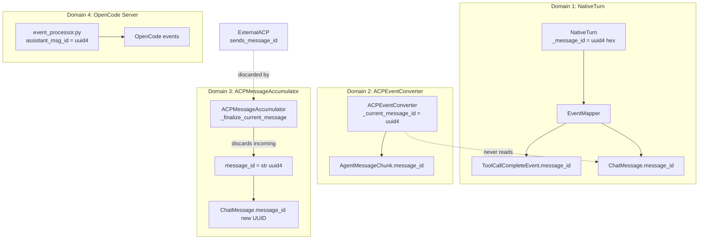
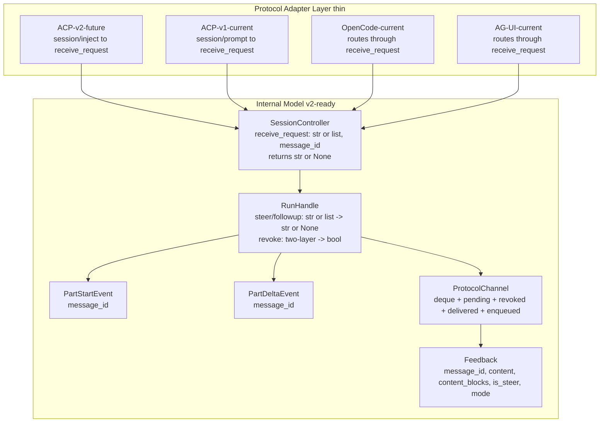
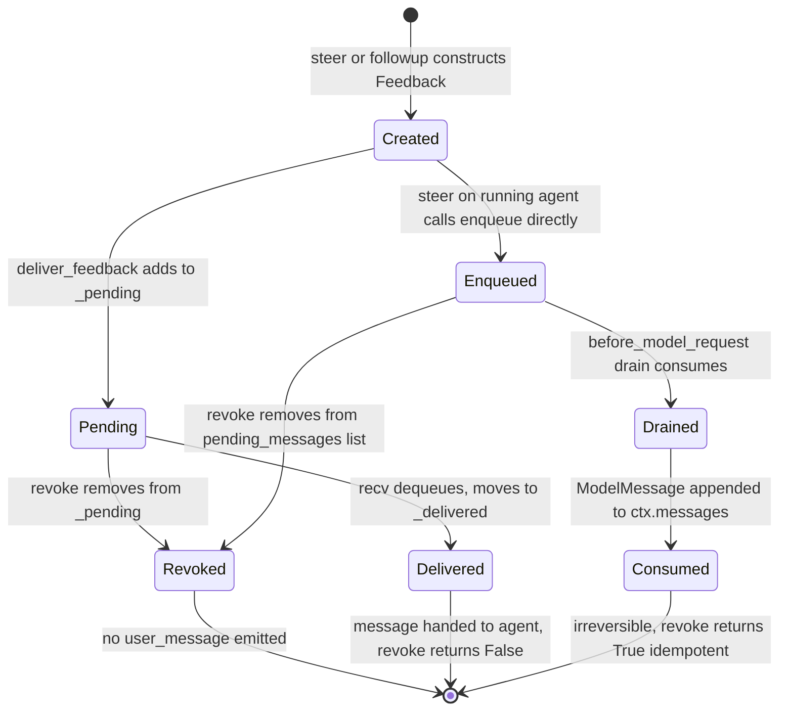
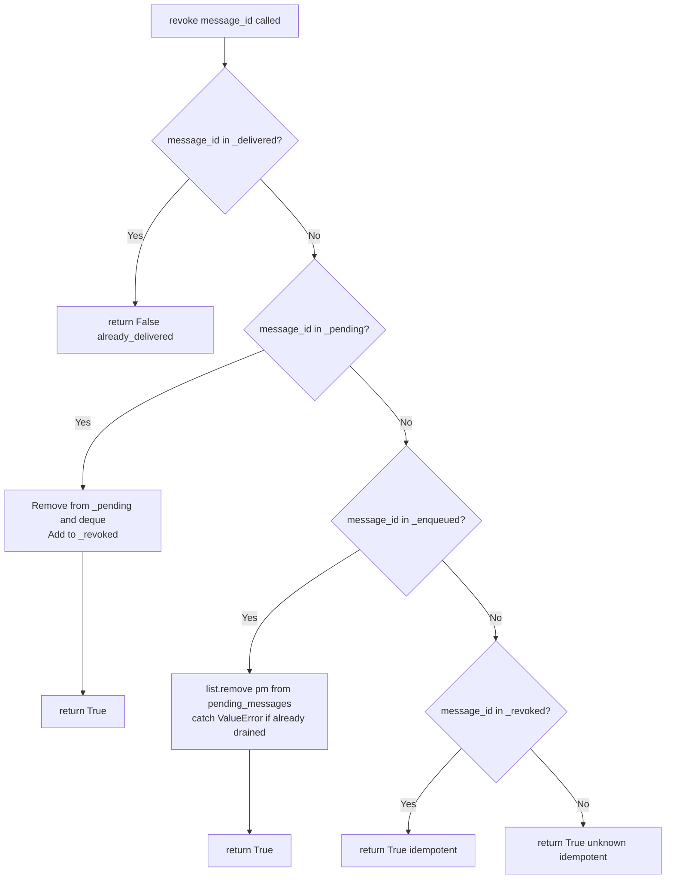
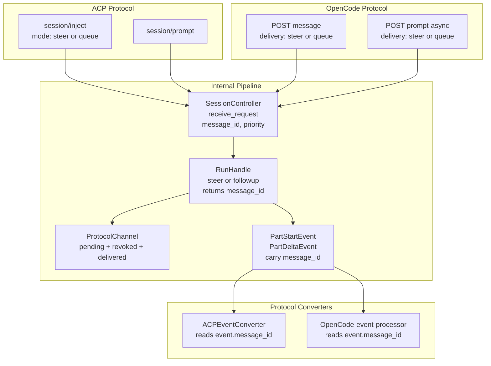
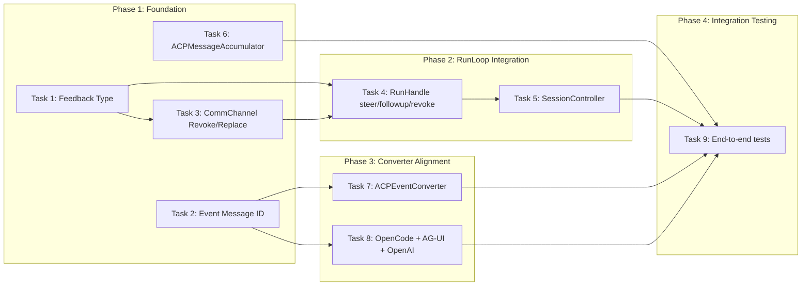

# RFC-0054: V2 Message ID Infrastructure

## Overview

AgentPool's internal architecture currently maintains four independent, non-communicating message ID domains: NativeTurn, ACPEventConverter, ACPMessageAccumulator, and the OpenCode server event processor. Each generates its own UUIDs without consulting the others, creating a fractured identity pipeline where message IDs are lost, regenerated, and mismatched across layers.

The upcoming ACP v2 protocol (RFD #1261 `session/inject`, message-id RFD, v2 prompt lifecycle) requires a single agent-owned `messageId` that flows end-to-end: from accept through the event pipeline to delivery to revoke. This RFC proposes unifying the message ID pipeline, extending the `Feedback` type with ID tracking, adding revoke/replace semantics to `ProtocolChannel`, and wiring all protocol converters to read from a single source of truth. The expected outcome is an internal architecture where v2 protocol support becomes a thin adapter layer rather than a deep refactor.

## Table of Contents

- [Background & Context](#background--context)
- [Problem Statement](#problem-statement)
- [Goals & Non-Goals](#goals--non-goals)
- [Evaluation Criteria](#evaluation-criteria)
- [Options Analysis](#options-analysis)
- [Recommendation](#recommendation)
- [Technical Design](#technical-design)
- [Security Considerations](#security-considerations)
- [Implementation Plan](#implementation-plan)
- [Open Questions](#open-questions)
- [Decision Record](#decision-record)
- [References](#references)

---

## Background & Context

### Current State

AgentPool is a unified agent orchestration framework that bridges multiple protocols (ACP, AG-UI, OpenCode, MCP) and supports native PydanticAI agents and external agents via ACP. The M2 lifecycle subsystem introduced `CommChannel` (DirectChannel and ProtocolChannel) for bidirectional communication between protocol handlers and the RunLoop (`RunHandle`).

The `Feedback` dataclass (`lifecycle/types.py:61-72`) is the internal representation of user feedback (steer/followup messages). It currently has only `content: str` and `is_steer: bool` — no message ID, no structured content, no revoke capability.

The `ProtocolChannel` feedback queue (`comm_channel.py:227`) is a plain `asyncio.Queue[Feedback]` with no ID-based tracking. Messages are enqueued by `SessionController.receive_request()` and dequeued by the RunLoop's idle/wake loop. There is no way to revoke or replace a pending message.

The following diagram illustrates the four independent, non-communicating message ID domains:



### Historical Context

The M2 lifecycle (RFC-0042) introduced the CommChannel abstraction and the RunLoop architecture. Steer/followup routing was unified in RFC-0037. The ACP v2 protocol evolution (message-id RFD, RFD #1261, v2 prompt lifecycle RFD) now requires message-level identity tracking that the current architecture cannot provide.

The `message_id` field already exists in several places:
- `ChatMessage.message_id` (`messaging/messages.py:189`) — UUID default, used for internal tracking
- `BaseChunk.message_id` (`acp/schema/session_updates.py:48`) — optional on v1 chunks, UNSTABLE
- `PromptRequest.message_id` (`acp/schema/client_requests.py:137`) — client-provided, UNSTABLE
- `PromptResponse.user_message_id` (`acp/schema/agent_responses.py:236`) — agent echo, UNSTABLE
- `ToolCallCompleteEvent.message_id` (`agents/events/events.py:607`) — tool call correlation
- `MessageReplacementEvent.message_id` (`agents/events/events.py:882`) — message targeting

However, these fields are disconnected: each layer generates or ignores IDs independently.

### OpenCode Protocol Considerations

The OpenCode protocol (at `~/src/opencode/`) has its own message ID system that differs from ACP in several important ways:

1. **ID format**: OpenCode uses `msg_` + monotonic ascending timestamp-based IDs (`SessionMessage.ID`), not UUIDs. IDs are lexicographically sortable for cursor-based pagination. AgentPool's OpenCode server already uses `identifier.ascending("message")` to generate compatible IDs.

2. **Delivery mode**: OpenCode already has `SessionDelivery.Delivery = ["steer", "queue"]` — the same steer/queue concept as ACP RFD #1261. Every prompt carries a `delivery` field. However, AgentPool's OpenCode server currently hardcodes `priority="when_idle"` and does not expose the `delivery` field.

3. **Idempotent admission**: OpenCode's `SessionInput.admit()` checks for existing messages by ID — clients can provide a `messageID` for dedup. `PromptInput.messageID` is optional; the server generates one if omitted. AgentPool's `MessageRequest.message_id` mirrors this but doesn't use it for idempotency.

4. **Event messageID**: All OpenCode session events carry `messageID: SessionMessage.ID`. Events are durable and replayable via `GET /api/session/:sessionID/event`. AgentPool's event processor generates `assistant_msg_id` independently instead of reading from events.

5. **Dual assistant_msg_id problem**: AgentPool's OpenCode server has TWO independent `assistant_msg_id` generation paths:
   - REST path (`message_routes.py:370`): generates `assistant_msg_id_A` for step-start/finish and message registration
   - EventBus consumer (`session_pool_integration.py:932`): generates `assistant_msg_id_B` for streaming content parts
   
   Content parts (text, tools, reasoning) are broadcast linked to `assistant_msg_id_B`, while step-start/finish is linked to `assistant_msg_id_A`. This creates a split-message issue in the frontend.

6. **No steer/followup via HTTP**: OpenCode handles follow-ups as new `POST /message` requests with fresh message IDs. Steer/followup injection is a core EventBus mechanism not exposed as an OpenCode route. The `delivery: "steer"` mode exists in the schema but is not wired through AgentPool's routing.

7. **Abort vs Revoke**: OpenCode uses session-level `POST /abort` (calls `RunHandle.cancel()`), not message-level revoke. ACP v2's `session/revoke_inject` has no OpenCode equivalent.

### Glossary

| Term | Definition |
|------|------------|
| Message ID | Agent-owned opaque string uniquely identifying a message within a session |
| Steer | Mid-turn injection of user content, delivered at the next safe break-point |
| Followup (Queue) | Post-turn message buffered for delivery when the agent goes idle |
| CommChannel | Protocol abstraction for event delivery and feedback reception |
| ProtocolChannel | Bidirectional CommChannel for protocol-server sessions (publishes to EventBus) |
| DirectChannel | Unidirectional CommChannel for standalone execution (in-process queue) |
| RunHandle | The RunLoop instance; manages turn execution lifecycle |
| Feedback | Internal dataclass representing a steer/followup message |
| RFD #1261 | ACP protocol RFD proposing `session/inject` with queue/steer modes |
| Message-id RFD | ACP protocol RFD adding `messageId` to streaming chunks (optional v1, required v2) |

---

## Problem Statement

### The Problem

AgentPool has four independent message ID generation domains that never communicate:

1. **NativeTurn** (`turn.py:98`): Generates `uuid4().hex` per turn, passes to `EventMapper`, stamps onto `ToolCallCompleteEvent` and final `ChatMessage`.
2. **ACPEventConverter** (`event_converter.py:208`): Generates `uuid.uuid4()` independently per stream reset. Never reads `ChatMessage.message_id` from `StreamCompleteEvent`.
3. **ACPMessageAccumulator** (`acp_converters.py:512`): Generates `str(uuid4())` at `_finalize_current_message()`, discarding the incoming `message_id` from external ACP agents.
4. **OpenCode server** (`event_processor.py`): Generates `assistant_msg_id` independently.

Additionally, the `Feedback` dataclass lacks `message_id`, the `ProtocolChannel` feedback queue has no ID-based tracking, and `steer()`/`followup()` return `bool` instead of a message ID handle.

### Evidence

- `ACPMessageAccumulator._finalize_current_message()` at line 512 always generates `str(uuid4())` — confirmed by source code reading
- `ACPEventConverter._current_message_id` at line 208 is independent of `ChatMessage.message_id` — confirmed by source code reading
- `ProtocolChannel._feedback_queue` at line 227 is `asyncio.Queue[Feedback]` with no ID tracking — confirmed by source code reading
- `RunHandle.steer()` at line 874 returns `bool`, not a message ID — confirmed by source code reading
- ACP RFD #1261 explicitly states: "This is a v2-only addition. It depends on the v2 prompt lifecycle's `user_message` notification and `state_change` semantics"
- The message-id RFD stabilizes optional `messageId` on v1 chunks but requires it on v2

### Impact of Inaction

- **Cost**: v2 protocol support (`session/inject`, `session/revoke_inject`) will require deep refactoring across 10+ files touching event types, CommChannel, RunHandle, SessionController, and all protocol converters
- **Risk**: External ACP agents' message IDs are silently discarded, breaking message identity continuity and preventing any future revoke/replace features
- **Opportunity**: Without unified IDs, AgentPool cannot support multi-client session replay, message-level operations, or the v2 prompt lifecycle

---

## Goals & Non-Goals

### Goals (In Scope)

1. Unify message ID generation into a single source of truth per message, flowing through events, CommChannel, and protocol conversion
2. Extend `Feedback` with `message_id` (auto-generated UUID), `content_blocks` (structured content, activated), and `mode` ("steer" | "queue")
3. Add `revoke(message_id)` and `replace(message_id, content)` to `ProtocolChannel` with pending/delivered/revoked tracking — revoke operates at two layers (CommChannel queue + PydanticAI `pending_messages` list)
4. Extend `RunHandle.steer()`/`followup()` to accept `str | list[Any]` (multimodal) and return `message_id`; add `RunHandle.revoke()` with two-layer semantics (CommChannel queue + PydanticAI `pending_messages`)
5. Extend `SessionController.receive_request()` to accept and propagate `message_id`, return `str | None` (message_id on success); add `revoke_inject()`. Initial prompts for new runs route through `followup()` (D17) for unified code path.
6. Fix `ACPMessageAccumulator` to preserve incoming `message_id` from external ACP agents
7. Wire `ACPEventConverter` to read `message_id` from events instead of generating independently
8. Add `message_id` field to `PartStartEvent` and `PartDeltaEvent`
9. Map OpenCode `delivery: "steer" | "queue"` to `SessionController.receive_request()` priority routing — server respects client's `delivery` field
10. Unify ALL `assistant_msg_id` generation sites in the OpenCode server (6+ files) — no technical debt left behind
11. Wire OpenCode `MessageRequest.message_id` through to `receive_request(message_id=...)` for client-provided ID propagation

### Non-Goals (Out of Scope)

1. Implementing the v2 protocol wire format (v2 JSON-RPC methods, `user_message` notification, `state_change` notification) — future change
2. Implementing `session/inject` / `session/revoke_inject` / `session/replace_inject` as ACP methods — this change only prepares the internal architecture
3. Modifying the ACP schema types (`BaseChunk.message_id`, `PromptRequest.message_id`) — these already exist
4. Steer-in-stream capability declaration (`["interrupt"]` / `["finish"]`) — future v2 protocol work
5. Non-blocking `session/prompt` lifecycle — future v2 protocol work
6. `RunHandle.replace()` and `SessionController.replace_inject()` — `CommChannel.replace()` is implemented but RunHandle exposure is deferred (D9)
7. ACP `ContentBlock` ↔ PydanticAI `UserContent` type mapping — deferred to v2 protocol adapter (D11 future work)
8. OpenCode `parts` → internal `content_blocks` mapping — deferred to v2 route handler (D11 future work)
9. Durable persistence of pending feedback for crash recovery — in-memory only, matching current behavior (D10)

### Success Criteria

- [ ] A single `message_id` flows from `NativeTurn._message_id` through `PartStartEvent` to `AgentMessageChunk` without regeneration
- [ ] External ACP agents' `message_id` values are preserved through `ACPMessageAccumulator` into `ChatMessage`
- [ ] `steer()` returns a `message_id` string that can be used with `revoke()` to cancel a pending message
- [ ] `revoke()` returns `False` for delivered messages and `True` for pending/enqueued/unknown (idempotent)
- [ ] `revoke()` can remove a steer message from PydanticAI's `pending_messages` list after `enqueue()` but before drain
- [ ] `receive_request()` returns `str` (message_id) for both new runs and steer/followup, `None` for failure — `RunHandle` is never returned to protocol handlers
- [ ] Initial prompts for new runs route through `followup()` (D17) — same code path as subsequent prompts
- [ ] All `assistant_msg_id` generation sites in OpenCode server read from events — zero independent generation
- [ ] All existing steer/followup callers continue to work without modification (backward compatible)
- [ ] All existing tests pass without regression

---

## Evaluation Criteria

| Criterion | Weight | Description | Minimum Threshold |
|-----------|--------|-------------|-------------------|
| End-to-end ID consistency | High | Same `message_id` flows from generation to protocol output without regeneration | 100% for native agents |
| Backward compatibility | High | Existing code (callers, tests, configs) works without changes | Zero breaking changes |
| Revoke/replace correctness | High | Revoke returns correct values for pending/delivered/unknown states | All spec scenarios pass |
| External ACP agent compatibility | Medium | Incoming `message_id` preserved; fallback to UUID when absent | Verified by integration test |
| Implementation complexity | Medium | Number of files touched, lines changed, risk of regression | ≤ 12 files, ≤ 500 LOC |
| V2 adapter thinness | Medium | Future v2 protocol handler is a thin routing layer | ≤ 50 LOC for v2 adapter |
| Thread safety | Low | All operations safe within single event loop | Documented constraint |

---

## Options Analysis

### Option 1: Full Pipeline Unification (Recommended)

**Description**

Unify all four message ID domains into a single pipeline. Add `message_id` to events (`PartStartEvent`, `PartDeltaEvent`), extend `Feedback` with ID tracking, upgrade `ProtocolChannel` with revoke/replace, change `steer()`/`followup()` return types, fix `ACPMessageAccumulator` to preserve incoming IDs, and refactor `ACPEventConverter` to read from events.

**Advantages**

- End-to-end ID consistency: one UUID per message flows through every layer
- Revoke/replace built into the infrastructure, not bolted on later
- v2 protocol adapter becomes a thin routing layer (route `session/inject` → `receive_request(message_id=...)`)
- External ACP agent IDs preserved, enabling future cross-agent message operations
- All changes are additive with defaults — backward compatible

**Disadvantages**

- Touches 10+ files across lifecycle, orchestrator, agents, and server layers
- `steer()`/`followup()` return type change from `bool` to `str | None` — requires verification of all call sites
- `ProtocolChannel` queue change from `asyncio.Queue` to `deque` — requires updating `close()` drain pattern
- `ACPEventConverter` refactor affects 7 yield sites — mechanical but wide

**Evaluation Against Criteria**

| Criterion | Rating | Notes |
|-----------|--------|-------|
| End-to-end ID consistency | Excellent | Single source of truth, no regeneration |
| Backward compatibility | Good | All new fields have defaults; truthy str compatible with bool |
| Revoke/replace correctness | Excellent | Full pending/delivered/revoked tracking |
| External ACP compatibility | Excellent | Incoming IDs preserved with UUID fallback |
| Implementation complexity | Medium | 10+ files, but changes are mechanical and well-scoped |
| V2 adapter thinness | Excellent | Internal semantics complete; adapter just routes |
| Thread safety | Good | Single event loop constraint documented |

**Effort Estimate**

- Complexity: Medium
- Resources: 1 engineer, 1-2 days
- Dependencies: None (all changes are self-contained)

**Risk Assessment**

| Risk | Likelihood | Impact | Mitigation |
|------|------------|--------|------------|
| `steer()` return type breaks caller | Low | Medium | Task 4.7 greps for `is True`/`is False` patterns |
| `deque` change breaks async semantics | Low | Low | Verified all `recv()` calls are synchronous |
| `ACPEventConverter` refactor introduces bugs | Medium | Medium | Integration tests verify ID flow end-to-end |
| External agent sends no `message_id` | Low | Low | Fallback to `str(uuid4())` when absent |

---

### Option 2: Incremental Layer-by-Layer

**Description**

Fix one layer at a time: first unify NativeTurn → ACPEventConverter, then fix ACPMessageAccumulator, then add Feedback message_id, then add revoke/replace. Each step is a separate PR.

**Advantages**

- Smaller PRs, easier to review
- Can ship partial value (e.g., ID consistency without revoke)
- Lower risk of regression per PR

**Disadvantages**

- Intermediate states are inconsistent (some layers unified, others not)
- Requires 4-5 separate PRs with dependency ordering
- Total effort is higher due to repeated context switching
- Revoke/replace cannot be tested until all layers are done
- Risk of forgetting a layer or introducing inconsistencies between PRs

**Evaluation Against Criteria**

| Criterion | Rating | Notes |
|-----------|--------|-------|
| End-to-end ID consistency | Partial | Only achieved after all PRs land |
| Backward compatibility | Good | Each PR is individually backward compatible |
| Revoke/replace correctness | Poor | Cannot be tested until final PR |
| External ACP compatibility | Partial | Only after ACPMessageAccumulator PR |
| Implementation complexity | Low per PR | But higher total effort |
| V2 adapter thinness | Good | Same end state as Option 1 |
| Thread safety | Good | Same constraint |

**Effort Estimate**

- Complexity: Low per PR, Medium total
- Resources: 1 engineer, 2-3 days total
- Dependencies: PR ordering constraints

**Risk Assessment**

| Risk | Likelihood | Impact | Mitigation |
|------|------------|--------|------------|
| Inconsistent intermediate state | Medium | Medium | Careful PR ordering |
| Forgotten layer | Low | Medium | Track via OpenSpec tasks |

---

### Option 3: v2-Only (Skip Internal Unification)

**Description**

Don't unify the internal pipeline. Instead, implement v2 protocol support directly in the ACP server handler, generating and tracking `message_id` at the protocol layer only. Internal events and Feedback remain unchanged.

**Advantages**

- Minimal internal changes
- v2 support shipped faster
- No risk to existing internal code

**Disadvantages**

- `message_id` exists only at the protocol layer, not in events or Feedback
- Revoke/replace must be implemented entirely in the ACP handler, duplicating logic
- Other protocol servers (OpenCode, AG-UI, OpenAI API) don't benefit
- External ACP agent IDs still discarded by `ACPMessageAccumulator`
- Future v2 features (multi-client, session replay) require deep refactoring anyway
- Violates the "define once, expose through multiple protocols" philosophy

**Evaluation Against Criteria**

| Criterion | Rating | Notes |
|-----------|--------|-------|
| End-to-end ID consistency | Poor | Only at protocol layer |
| Backward compatibility | Excellent | No internal changes |
| Revoke/replace correctness | Fair | Works but logic is ACP-specific |
| External ACP compatibility | Poor | ACPMessageAccumulator still discards IDs |
| Implementation complexity | Low | But creates technical debt |
| V2 adapter thinness | Poor | Adapter is thick, duplicating internal logic |
| Thread safety | Good | No new constraints |

**Effort Estimate**

- Complexity: Low
- Resources: 1 engineer, 0.5-1 day
- Dependencies: None

**Risk Assessment**

| Risk | Likelihood | Impact | Mitigation |
|------|------------|--------|------------|
| Technical debt blocks future v2 features | High | High | Plan for later refactor |
| Logic duplication across protocol servers | High | Medium | Accept duplication for now |

---

### Options Comparison Summary

| Criterion | Option 1: Full Unification | Option 2: Incremental | Option 3: v2-Only |
|-----------|--------------------------|---------------------|-------------------|
| End-to-end ID consistency | Excellent | Partial | Poor |
| Backward compatibility | Good | Good | Excellent |
| Revoke/replace correctness | Excellent | Poor | Fair |
| External ACP compatibility | Excellent | Partial | Poor |
| Implementation complexity | Medium | Medium total | Low |
| V2 adapter thinness | Excellent | Good | Poor |
| Thread safety | Good | Good | Good |
| **Overall** | **Recommended** | Acceptable | Not recommended |

---

## Recommendation

### Recommended Option

**Option 1: Full Pipeline Unification**

### Justification

Based on the evaluation criteria, Option 1 scores highest on end-to-end ID consistency (Excellent), revoke/replace correctness (Excellent), external ACP compatibility (Excellent), and v2 adapter thinness (Excellent). The main trade-off is implementation complexity (Medium, 10+ files), but the changes are mechanical and well-scoped with clear file paths and method signatures.

Option 2 (Incremental) achieves the same end state but with higher total effort and inconsistent intermediate states. Option 3 (v2-Only) creates technical debt that blocks future v2 features and violates AgentPool's "define once, expose through multiple protocols" philosophy.

### Accepted Trade-offs

1. **10+ files touched**: Acceptable because changes are additive (new fields with defaults) and mechanical (reading from events instead of generating)
2. **`steer()` return type change**: Acceptable because truthy `str` is boolean-compatible with existing `if run.steer(msg):` patterns, and Task 4.7 verifies no `is True`/`is False` dependencies
3. **`asyncio.Queue` → `deque`**: Acceptable because all `recv()` call sites are synchronous drain loops, not async blocking contexts
4. **`RunHandle.replace()` deferred**: Acceptable because RFD #1261 marks `session/replace_inject` as opt-in (P3); `CommChannel.replace()` is implemented so infrastructure is ready

### Conditions

- Task 4.7 must be executed rigorously (grep for `is True`, `is False`, bare statement calls)
- Integration tests (Tasks 9.1-9.8) must pass before marking the change complete
- The `""` sentinel on events must be documented as "not set" for v1 and asserted against in future v2 adapters

---

## Technical Design

### Architecture Overview



### Key Design Decisions

#### D1: `message_id` as `str` with `""` default on events

`PartStartEvent.message_id` and `PartDeltaEvent.message_id` use `str` with default `""`. Empty string means "not set" — protocol converters treat `""` as absent for v1 optional semantics. For v2 where `message_id` is required, `""` is a bug indicator; the future v2 adapter layer should add a debug-level assertion.

#### D2: `Feedback.message_id` auto-generated in `__post_init__`

`Feedback.message_id` defaults to `str(uuid.uuid4())` via `field(default_factory=...)`. Callers can override with an explicit value. Auto-generation ensures every `Feedback` has a valid ID regardless of construction site.

#### D3: `ProtocolChannel` feedback queue restructured to `deque` with ID tracking

Replace `asyncio.Queue[Feedback]` with `collections.deque[Feedback]` plus `_pending: dict[str, Feedback]`, `_revoked: set[str]`, `_delivered: set[str]`. The `recv()` method changes from `get_nowait()` to `deque.popleft()` with length check. The `close()` method uses `deque.clear()`. `deque.remove()` in `revoke()` is O(n) — acceptable given small queue sizes (typically 1-3 items).

#### D4: `steer()`/`followup()` return `str | None` instead of `bool`

Returning the `message_id` gives callers the handle needed for revoke/replace. Truthy `str` is boolean-compatible with existing `if run.steer(msg):` patterns.

**Feedback tracking for revoke**: `revoke()` operates at two layers (see D12.1). When `steer()` is called on a running agent (the most common case), it calls `agent_run.enqueue()` directly, bypassing `ProtocolChannel._pending`. To make revoke work in this case, `steer()` records the newly appended `PendingMessage` references by slicing `agent_run.pending_messages[queue_len_before:]` and stores them in `ProtocolChannel._enqueued[message_id]`. `revoke()` can then remove these references from the live `pending_messages` list via `list.remove(pm)` (identity comparison). The revoke window is from `enqueue()` to `before_model_request` drain — during model API generation, the message sits in the list and can be removed. If drain has already consumed the message, `list.remove(pm)` raises `ValueError` (caught), and `revoke()` returns `True` (idempotent).

For `followup()` and steer on idle agents: the `Feedback` goes through `ProtocolChannel.deliver_feedback()` → `_pending` dict. `revoke()` removes from `_pending` before `recv()` delivers it. Once `recv()` dequeues, the message transitions to `_delivered` and `revoke()` returns `False`.

#### D5: `ACPEventConverter` reads `message_id` from events

Remove `_current_message_id` from `ACPEventConverter`. Read `event.message_id` from `PartStartEvent`/`PartDeltaEvent`. For events without `message_id`, generate a one-off UUID inline.

For external ACP agents, `ACPMessageAccumulator` detects `message_id` changes: if incoming `update.message_id` differs from `self._current_message_id` and both are non-empty, trigger `_finalize_current_message()` for the previous message.

#### D6: `ACPMessageAccumulator` preserves incoming `message_id`

`_finalize_current_message()` uses `self._current_message_id` (set from incoming chunks) instead of always generating `str(uuid4())`. Falls back to UUID only when incoming is `None` or empty.

#### D7: `CommChannel` Protocol gains `revoke()` and `replace()`

Both methods added to the Protocol. `DirectChannel` implements as no-ops returning `False`. `ProtocolChannel` implements with real tracking logic.

#### D8: `receive_request()` return type simplifies to `str | None`

`str` (the `message_id`) for success (both new runs via followup D17 and steer/followup on busy sessions), `None` for failure. The `RunHandle` case is eliminated — initial prompts route through `followup()` which returns `str`. Two existing callers that access `RunHandle.complete_event` / `_turn_complete_event` (`session_routes.py:1935` and `acp_server/handler.py:607`) are migrated to a new `wait_for_completion(session_id, timeout)` method on `SessionController`/`SessionPool`.

#### D9-D12: Deferred items and constraints

- **D9**: `RunHandle.replace()` deferred — `CommChannel.replace()` is implemented but not exposed at RunHandle level
- **D10**: Crash recovery does not persist pending feedback — in-memory only, matching current behavior
- **D11**: `Feedback.content_blocks` **activated** — pipeline carries structured content (`list[Any]`) through `receive_request()` → `Feedback` → `steer()` → `agent_run.enqueue(*content_blocks)` without stringification. `receive_request()` stops stringifying `list` content. PydanticAI's `enqueue()` already supports multimodal (`ImageUrl`, `BinaryContent`, `TextContent`). Protocol-specific type mapping (ACP `ContentBlock` ↔ PydanticAI `UserContent`) deferred to v2 protocol adapter.
- **D12**: All `ProtocolChannel` methods must be called from the same event loop thread

#### D12.1: Two-layer revoke — CommChannel queue + PydanticAI pending_messages

`revoke(message_id)` operates at two layers to cover both `steer()` code paths:

1. **CommChannel layer** (`ProtocolChannel._pending`): For messages still pending in the feedback queue (followup messages, steer on idle agents, steer in turn gaps). `revoke()` removes from `_pending` dict.

2. **PydanticAI queue layer** (`agent_run.pending_messages`): For steer messages that went directly to `enqueue()` (the most common steer case — agent RUNNING with active agent_run). After `enqueue()`, `steer()` records the newly appended `PendingMessage` references by slicing `agent_run.pending_messages[queue_len_before:]`. `revoke()` removes these from the live list via `list.remove(pm)` (identity comparison).

**Revoke window**: From `enqueue()` (t0) to `before_model_request` drain (t1). During model generation (waiting for API response), the message sits in `pending_messages` and can be removed. Once drain consumes it and appends `ModelMessage`s to `ctx.messages`, the message is irreversible.

**Race safety**: `list.remove(pm)` uses identity comparison. If drain already consumed the message, `ValueError` is caught — `revoke()` returns `True` (idempotent). Both `remove()` and `_drain_by_priority()` run on the same event loop thread — no true concurrency, only interleaving at `await` points.

**Evidence**: PydanticAI's `PendingMessage` has no `message_id` field and `enqueue()` returns `None`, but `agent_run.pending_messages` exposes the live `list[PendingMessage]` for inspection. `list.remove(pm)` uses identity (`is`) comparison, which reliably finds the exact object appended by `enqueue()`.

### Data Model

```python
# lifecycle/types.py
@dataclass
class Feedback:
    content: str
    is_steer: bool
    message_id: str = field(default_factory=lambda: str(uuid.uuid4()))
    content_blocks: list[Any] | None = None  # activated: multimodal content (dicts, strings, ImageUrl, etc.)
    mode: str | None = None  # "steer" | "queue", derived from is_steer

    def __post_init__(self) -> None:
        if self.mode is None:
            self.mode = "steer" if self.is_steer else "queue"

# agents/events/events.py
class PartStartEvent(PyAIPartStartEvent):
    session_id: str = ""
    message_id: str = ""  # NEW: agent-owned, maps to ACP messageId

class PartDeltaEvent(PyAIPartDeltaEvent):
    session_id: str = ""
    message_id: str = ""  # NEW: same ID as the originating PartStartEvent

# lifecycle/comm_channel.py
class ProtocolChannel:
    _feedback_queue: deque[Feedback]       # CHANGED from asyncio.Queue
    _pending: dict[str, Feedback]          # NEW: O(1) lookup by message_id
    _revoked: set[str]                     # NEW: tombstone tracking
    _delivered: set[str]                   # NEW: already-delivered tracking
    _enqueued: dict[str, list]             # NEW: PendingMessage refs for PydanticAI-layer revoke
```

### Feedback Lifecycle State Machine

The following state machine shows the lifecycle of a `Feedback` message through the `ProtocolChannel` tracking system:



### Revoke Semantics Decision Tree



### Cross-Protocol Message ID Flow

The following diagram shows how message IDs flow across both ACP and OpenCode protocols through the unified internal pipeline:



### OpenCode-Specific Design Decisions

#### D13: Map OpenCode `delivery` to `receive_request` priority

OpenCode's `delivery: "steer" | "queue"` maps directly to AgentPool's priority system:
- `delivery: "steer"` → `priority: "asap"` (mid-turn injection)
- `delivery: "queue"` → `priority: "when_idle"` (next-turn queue)

`receive_request()` SHALL accept `delivery` as an alias for `priority`. OpenCode route handlers SHALL pass `delivery` from `MessageRequest` to `receive_request()`. Currently, OpenCode routes hardcode `priority="when_idle"` — this must be updated to respect the client's `delivery` field.

#### D14: Unify ALL `assistant_msg_id` generation in OpenCode server

The OpenCode server currently has multiple independent `assistant_msg_id` generation paths (REST, EventBus consumer, stream adapter, session routes, etc.), creating a split-message issue. **All** generation sites SHALL be unified — no technical debt left behind. The fix:

1. The REST path (`message_routes.py`) generates the canonical `assistant_msg_id` using `identifier.ascending("message", request.message_id)`
2. This ID is passed to `receive_request(message_id=...)` and propagates through events
3. ALL consumers (EventBus consumer, stream adapter, session routes, etc.) read `message_id` from `PartStartEvent` instead of generating their own
4. All parts (text, tools, reasoning, step-start/finish) link to the same `message_id`

This eliminates the split-message issue and ensures the frontend sees a single coherent message. Task 8.6 audits all remaining sites.

#### D15: OpenCode `message_id` format is opaque to internal pipeline

AgentPool's internal `Feedback.message_id` uses UUID by default, but the OpenCode server uses `identifier.ascending("message")` which produces `msg_*` format IDs. Both are opaque strings — the internal pipeline treats them identically. The `identifier.ascending("message", given_id)` function already accepts client-provided IDs, so when a client sends `messageID` in the OpenCode request, it flows through unchanged.

The internal pipeline does NOT enforce UUID format — it treats `message_id` as an opaque string, matching both ACP's UUID4 and OpenCode's `msg_*` formats.

#### D16: OpenCode abort maps to `RunHandle.cancel()`, not `revoke()`

OpenCode's `POST /abort` is session-level — it cancels the entire run, not a specific message. This maps to `RunHandle.cancel()` (existing behavior). ACP v2's `session/revoke_inject` is message-level — it cancels a specific pending inject. These are different operations:

- `POST /abort` → `RunHandle.cancel()` → cancels entire run (OpenCode)
- `session/revoke_inject` → `RunHandle.revoke(message_id)` → cancels specific pending message (ACP v2)

OpenCode does not need a message-level revoke endpoint in this change. The `revoke()` infrastructure is built internally so that ACP v2 can use it, but OpenCode clients continue to use session-level abort.

#### D17: Initial prompt reuses `followup()` — unified code path

When `receive_request()` starts a new run (idle session), the initial prompt SHALL be delivered via `run_handle.followup(content, message_id=message_id)` BEFORE `start()` is called. `start()` is called with `initial_prompt=""` — the first `_idle_loop()` iteration drains the followup feedback from `ProtocolChannel._pending` and uses it as the first turn's prompt.

This unifies the code path: all prompts (initial, steer, followup) go through `Feedback` → `ProtocolChannel` → `_idle_loop`/`recv()`. Benefits:

- Initial prompt gets a `message_id` automatically — ACP v2 `session/prompt` can return `user_message_id`
- Revoke works on the initial prompt (before `start()` picks it up)
- `content_blocks` (multimodal) flows through the same `Feedback` path
- `receive_request()` return type simplifies to `str | None` (always `message_id` on success)

Implementation: `_idle_loop()` and `_drain_events()` read both `fb.content` and `fb.content_blocks`; `_message_queue` type changes from `list[str]` to `list[str | list[Any]]`.

### API Design

```python
# RunHandle
def steer(self, message: str | list[Any], *, message_id: str | None = None) -> str | None: ...
def followup(self, message: str | list[Any], *, message_id: str | None = None) -> str | None: ...
def revoke(self, message_id: str) -> bool: ...  # two-layer: _pending + _enqueued
async def start(self, initial_prompt: str = "") -> AsyncGenerator[...]: ...  # D17: empty → _idle_loop drains followup

# SessionController
async def receive_request(
    self, session_id: str, content: str | list[Any],
    priority: str = "when_idle",
    *, message_id: str | None = None,
) -> str | None: ...  # always returns message_id on success (new runs via followup D17), None on failure
def revoke_inject(self, session_id: str, message_id: str) -> bool: ...

# CommChannel Protocol
def revoke(self, message_id: str) -> bool: ...  # two-layer: _pending → _enqueued → _delivered → unknown
def replace(self, message_id: str, new_content: str | list[Any]) -> bool: ...
def _track_enqueued(self, message_id: str, items: list) -> None: ...  # stores PendingMessage refs
```

---

## Security Considerations

### Threat Analysis

| Threat | Impact | Likelihood | Mitigation |
|--------|--------|------------|------------|
| Message ID spoofing | Low | Low | IDs are agent-owned opaque strings; clients cannot inject IDs into the pipeline |
| Revoke race condition | Low | Low | Single-threaded event loop; `_delivered` set prevents post-delivery revoke; `list.remove(pm)` catches `ValueError` for post-drain revoke (idempotent) |
| Pending feedback memory leak | Low | Low | `close()` clears all tracking structures; TTL cleanup handles abandoned sessions |

### Security Measures

- [x] Message IDs are agent-generated (not client-provided) — single source of truth
- [x] Revoke is scoped to the session's active run — cross-session revoke returns `False`
- [x] All `ProtocolChannel` methods are same-thread only (D12)

### Compliance

No regulatory or compliance requirements are affected by this change.

---

## Implementation Plan

### Phase Dependency Graph



### Phases

#### Phase 1: Foundation (Tasks 1-3)

- **Scope**: Feedback type extension, event message_id fields, CommChannel revoke/replace
- **Deliverables**: Extended `Feedback` dataclass, `PartStartEvent`/`PartDeltaEvent` with `message_id`, `ProtocolChannel` with revoke/replace
- **Dependencies**: None — these are foundational layers

#### Phase 2: RunLoop Integration (Tasks 4-5)

- **Scope**: RunHandle steer/followup/revoke, SessionController extension
- **Deliverables**: Updated `steer()`/`followup()` signatures, `revoke()` method, `receive_request()` with `message_id`, `revoke_inject()`
- **Dependencies**: Phase 1 (Feedback and CommChannel must be ready)

#### Phase 3: Protocol Converter Alignment (Tasks 6-8)

- **Scope**: ACPMessageAccumulator fix, ACPEventConverter refactor, OpenCode delivery mode + dual ID fix, AG-UI/OpenAI audit
- **Deliverables**: Preserved incoming message IDs, event-driven ID propagation, OpenCode `delivery` field wired through, dual `assistant_msg_id` resolved, consistent IDs across all servers
- **Dependencies**: Phase 1 (events have `message_id`), Phase 2 (receive_request accepts message_id)

#### Phase 4: Integration Testing (Task 9)

- **Scope**: End-to-end tests for message_id flow, revoke semantics, regression tests
- **Deliverables**: 8 integration tests covering native agents, external ACP agents, steer/revoke, and backward compatibility
- **Dependencies**: All phases complete

### Milestones

| Milestone | Description | Target | Status |
|-----------|-------------|--------|--------|
| Phase 1 complete | Foundation layer ready | Day 1 | Not Started |
| Phase 2 complete | RunLoop integration done | Day 1 | Not Started |
| Phase 3 complete | All converters aligned | Day 2 | Not Started |
| Phase 4 complete | All tests pass | Day 2 | Not Started |

### Rollback Strategy

All changes are additive (new fields with defaults, new methods). Rolling back means reverting the commits — no data migration or schema change is needed. The `Feedback` dataclass reverts to 2 fields, events lose `message_id`, `ProtocolChannel` reverts to `asyncio.Queue`, and `steer()`/`followup()` return `bool` again. No persistent state is affected.

---

## Open Questions

All open questions have been resolved:

1. **Should `receive_request` return the `message_id` for newly created runs (idle session)?**
   - **Resolved**: Yes — initial prompts now route through `followup()` (D17), so `receive_request()` always returns `str | None` (the `message_id` on success, `None` on failure). The `RunHandle` case is eliminated. Protocol handlers subscribe to the `EventBus` and filter by `session_id`; they do not need the `RunHandle` directly.

2. **Should the OpenCode server's `assistant_msg_id` generation be fully unified?**
   - **Resolved**: Yes — all 6+ `assistant_msg_id` generation sites in the OpenCode server SHALL be unified in this change. No technical debt left behind. The REST path generates the canonical ID; all consumers (EventBus consumer, stream adapter, session routes, etc.) read `message_id` from events. Task 8.6 audits all remaining sites.

3. **Should `Feedback.content_blocks` use a typed model instead of `list[Any]`?**
   - **Resolved**: No — `list[Any]` is the correct type for the internal pipeline. The pipeline is content-agnostic by design — it carries structured content through without interpreting it. Protocol-specific type mapping (ACP `ContentBlock` ↔ PydanticAI `UserContent`) belongs in the v2 protocol adapter, not the internal pipeline.

4. **Should OpenCode expose `delivery: "steer"` via HTTP routes?**
   - **Resolved**: Yes — `delivery` is wired through in this change (D13). This is a protocol completeness fix — the server respects the client's `delivery` field value. Whether the frontend uses `delivery: "steer"` is a separate concern; the server must handle it correctly when sent.

---

## Decision Record

> This RFC is in REVIEW status. Decision record will be completed after stakeholder review.

### Review History

| Reviewer | Round | Verdict | Key Findings |
|----------|-------|---------|--------------|
| Oracle | 1 | Needs changes | 7 issues: 2 blockers (D8 return type, D5 multi-message), 5 gaps (G1-G6) |
| Oracle | 2 | Approved | 11/11 fixes verified, architecture SOUND, solution SOUND |
| Momus | 1 | Pass | All 4 criteria passed; TurnRunner naming is pre-existing convention |
| Oracle | Final | Verified | D4 ambiguity resolved; all artifacts intact |

---

## References

### Related Documents

- [OpenSpec Change: v2-message-id-infrastructure](../../openspec/changes/v2-message-id-infrastructure/)
- [RFC-0050: AgentWolf v1 Foundation Architecture](../draft/RFC-0050-agentwolf-v1-foundation-architecture.md)
- [RFC-0042: Unified Lifecycle Architecture](../draft/RFC-0042-unified-lifecycle-architecture.md)
- [GitHub Issue #154: Extend Feedback type with messageId](https://github.com/Leoyzen/agentpool/issues/154)

### External Resources

- [ACP RFD #1261: session/inject (queue and steer)](https://github.com/agentclientprotocol/agent-client-protocol/pull/1261)
- [ACP message-id RFD](https://github.com/agentclientprotocol/agent-client-protocol/blob/main/docs/rfds/message-id.mdx)
- [ACP v2 prompt lifecycle RFD](https://github.com/agentclientprotocol/agent-client-protocol/blob/main/docs/rfds/v2/prompt.mdx)
- [ACP v2 session-inject RFD](https://github.com/agentclientprotocol/agent-client-protocol/blob/main/docs/rfds/v2/session-inject.mdx)
- [OpenCode Protocol: SessionDelivery schema](https://github.com/nichochar/open-code/blob/main/packages/schema/src/session-delivery.ts) — `"steer" | "queue"` delivery semantics
- [OpenCode Protocol: SessionMessage.ID schema](https://github.com/nichochar/open-code/blob/main/packages/schema/src/session-message.ts) — `msg_` prefixed ascending IDs
- [OpenCode Protocol: SessionEvent schema](https://github.com/nichochar/open-code/blob/main/packages/schema/src/session-event.ts) — All events carry `messageID`

### Appendix

#### Affected Files Summary

| File | Change Type | Impact |
|------|------------|--------|
| `lifecycle/types.py` | Feedback +3 fields | Low — defaults preserve backward compat |
| `agents/events/events.py` | PartStart/DeltaEvent +1 field | Low — default `""` |
| `lifecycle/comm_channel.py` | ProtocolChannel queue + methods | Medium — queue type change |
| `lifecycle/protocols.py` | CommChannel Protocol +2 methods | Low — new signatures |
| `orchestrator/run.py` | steer/followup signature + revoke | Medium — return type + content type change |
| `orchestrator/session_controller.py` | receive_request + revoke_inject | Medium — stop stringifying, accept list[Any] |
| `orchestrator/session_pool.py` | Public API pass-through | Low — optional parameter |
| `agents/native_agent/turn.py` | message_id propagation | Low — set field on events |
| `agents/acp_agent/acp_converters.py` | Preserve incoming message_id | Low — conditional fallback |
| `agentpool_server/acp_server/event_converter.py` | Read from events | Low — mechanical |
| `agentpool_server/opencode_server/` | Read from events | Low — audit + update |
| `agui_server/` + `openai_api_server/` | Audit | Low — audit + update if needed |
